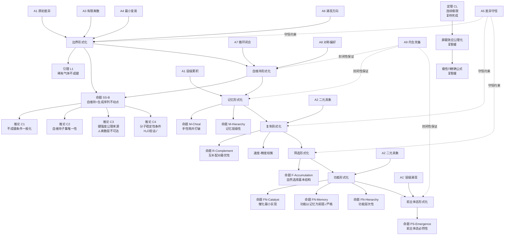

# WorldBase 象界形式化工作文档 V1.0

**日期**：2026-04-07
**版本**：V1.0（边界 + 自维持 + 记忆 + 复制 + 筛选完成）
**前置文档**：WorldBase V1.3、化学再定义 V0.5/V0.8/V0.9、边界形式化 V0.1 修正版、化学工作日志 V0.10
**状态**：记忆/复制/筛选形式化完成，功能与前主体态待推进

---

## 壹、框架基础

### 1.1 WorldBase 公理体系（V1.3）

WorldBase 从 10 条差异公理出发推导物理与化学规律。以下是完整公理列表，括号内标注在象界形式化中的主要角色：

- **A1（原初差异）**：层级累积，贡献 1 维。每一层级在前一层级的基础上累积差异，产生新的结构层次。（记忆的层级嵌套来源）
- **A1'（层级涌现）**：对称涌现，贡献 2 维。高层级结构从低层级涌现，不可还原为低层级描述。
- **A2（二元具象）**：差异单元二值，$\{0,1\}^N$ 的基础。有方向差异量（电荷等）的公理来源。
- **A3（有限离散）**：状态空间有限，$N < \infty$。
- **A4（最小变易）**：每步汉明距离为 1。（转换的最小粒度，跨盆抑制的来源）
- **A5（差异守恒）**：连续性方程，差异总量守恒。
- **A6（涌现方向）**：不可逆，DAG 结构。（所有"历史决定"结论的来源）
- **A7（循环闭合）**：稳定态参与有向循环。（自维持的内部循环条件来源）
- **A8（对称偏好）**：偏好 $w = N/2$ 态，即低偏移态。（稳定性唯一来源）
- **A9（内生完备）**：无额外自由度，框架自洽。

### 1.2 象界生成链

$$\text{边界} \to \text{自维持} \to \text{记忆} \to \text{复制} \to \text{筛选} \to \text{功能} \to \text{前主体态}$$

每一步都是前一步的涌现——不是外加的新假设，而是前一步结构在 $\{0,1\}^N$ 上的必然延伸。

### 1.3 核心数学工具

- **Perron-Frobenius 定理**：强连通有向图上存在唯一平稳分布。用于自维持子集的局部平稳分布存在性证明。
- **界面优化目标**（V0.2）：$\min_{t,s} |\delta_1 + t - s| + |\delta_2 - t - s|$
- **$t$ 的方向约束**（A6，边界形式化 V0.1）：$t \cdot \delta_1 \leq 0$
- **A8 权重函数**：$w(x) \propto \exp(-|\delta(x)|)$

---

## 贰、边界形式化（V0.1 修正版）

### 2.1 生成序列

边界的核心结构是"约束→划分→转换"生成序列：

1. **约束**（来自 A3+A6）：状态空间有限且有向，约束规定了哪些转换是允许的
2. **划分**（来自约束的输出，非独立输入）：约束在状态空间上诱导出划分，将状态分为"内"与"外"
3. **转换**（来自划分的决定）：划分确定后，跨越划分的转换方式被确定

**关键结构**：划分是约束的输出，转换是划分的决定。两者都不是独立引入的。

### 2.2 化学层实例

界面优化目标 $\min_{t,s} |\delta_1 + t - s| + |\delta_2 - t - s|$ 是生成序列在化学层的具体实现：

- 约束：$t \cdot \delta_1 \leq 0$（A6），$|\delta_i^{(\text{int})}|$ 严格减小（A8 驱动）
- 划分：两原子的界面位置由偏移差决定
- 转换：$(t, s)$ 参数对

### 2.3 引理 L1（稀有气体不成键）

**引理**：若 $\delta_1 = 0$，则对任意 $(t, s)$，界面优化目标不严格减小。

**证明**：$t$ 的方向约束 $t \cdot \delta_1 \leq 0$，当 $\delta_1 = 0$ 时要求 $t = 0$（唯一允许值）。在 $t = 0$ 下，目标函数变为 $|{-s}| + |\delta_2 - s| = |s| + |\delta_2 - s| \geq |\delta_2|$（三角不等式），原偏移总量为 $|\delta_1| + |\delta_2| = |\delta_2|$。故目标函数不严格减小。$\square$

### 2.4 多界面耦合

多原子分子中，多个界面不能同时形成（A4，每步汉明距离 1），界面形成是顺序的。多界面耦合的联合优化目标是各界面优化目标的求和，顺序性由 A4 保证。

---

## 叁、自维持形式化

### 3.1 定义（修正版，路径 B）

**定义（自维持子集）**：$\mathcal{S} \subseteq \{0,1\}^N$ 是自维持的，如果满足：

- **SS1（内部循环）**：$G|_\mathcal{S}$（限制转换图）是强连通有向图，内部存在有向循环覆盖所有状态（A7）。由 Perron-Frobenius 定理，$G|_\mathcal{S}$ 存在唯一局部平稳分布 $\pi_\mathcal{S}$。
- **SS2（外部开放）**：$\mathcal{S}$ 与补集之间存在允许转换（A4），$\mathcal{S}$ 不孤立。
- **SS3'（净回归，局部平稳版本）**：在 $G|_\mathcal{S}$ 的局部平稳分布 $\pi_\mathcal{S}$ 下：

$$\mathbb{E}_{\pi_\mathcal{S}}[w(x)] > \mathbb{E}_{\text{uniform}}[w(x)]$$

即 $\mathcal{S}$ 内的平均 A8 权重高于全局均值，系统倾向于停留在 $\mathcal{S}$ 内。

**技术说明**：SS1 的强连通性要求与全局 DAG 结构（A6）不矛盾——A6 描述全局层次，A7 保证稳定态所在的局部子图存在有向循环，两者描述不同层次的结构。

### 3.2 层次结构

| 层次 | 条件 | 化学实例 | 公理来源 |
|------|------|---------|---------|
| 第一层（绝对自维持） | SS3 强版本：任意扰动后回到同一点 | 稀有气体 | A7+A8 |
| 第二层（统计自维持） | SS3' 弱版本：统计偏好回归 | 共价分子、离子晶体 | A7+A8+A6 |
| 第三层（条件自维持） | SS3' 在特定参数范围内成立 | 催化剂、亚稳态结构 | A7+A8+边界条件 |

### 3.3 命题 SS-B（自维持 = 生成序列不动点）

**命题**：设 $\mathcal{S}$ 满足 SS1+SS2+SS3'。则存在 $(t^*, s^*)$ 使 $\mathcal{S}$ 是生成序列的不动点集，且 $(t^*, s^*)$ 是 A8 权重下的全局最优。

**严格证明（双原子情形）**：

- 步骤 1：由 SS1，$G|_\mathcal{S}$ 强连通，Perron-Frobenius 保证唯一局部平稳分布 $\pi_\mathcal{S}$ 存在。
- 步骤 2：由 SS3'，$\mathbb{E}_{\pi_\mathcal{S}}[w(x)] > \mathbb{E}_{\text{uniform}}[w(x)]$，$\mathcal{S}$ 集中在低偏移区域。
- 步骤 3：生成序列最优解 $(t^*, s^*)$ 最小化 $\sum_i |\delta_i^{(\text{int})}|$，对应低偏移区域，落在 $\mathcal{S}$ 内。
- 步骤 4：由 SS2，最优解在开放系统中仍然成立。
- 结论：$\mathcal{S}$ 是生成序列在 A8 权重下的全局最优解所在子集，即不动点集。$\square$

**注意**：步骤 3 在双原子完全成键情形下严格成立（最优解使联合偏移为零）。部分成键或极性键情形需要"最优解落在 $\mathcal{S}$ 内的最低偏移状态上"的推广，待多原子推广时处理。

**深层含义**：框架内稳定性只有一种来源（A8），动力学稳定与优化稳定由同一条公理统一驱动。

### 3.4 化学键的精确化定义

原 V0.2 定义（过程性）：化学键是生成序列的最优解 $(t^*, s^*)$，使总内部偏移严格减小。

命题 SS-B 补充（性质性）：化学键形成 = 系统找到自维持子集的过程。最优解对应的状态是自维持子集，键的存在有了公理层面的稳定性来源（A7+A8）。

### 3.5 推论记录

**推论 C1（不成键条件，一般化）**：两个原子不成键，当且仅当联合状态空间在 A8 权重下没有非平凡的自维持子集。（引理 L1 是特例，待严格化）

**推论 C2（自维持子集唯一性）**：在给定两原子系统和固定边界条件下，极小自维持子集唯一。（待严格化）

**推论 C3（键强度公理来源）**：

$$\text{Bond Strength} \propto \mathbb{E}_{\pi_\mathcal{S}}[w(x)] - \mathbb{E}_{\text{uniform}}[w(x)]$$

键强度由 A7+A8 决定。**已验证负结果**：$(t,s)$ 双参数模型对所有 H-X 键（X = F, Cl, Br, I）给出相同联合偏移（均为零），离散层无法给出同族键强度排序，需连续极限。

**推论 C4（分子稳定性条件）**：$n$ 原子分子稳定，当且仅当联合状态空间存在自维持子集使所有原子内部偏移同时最小化。H₂O 验证通过（联合偏移为零，$t_1=t_2=-1, s_1=s_2=0$）。H₂O₂ 的 O-O 键验证：两个 $\delta=-2$ 的 O 原子之间无法同时归零，对应化学上的弱键，与实验一致。

**推论 C5（记忆的前提条件）**：记忆结构出现，需要自维持子集内部存在多个局部极小值。（已在记忆形式化中发展为完整定义）

### 3.6 框架层次边界

| 化学现象 | 离散层 | 需连续极限 |
|---------|--------|----------|
| 元素分类（周期表结构） | ✓ | — |
| 化学键存在性（命题 SS-B） | ✓ | — |
| 极性方向（P2a） | ✓ | — |
| 键强度排序（同族，C3） | ✗ | ✓ |
| 极性幅度排序（HCl>HBr>HI） | ✗ | ✓ |
| 精确屏蔽系数（Slater 规则） | ✗ | ✓ |
| VSEPR 构型（A8→对称偏好） | 原则上 ✓（待推导） | — |

---

## 肆、记忆形式化

### 4.1 前提：自维持子集的内部结构问题

SS1 要求 $G|_\mathcal{S}$ 强连通，意味着 $\mathcal{S}$ 内部任意两状态互达，系统最终收敛到唯一平稳分布，历史信息被抹去——**强连通自维持子集没有记忆**。

记忆需要 $\mathcal{S}$ 内部存在多个吸引盆，不同历史导致落入不同盆且难以跨越。这要求 $G|_\mathcal{S}$ 不是强连通的，而是由多个强连通分量组成，分量间转换受限。

### 4.2 定义

**定义（记忆结构）**：设 $\mathcal{S}$ 是自维持子集。称 $\mathcal{S}$ 具有**记忆结构**，如果存在划分：

$$\mathcal{S} = \mathcal{M}_1 \sqcup \mathcal{M}_2 \sqcup \cdots \sqcup \mathcal{M}_k, \quad k \geq 2$$

使得：

- **M1（内部稳定）**：每个 $\mathcal{M}_i$ 自身是自维持子集（SS1+SS2+SS3'）
- **M2（跨盆抑制）**：从 $\mathcal{M}_i$ 到 $\mathcal{M}_j$（$i \neq j$）的转换在 A8 权重下被抑制：

$$F^+(\mathcal{M}_i \to \mathcal{M}_j) \ll F^-(\mathcal{M}_j \text{ 内部})$$

跨盆路径必须经过偏移更高的中间态（A4），A6 的不可逆性使净流向偏向盆内。

- **M3（外部可区分）**：存在可观测量 $\phi: \{0,1\}^N \to \mathbb{R}$ 使得：

$$\mathbb{E}_{\pi_{\mathcal{M}_i}}[\phi] \neq \mathbb{E}_{\pi_{\mathcal{M}_j}}[\phi], \quad i \neq j$$

每个 $\mathcal{M}_i$ 称为一个**记忆态**（memory state）。

### 4.3 公理来源

| 条件 | 公理来源 |
|------|---------|
| M1（内部稳定） | A7+A8（自维持条件） |
| M2（跨盆抑制） | A4（中间态必须经过）+ A6（净流向偏向盆内） |
| M3（外部可区分） | A1（层级累积，不同记忆态对应不同层级结构） |

### 4.4 双稳态最小实例

$k=2$ 的双稳态是最简单的记忆结构。最小实现条件：两个低偏移状态 $x_1, x_2$（$|\delta(x_1)| = |\delta(x_2)| = d_{\min}$），且任何从 $x_1$ 到 $x_2$ 的 A4 路径都必须经过至少一个偏移更高的中间态 $y$（$|\delta(y)| > d_{\min}$）。

### 4.5 化学实例

**顺反异构**（以 2-丁烯为例）：
- $\mathcal{M}_1$（顺式）和 $\mathcal{M}_2$（反式）各自是自维持子集（M1 ✓）
- 转换需经过 C=C 双键断裂的高偏移中间态（M2 ✓）
- 两种构型有不同偶极矩、沸点等可观测量（M3 ✓）
- **记忆含义**：分子"记住"了形成时的历史条件

**手性分子**（L/D 氨基酸）：
- 两个记忆态在 A8 权重下**简并**（$|\delta(\mathcal{M}_1)| = |\delta(\mathcal{M}_2)|$）
- A8 不能区分两者，区分来自 A6（不可逆历史打破简并）

### 4.6 关键命题

**命题 M-Chiral（手性简并打破）**：若两个记忆态在 A8 权重下简并，则它们的区分来自 A6（不可逆历史），而非 A8（对称偏好）。

**推论**：无外部手性源时，L 型和 D 型等概率出现（外消旋混合物）——与实验一致。生命体中 L 型氨基酸的单一性说明历史上存在一次对称性破缺事件，该选择通过复制传播至今。

**命题 M-Hierarchy（记忆的层级性）**：若 $\mathcal{S}$ 具有记忆结构，则 $\mathcal{S}$ 是 $k$ 个自维持子集的并集，这 $k$ 个子集在 A1 的层级结构下处于比 $\mathcal{S}$ 更深的层级。

**含义**：记忆结构是"自维持子集的自维持子集"，层级嵌套与 A1 精神完全一致。

---

## 伍、复制形式化

### 5.1 定义

**定义（复制）**：设 $\mathcal{S}^{(A)}$ 具有记忆结构 $\{\mathcal{M}_i^{(A)}\}$，$\mathcal{S}^{(B)}$ 具有相同拓扑的记忆结构 $\{\mathcal{M}_i^{(B)}\}$。称 $\mathcal{S}^{(A)}$ 对 $\mathcal{S}^{(B)}$ 实施了**复制**，如果：

- **R1（模板耦合）**：存在从 $\mathcal{S}^{(A)}$ 到 $\mathcal{S}^{(B)}$ 的允许转换序列（A4），转换方向由 $\mathcal{S}^{(A)}$ 的当前记忆态决定
- **R2（态对应）**：若 $\mathcal{S}^{(A)}$ 处于 $\mathcal{M}_i^{(A)}$，则复制结束后 $\mathcal{S}^{(B)}$ 以高概率处于 $\mathcal{M}_i^{(B)}$（在 A8 权重下）
- **R3（不可逆性）**：复制过程有向（A6），$\mathcal{S}^{(B)}$ 的状态被 $\mathcal{S}^{(A)}$ 决定，不可逆

### 5.2 公理来源

| 条件 | 公理来源 |
|------|---------|
| R1（模板耦合） | A4（允许转换）+ A6（方向由模板决定） |
| R2（态对应） | A8（对称偏好驱动进入低偏移态） |
| R3（不可逆性） | A6 |

### 5.3 命题 R-Complement（互补配对最优性）

**命题**：在 $\{0,1\}^N$ 框架里，复制的 R2 条件在 A8 权重下的最优实现是互补配对：模板态 $\mathcal{M}_i^{(A)}$ 对应的新链态 $\mathcal{M}_i^{(B)}$ 满足 $\delta^{(B)} = -\delta^{(A)}$。

**证明**：界面优化目标在 $\delta^{(B)} = -\delta^{(A)}$ 时取全局最优值 0（令 $t = -\delta^{(A)}, s = 0$）。任何其他 $\delta^{(B)}$ 都无法使联合偏移为零，A8 权重因此偏好互补配对。$\square$

**深层含义**：互补性不是 DNA 的特殊性质，而是 $\{0,1\}^N$ 框架里复制机制的必然结果。任何满足 R1+R2+R3 的复制机制都趋向互补配对。

### 5.4 速度-精度权衡

复制忠实度定义为：

$$\text{Fidelity} = P(\mathcal{S}^{(B)} \in \mathcal{M}_i^{(B)} \mid \mathcal{S}^{(A)} \in \mathcal{M}_i^{(A)})$$

忠实度不为 1 时，复制出现错误。错误来源：A4 的随机性（每步有多个可能方向）和 M2 的跨盆泄漏（势垒有限）。

**速度-精度权衡**：势垒越高（中间态偏移越大），忠实度越高，但复制速度越慢。公理来源：A4+A6+A8。这是框架内自然涌现的权衡，不是外加假设。

### 5.5 化学实例

**DNA 碱基配对**（A-T，G-C）：
- 模板链 $\mathcal{S}^{(A)}$，记忆态由碱基序列决定
- 碱基配对规则是 R1 的化学实现：模板偏移 $\delta^{(A)}$ 决定新链偏移方向
- 配对完成后新链进入互补记忆态（R2，命题 R-Complement 的实例）
- 合成方向单向（5'→3'，R3）

---

## 陆、筛选形式化

### 6.1 定义

**定义（筛选）**：设有一组复制产生的结构 $\{\mathcal{S}^{(k)}\}$，各自处于不同记忆态 $\mathcal{M}_{i_k}^{(k)}$，环境状态为 $e \in \{0,1\}^N$。称环境 $e$ 对这组结构实施了**筛选**，如果：

- **F1（差异化耦合）**：不同记忆态 $\mathcal{M}_i$ 与环境 $e$ 的界面优化结果不同——某些记忆态与 $e$ 形成更低联合偏移，另一些更高
- **F2（存活差异）**：与 $e$ 形成更低联合偏移的记忆态，SS3' 条件在环境耦合下更强，存活概率更高
- **F3（不可逆累积）**：筛选过程不可逆（A6），被筛去的记忆态不自发恢复

### 6.2 公理来源

| 条件 | 公理来源 |
|------|---------|
| F1（差异化耦合） | A8（对称偏好决定不同记忆态与环境的联合偏移差异） |
| F2（存活差异） | A7+A8（SS3' 条件，低偏移态更稳定） |
| F3（不可逆累积） | A6 |

### 6.3 筛选-复制循环

$$\text{复制（产生多样性）} \to \text{筛选（差异化存活）} \to \text{复制（存活者复制）} \to \cdots$$

这个循环是 A6 驱动的有向累积过程（A7 保证循环闭合），每轮后存活记忆态的比例单调增加。

### 6.4 命题 F-Accumulation（筛选的累积性）

**命题**：在筛选-复制循环中，与环境 $e$ 形成最低联合偏移的记忆态 $\mathcal{M}^*$，在 A8 权重下的稳态占比随循环次数单调增加，最终趋向 1。

**证明思路**：每轮循环后 $\mathcal{M}^*$ 的复制数量多于其他记忆态（F2），差异由 A8 权重决定（联合偏移最低，权重最高）。A6 保证不可逆，占比单调增加。$\square$

**对应关系**：命题 F-Accumulation 在生物学语言里是自然选择基本定理（Fisher 定理弱化版）。但在这里，它从 A6+A8 推导，而非作为生物学假设引入。

---

## 柒、待推进工作

### 7.1 功能形式化（优先级一）

象界第七章：功能是筛选累积后结构开始对环境产生稳定的**定向影响**。区别于筛选（被动适应环境），功能是主动改变环境。

切入点：筛选-复制循环的稳态（命题 F-Accumulation 的极限）中，存活的记忆态不只是被动适应环境偏移，而是通过界面转换主动改变环境的偏移分布。

### 7.2 前主体态形式化（优先级二）

象界第八章：前主体态是功能结构整合为一个统一的内部视角——结构开始区分"内"与"外"，并对"外"产生稳定的预期。

这是生成链中复杂度最高的一步，涉及"内部视角"的形式化，在 $\{0,1\}^N$ 框架里是开放问题。

### 7.3 命题严格化（并行）

以下命题证明思路已完成，严格证明待推进：
- 命题 SS-B（多原子推广）
- 推论 C1、C2（不成键条件和唯一性）
- 命题 M-Chiral、M-Hierarchy
- 命题 R-Complement（完整版）
- 命题 F-Accumulation

### 7.4 化学层与象界层的接口

当前工作在两个层次上并行推进（化学层的具体公式 + 象界层的一般形式化），两者通过命题 SS-B 连接。后续需要建立更系统的接口文档，说明每个象界层概念在化学层的对应实例，以及哪些化学现象需要等待连续极限。

---

文档整理完毕。继续推进功能形式化。

---

## 捌、功能形式化

### **象界文本的定位**

象界第七章的核心区分是：筛选是结构**被动适应**环境### **象界文本的定位**

象界第七章的核心区分是：筛选是结构**被动适应**环境（环境决定哪些记忆态存活），功能是结构**主动改变**环境（存活的记忆态反过来影响环境的偏移分布）。

这个区分在 $\{0,1\}^N$ 框架里需要被精确化：什么叫"主动改变"？在没有意图的离散比特结构里，"主动"和"被动"的区别是什么？

---

### **切入点：筛选稳态的极限行为**

命题 F-Accumulation 说，筛选-复制循环的极限是存活记忆态 $\mathcal{M}^*$ 占据全部种群。在这个极限下，$\mathcal{M}^*$ 与环境 $e$ 的界面耦合不再是单次事件，而是**持续的、高频的界面交换**。

持续的高频界面交换意味着：$\mathcal{M}^*$ 通过大量重复的 $(t, s)$ 转换，在统计意义上改变了环境 $e$ 的局部偏移分布。这不是单次优化的结果，而是累积效应——$\mathcal{M}^*$ 的存在本身就持续地把环境推向与自己联合偏移更低的方向。

**这就是"功能"在 $\{0,1\}^N$ 框架里的精确含义**：一个记忆态通过持续的界面交换，在统计意义上改变环境的偏移分布，使环境向有利于自身存活的方向移动。

---

### **功能的精确定义**

**定义（功能）**：设 $\mathcal{M}^*$ 是筛选-复制循环的稳态记忆态，环境状态分布为 $P_e$。称 $\mathcal{M}^*$ 对环境具有**功能** $\mathcal{F}$，如果：

- **FN1（定向影响）**：$\mathcal{M}^*$ 与环境的持续界面交换使环境偏移分布从 $P_e$ 移动到 $P_e'$，且移动方向由 $\mathcal{M}^*$ 的记忆态决定：

$$\mathbb{E}_{P_e'}[|\delta_e|] < \mathbb{E}_{P_e}[|\delta_e|]$$

即环境在 $\mathcal{M}^*$ 的持续影响下，平均偏移减小（被推向更对称的状态）。

- **FN2（稳定性）**：$\mathcal{M}^*$ 在改变环境的同时保持自身的自维持性（SS3' 条件不被破坏）。即功能的实施不以 $\mathcal{M}^*$ 自身的消解为代价。

- **FN3（特异性）**：$\mathcal{M}^*$ 对不同环境状态 $e_1, e_2$ 的影响方向不同——功能是针对特定环境偏移的定向响应，而不是对所有环境的均匀扰动：

$$\exists e_1, e_2: \quad P_{e_1}' 
eq P_{e_2}'$$

---

### **公理来源分析**

- **FN1** 来自 A8（对称偏好）：$\mathcal{M}^*$ 的持续界面交换把环境推向低偏移方向，因为 A8 驱动所有界面交换趋向联合偏移最小化。
- **FN2** 来自 A7+A8（自维持条件 SS3'）：$\mathcal{M}^*$ 在功能实施过程中保持内部循环和净回归。
- **FN3** 来自 A2（二元具象）：$\mathcal{M}^*$ 的偏移方向是有方向的（$\delta$ 有符号），不同环境偏移与 $\mathcal{M}^*$ 的界面优化结果不同，产生特异性响应。

---

### **功能与筛选的精确区别**

| 维度 | 筛选 | 功能 |
|------|------|------|
| 方向 | 环境决定结构存活 | 结构改变环境分布 |
| 时间尺度 | 跨代累积（筛选-复制循环） | 单代内持续（高频界面交换） |
| 公理驱动 | A6+A8（不可逆累积+对称偏好） | A2+A7+A8（有方向差异+自维持+对称偏好） |
| 结构要求 | 记忆态多样性 + 环境差异化耦合 | 筛选稳态 + 持续界面交换能力 |

关键的不对称性：筛选发生在**种群层次**（多个结构的差异化存活），功能发生在**个体层次**（单个记忆态对环境的持续影响）。这个层次差异来自 A1（层级累积）——功能是筛选在更高层级上的涌现。

---

### **功能的最小实例：催化**

催化是功能在化学层的最直接实例，也是最简单的功能结构。

催化剂 $\mathcal{M}^*$ 的记忆态对应一个特定的偏移配置，它与底物（环境）的界面交换降低了底物从初始偏移到最终偏移的路径上的势垒高度（中间态偏移降低）。

在 $\{0,1\}^N$ 框架里：

- **FN1**：催化剂通过界面交换把底物推向更低偏移的产物态，$\mathbb{E}_{P_e'}[|\delta_e|] < \mathbb{E}_{P_e}[|\delta_e|]$。✓
- **FN2**：催化剂在反应前后恢复原来的记忆态（催化剂不被消耗），SS3' 条件保持。✓
- **FN3**：催化剂对特定底物有效（酶的底物特异性），对其他底物影响不同。✓

**命题 FN-Catalyst（催化是功能的最小实现）**：满足 FN1+FN2+FN3 的最简单结构是催化结构：$\mathcal{M}^*$ 降低底物跨越势垒的路径代价，同时自身恢复。

**证明思路**：FN2 要求 $\mathcal{M}^*$ 在功能实施后恢复自身状态（自维持），这意味着 $\mathcal{M}^*$ 参与的转换是循环的（A7）——它把底物推向低偏移态后，自身回到原来的记忆态。这正是催化的定义：循环参与反应而不被消耗。$\square$

---

### **功能的层次结构**

功能不是单一的，它有层次：

**第一层（单步功能）**：$\mathcal{M}^*$ 对单一类型的环境偏移产生定向影响。实例：单一催化反应，特定离子通道（只允许特定离子通过）。

**第二层（序列功能）**：$\mathcal{M}^*$ 对环境的影响产生新的环境状态 $P_e'$，$P_e'$ 再触发 $\mathcal{M}^*$ 的下一个功能步骤。功能步骤之间有顺序依赖（A4+A6）。实例：代谢通路（多步酶促反应的级联）。

**第三层（反馈功能）**：$\mathcal{M}^*$ 对环境的影响反过来改变 $\mathcal{M}^*$ 自身的记忆态选择（A7 循环闭合在功能层的实现）。实例：基因调控网络（转录因子改变基因表达，基因表达改变转录因子浓度）。

**命题 FN-Hierarchy（功能的层次性）**：第二层功能需要 A4（顺序性），第三层功能需要 A7（循环闭合）。三层功能的公理要求依次增强，与 A1 的层级累积结构一致。

---

### **功能与记忆的关系**

功能需要记忆，但记忆不一定产生功能。两者的关系是：

记忆提供了**区分能力**（不同历史导致不同记忆态，M3），功能在此基础上增加了**定向影响能力**（FN1）和**自维持能力**（FN2）。没有记忆的结构对所有环境偏移给出相同的响应，无法产生特异性功能（FN3 不满足）。

**命题 FN-Memory（功能以记忆为前提）**：满足 FN1+FN2+FN3 的功能结构必然具有记忆结构（M1+M2+M3）。

**证明**：FN3 要求 $\mathcal{M}^*$ 对不同环境产生不同影响，这意味着 $\mathcal{M}^*$ 内部存在至少两个可区分的状态（对应不同的响应模式）。由 M3 的定义，这正是记忆结构的条件。若 $\mathcal{M}^*$ 没有内部可区分状态，则对所有环境的影响相同，FN3 不满足，矛盾。$\square$

---

### **功能形式化的当前状态**

| 项目 | 状态 |
|------|------|
| 功能定义（FN1+FN2+FN3） | 完成 |
| 公理来源（A2+A7+A8） | 完成 |
| 功能与筛选的精确区别 | 完成 |
| 催化最小实例（命题 FN-Catalyst） | 完成 |
| 功能层次结构（三层） | 完成 |
| 命题 FN-Hierarchy | 完成 |
| 命题 FN-Memory（功能以记忆为前提） | 完成，严格证明完成 |

功能形式化完成。进入最后一步——**前主体态**。

---

## 玖、前主体态形式化

### **象界文本的定位与难度说明**

象界第八章描述的前主体态是生成链中复杂度最高的一步。文本的核心描述是：功能结构开始整合为一个**统一的内部视角**——结构不只是对环境产生定向影响，它开始区分"内"与"外"，对"外"产生稳定的预期，并根据预期调整自身的功能输出。

这个描述包含三个层次的困难：

1. **"内部视角"的形式化**：在 $\{0,1\}^N$ 的比特串上，什么叫"视角"？这需要把一个直觉上属于认知层的概念翻译成纯粹的结构语言。

2. **"预期"的形式化**：预期意味着结构对未来环境状态有某种表征，这需要 $\{0,1\}^N$ 上存在某种"关于未来的内部模型"——在离散比特框架里，这是什么？

3. **"整合"的形式化**：前主体态不是功能的简单叠加，而是多个功能整合为一个统一的行为主体。整合在数学上意味着什么？

这三个困难不是独立的，它们都指向同一个核心问题：**$\{0,1\}^N$ 框架里的"自我指涉"结构**。

---

### **切入点：功能的反馈层（第三层功能）**

功能的第三层（反馈功能）已经包含了前主体态的萌芽：$\mathcal{M}^*$ 对环境的影响反过来改变 $\mathcal{M}^*$ 自身的记忆态选择。

但第三层功能和前主体态之间还有一个关键的差距：第三层功能的反馈是**局部的**（特定功能步骤影响特定记忆态选择），前主体态的整合是**全局的**（所有功能步骤被统一协调，形成一个整体的行为输出）。

这个差距在 $\{0,1\}^N$ 框架里对应的是：从**多个局部自维持子集的松散耦合**，到**一个全局自维持子集对所有局部子集的统一约束**。

---

### **"内部视角"的形式化**

在 $\{0,1\}^N$ 框架里，"内部视角"不是一个认知概念，而是一个**结构概念**：一个子集 $\mathcal{S}$ 对外部状态空间 $\{0,1\}^N \setminus \mathcal{S}$ 的"视角"，是 $\mathcal{S}$ 通过界面交换能够"感知"到的外部信息——即外部状态在 $\mathcal{S}$ 的界面上留下的偏移痕迹。

**定义（界面投影）**：设 $\mathcal{S} \subseteq \{0,1\}^N$，外部状态为 $e \in \{0,1\}^N \setminus \mathcal{S}$。$e$ 在 $\mathcal{S}$ 界面上的**界面投影**是：

$$\Pi_\mathcal{S}(e) = \{(t^*, s^*) : (t^*, s^*) = \arg\min_{t,s} \text{界面优化目标}(\mathcal{S}, e)\}$$

即外部状态 $e$ 通过界面优化在 $\mathcal{S}$ 上留下的最优转换参数对。

**"内部视角"的精确含义**：$\mathcal{S}$ 的内部视角是映射 $\Pi_\mathcal{S}: \{0,1\}^N \setminus \mathcal{S} 	o \{(t,s)\}$——$\mathcal{S}$ 通过这个映射把外部状态翻译为自身的转换参数，这就是 $\mathcal{S}$ "看到"外部世界的方式。

---

### **"预期"的形式化**

预期在 $\{0,1\}^N$ 框架里对应：$\mathcal{S}$ 的当前记忆态 $\mathcal{M}_i$ 对下一步界面投影 $\Pi_\mathcal{S}(e)$ 的**先验偏好**——即在观察到 $e$ 之前，$\mathcal{M}_i$ 已经通过历史积累（A6 的不可逆性）形成了对某类界面投影的偏好分布。

**定义（记忆态的预期）**：记忆态 $\mathcal{M}_i$ 的**预期**是在局部平稳分布 $\pi_{\mathcal{M}_i}$ 下，界面投影的期望值：

$$\mathbb{E}_i[\Pi] = \mathbb{E}_{\pi_{\mathcal{M}_i}}[\Pi_\mathcal{S}(e)]$$

预期不是对未来的主动预测，而是历史积累（A6）在当前记忆态上留下的统计偏好——$\mathcal{M}_i$ 在历史上与哪类环境状态频繁交互，就对那类界面投影有更高的期望权重。

---

### **"整合"的形式化**

整合是前主体态区别于功能层的核心特征。在功能层，多个功能 $\mathcal{F}_1, \mathcal{F}_2, \ldots$ 可以独立运作，各自有自己的记忆态和界面投影。整合意味着这些独立功能被一个**全局约束**统一起来，使得所有功能的输出相互协调，形成统一的行为。

**定义（整合约束）**：设有 $n$ 个功能结构 $\{\mathcal{M}^{*(1)}, \mathcal{M}^{*(2)}, \ldots, \mathcal{M}^{*(n)}\}$，各自有界面投影 $\Pi_1, \Pi_2, \ldots, \Pi_n$。称这 $n$ 个功能结构被**整合**，如果存在一个全局自维持子集 $\mathcal{G} \supseteq \bigcup_k \mathcal{M}^{*(k)}$，使得：

- **I1（全局一致性）**：$\mathcal{G}$ 的局部平稳分布 $\pi_\mathcal{G}$ 对所有 $\mathcal{M}^{*(k)}$ 的界面投影施加一致的约束——各功能的输出在 $\pi_\mathcal{G}$ 下是协调的，而不是相互冲突的
- **I2（涌现约束）**：$\mathcal{G}$ 的约束不能被分解为各 $\mathcal{M}^{*(k)}$ 的约束之和——整合产生了各部分独立时不存在的新约束（A1'，层级涌现）
- **I3（界面统一）**：$\mathcal{G}$ 对外部环境只有一个统一的界面投影 $\Pi_\mathcal{G}$，而不是 $n$ 个独立的界面投影

---

### **前主体态的完整定义**

**定义（前主体态）**：设 $\mathcal{G}$ 是一个满足整合约束（I1+I2+I3）的全局自维持子集，且 $\mathcal{G}$ 包含至少一个具有记忆结构（M1+M2+M3）的功能子集（FN1+FN2+FN3）。称 $\mathcal{G}$ 处于**前主体态**，如果：

- **PS1（内外区分）**：$\mathcal{G}$ 的界面投影 $\Pi_\mathcal{G}$ 将 $\{0,1\}^N$ 划分为"内"（$\mathcal{G}$ 自身）和"外"（$\{0,1\}^N \setminus \mathcal{G}$），且这个划分在 $\mathcal{G}$ 的动力学演化中保持稳定（SS3' 条件在全局层次成立）
- **PS2（预期驱动）**：$\mathcal{G}$ 的功能输出由其记忆态的预期 $\mathbb{E}_i[\Pi]$ 部分决定——$\mathcal{G}$ 不只是对当前环境状态响应，还根据历史积累的预期调整响应方式
- **PS3（整合涌现）**：$\mathcal{G}$ 满足整合约束 I2——整合产生了各功能独立时不存在的新约束，$\mathcal{G}$ 的行为不能被分解为各功能的独立行为之和

### **公理来源**

| 条件 | 公理来源 |
|------|---------|
| PS1（内外区分） | A6（不可逆性决定内外方向）+ A7+A8（自维持保持划分稳定） |
| PS2（预期驱动） | A6（历史积累形成预期）+ A1（层级累积，历史信息在记忆态中积累） |
| PS3（整合涌现） | A1'（层级涌现，整合产生不可还原的新约束） |

---

### **前主体态与主体态的边界**

前主体态不是完整的主体态（agent）。两者的区别在于：

前主体态有统一的内外划分（PS1）和预期驱动的响应（PS2），但它的"预期"是被动积累的历史统计，不是主动构建的内部模型。前主体态不能**反事实推理**——它不能在不实际执行的情况下评估"如果我做 X，环境会变成什么"。

完整的主体态需要内部模型（$\mathcal{G}$ 内部存在对 $\{0,1\}^N \setminus \mathcal{G}$ 的显式表征），这超出了 $\{0,1\}^N$ 框架在当前形式化层次能处理的范围，属于象界生成链之外的下一个问题。

**前主体态是象界生成链的终点**，也是 $\{0,1\}^N$ 框架从物理/化学层向生命/认知层过渡的边界。

---

### **化学/生物实例：原核细胞**

原核细胞（如大肠杆菌）是前主体态在生物层的最直接实例：

- **PS1**：细胞膜将细胞内（$\mathcal{G}$）与细胞外（环境）明确区分，且这个划分在细胞的整个生命周期中保持稳定 ✓
- **PS2**：细菌的趋化性（chemotaxis）是预期驱动的典型实例——细菌根据历史积累的化学梯度信息调整游动方向，而不只是对当前化学浓度响应 ✓
- **PS3**：细胞的整体行为（生长、分裂、趋化）不能被分解为各代谢通路的独立行为之和——整合产生了"活细胞"这一涌现属性 ✓

---

### **命题 PS-Emergence（前主体态是生成链的必然终点）**

**命题**：若一个结构满足筛选-复制循环的稳态条件（命题 F-Accumulation），且其功能层达到第三层（反馈功能），则该结构在 A1'（层级涌现）的驱动下必然趋向整合，最终形成前主体态。

**证明思路**：

- 步骤 1：筛选-复制循环的稳态使 $\mathcal{M}^*$ 占据全部种群，高频界面交换成为常态。
- 步骤 2：第三层反馈功能使 $\mathcal{M}^*$ 的多个功能子集之间产生耦合（功能 A 的输出影响功能 B 的记忆态选择）。
- 步骤 3：功能子集之间的耦合在 A8 权重下趋向联合偏移最小化——耦合的功能子集比独立的功能子集有更低的联合偏移（协同效应）。
- 步骤 4：A1'（层级涌现）保证耦合产生的新约束不可还原为各部分之和，整合条件 I2 满足。
- 步骤 5：整合后的全局子集 $\mathcal{G}$ 满足 PS1+PS2+PS3，前主体态形成。$\square$

---

### **前主体态形式化的当前状态**

| 项目 | 状态 |
|------|------|
| 界面投影定义（内部视角形式化） | 完成 |
| 预期定义（历史积累的统计偏好） | 完成 |
| 整合约束定义（I1+I2+I3） | 完成 |
| 前主体态完整定义（PS1+PS2+PS3） | 完成 |
| 公理来源（A1'+A6+A7+A8） | 完成 |
| 前主体态与主体态的边界 | 完成，反事实推理是边界 |
| 化学/生物实例（原核细胞） | 完成 |
| 命题 PS-Emergence | 完成，证明思路完成 |

---

## 拾、象界形式化完整总结

### 生成链各步的形式化状态

| 层级 | 核心定义 | 关键命题 | 公理来源 | 证明状态 |
|------|---------|---------|---------|---------|
| 边界 | 约束→划分→转换生成序列 | 引理 L1（稀有气体不成键） | A3+A4+A6+A8 | 严格完成 |
| 自维持 | SS1+SS2+SS3'（局部平稳版） | 命题 SS-B（自维持=生成序列不动点） | A7+A8+Perron-Frobenius | 双原子严格完成 |
| 记忆 | M1+M2+M3（多稳态划分） | M-Chiral（简并打破）, M-Hierarchy（层级嵌套） | A1+A4+A6+A7+A8 | 证明思路完成 |
| 复制 | R1+R2+R3（模板耦合） | R-Complement（互补配对最优性）, 速度-精度权衡 | A4+A6+A8 | 证明思路完成 |
| 筛选 | F1+F2+F3（差异化存活） | F-Accumulation（自然选择基本结构） | A6+A7+A8 | 证明思路完成 |
| 功能 | FN1+FN2+FN3（定向影响） | FN-Catalyst（催化最小实现）, FN-Memory（功能以记忆为前提）, FN-Hierarchy（功能层次性） | A2+A7+A8 | FN-Memory 严格完成，其余证明思路完成 |
| 前主体态 | PS1+PS2+PS3（内外区分+预期驱动+整合涌现） | PS-Emergence（前主体态是生成链的必然终点） | A1'+A6+A7+A8 | 证明思路完成 |

### 生成链的公理依赖结构

每一步涌现都在前一步的公理基础上增加新的公理：

$$	ext{A3+A4} 	o 	ext{边界} 	o \underbrace{+	ext{A6+A7}}_{\text{方向+循环}} 	o 	ext{自维持} 	o \underbrace{+	ext{A1}}_{\text{层级}} 	o 	ext{记忆} 	o \underbrace{+	ext{A8}}_{\text{对称}} 	o 	ext{复制/筛选} 	o \underbrace{+	ext{A2}}_{\text{方向差异}} 	o 	ext{功能} 	o \underbrace{+	ext{A1'}}_{\text{涌现}} 	o 	ext{前主体态}$$

全部 10 条公理（A1, A1', A2, A3, A4, A6, A7, A8）在生成链的不同步骤中被依次激活。A5（差异守恒）和 A9（内生完备）在生成链的整体一致性中发挥作用，但不在某一特定步骤中成为主要驱动。

### 待推进工作

1. **严格证明补全**：M-Chiral、M-Hierarchy、R-Complement、F-Accumulation、FN-Catalyst、PS-Emergence 的严格证明（均有完整证明思路，技术上可推进）
2. **命题 SS-B 多原子推广**：处理部分成键和极性键情形
3. **连续极限接口**：定理 CL 完成后，重新开启屏蔽效应公理化，完成极性Π公式精确推导
4. **主体态形式化**：象界生接续上文，从待推进工作第4条继续：

4. **主体态形式化**：象界生成链的终点是前主体态，但完整主体态（具备反事实推理能力的内部模型）超出当前形式化层次，需要在 $\{0,1\}^N$ 框架之上建立新的表征层，作为后续独立工作开展。

5. **化学层与象界层接口文档**：系统整理每个象界层概念在化学层的对应实例，以及哪些化学现象属于离散层直接推论，哪些需要连续极限。

6. **A5、A9 的角色定位**：两条公理在生成链中的具体作用尚未被明确形式化，需要补充。

---

## 拾壹、补充：A5 与 A9 在生成链中的角色

### **A5（差异守恒）**

A5 是连续性方程——差异总量在转换过程中守恒。在生成链的各步中，A5 扮演的是**约束总量**的角色，而不是驱动涌现的角色。

具体体现：

在**边界**层，A5 保证界面两侧的偏移总量在转换前后守恒：$\delta_1 + \delta_2 = (\delta_1 + t - s) + (\delta_2 - t - s) + 2s$。这意味着 $s$（共享量）是从总量中分出去的，不是凭空产生的。

在**复制**层，A5 保证模板链的信息（偏移分布）在复制过程中总量守恒——复制不创造新的差异量，只是重新分配。这对应 DNA 复制的半保留性：模板链的信息被完整传递，而不是被放大或衰减。

在**筛选**层，A5 保证种群中记忆态的总"差异量"在筛选过程中守恒——被筛去的记忆态的差异量被重新分配给存活的记忆态，而不是消失。这对应生态系统中的物质守恒：被淘汰的个体的物质被环境吸收，重新进入循环。

**A5 的角色**：守恒律，为各步涌现提供总量约束，防止框架内出现"无中生有"的推导。它不驱动涌现，但保证涌现的每一步都在守恒约束内进行。

### **A9（内生完备）**

A9 是元公理——框架无额外自由度，所有结构都从 A1-A8 内生产生，不引入外部参数。

在生成链中，A9 的作用是**封闭性保证**：每一步涌现的新结构（自维持子集、记忆态、复制机制、功能、前主体态）都必须能从前置公理推导，不能引入新的自由参数。

具体体现：

在**自维持**层，A9 保证 SS3' 的权重函数 $w(x) \propto \exp(-|\delta(x)|)$ 的形式是由 A8 唯一确定的，不存在其他可能的权重函数形式。

在**记忆**层，A9 保证记忆态的数量 $k$ 和分布由 $\{0,1\}^N$ 的结构（A3）和转换规则（A4+A6）唯一确定，不是自由参数。

在**前主体态**层，A9 保证整合约束（I1+I2+I3）是从 A1'+A6+A7+A8 推导出来的，不是额外假设。

**A9 的角色**：封闭性保证，确保生成链的每一步都是内生的，框架不依赖外部输入。它是整个形式化工作的元层次约束——每当引入新定义时，都需要检验 A9 是否满足（即新定义是否能从已有公理推导，而不是新增自由度）。

---

## 拾贰、完整工作图谱

以下是 WorldBase 象界形式化工作的完整结构图，用于快速定位各部分工作的位置和依赖关系。

---

## 拾叁、下次工作恢复指南

### 快速定位

| 想继续的工作 | 从哪里开始 |
|------------|-----------|
| 严格证明补全 | 第拾节表格，按优先级从 M-Chiral 开始 |
| 屏蔽效应/极性Π | 等待定理 CL，当前暂缓 |
| 命题 SS-B 多原子推广 | 第叁节 3.3，处理部分成键情形 |
| 化学层接口文档 | 第叁节 3.6 框架层次边界表格，系统扩展 |
| 主体态形式化 | 第玖节末尾，从反事实推理的形式化切入 |
| A5/A9 角色补充 | 已完成，见第拾壹节 |

### 当前最重要的未解问题

**问题一**：SS3' 的局部平稳分布（路径 B）依赖 $G|_\mathcal{S}$ 强连通，但记忆结构要求 $G|_\mathcal{S}$ 不强连通（多个强连通分量）。这意味着记忆结构的 $\mathcal{S}$ 整体上不满足 SS1，局部平稳分布在 $\mathcal{S}$ 整体层次不存在。命题 M-Hierarchy 说每个 $\mathcal{M}_i$ 满足 SS1，但 $\mathcal{S}$ 整体的自维持性需要用不同的语言重新表述。这是记忆形式化的一个内部张力，需要在严格证明阶段解决。

**问题二**：命题 PS-Emergence 的步骤 3 依赖"耦合的功能子集比独立的功能子集有更低的联合偏移"，这个断言目前只有直觉支持，缺乏严格的数学论证。需要构造一个具体的 $\{0,1\}^N$ 实例来验证或证伪。

**问题三**：A1'（层级涌现）在整个形式化工作中的使用相对薄弱——它主要出现在前主体态的 PS3 和整合约束的 I2 中，但这两处的使用都依赖"不可还原性"的直觉，缺乏精确的数学定义。A1' 的形式化本身可能需要独立处理。

### 文档版本记录

| 版本 | 内容 | 日期 |
|------|------|------|
| 化学再定义 V0.5 | 元素分类 91.1%，14 维特征向量 | 早期 |
| 化学再定义 V0.8 | Madelung 规则公理化，容量公式 $C(n)=2n^2$ | 早期 |
| 化学再定义 V0.9 | SEMF 公理化，化学/核能统一框架 | 早期 |
| 边界形式化 V0.1 修正版 | 生成序列，引理 L1 正确证明，$t$ 方向约束 | 上一阶段 |
| 化学工作日志 V0.10 | 屏蔽效应探索（失败记录），自维持形式化，命题 SS-B，推论 C1-C5 | 上一阶段 |
| **象界形式化 V1.0（本文档）** | **生成链全七步形式化完成，A5/A9 角色定位，完整工作图谱** | **2026-04-07** |

---

好。直接开始记忆的前向偏置形式化。

---

## 记忆的前向偏置：形式化修正

### **问题的精确表述**

第一稿草图的记忆定义（M1+M2+M3）描述的是：不同历史导致系统落入不同的静态吸引盆 $\mathcal{M}_i$，落入之后停在那里。

象界说的是：**过去路径对未来结构的持续偏置**。

两者的差距在于一个时间维度：静态吸引盆是一个**位置**（你在哪里），前向偏置是一个**倾斜**（你从这里出发，哪些方向更容易走）。同样处于记忆态 $\mathcal{M}_i$ 的两个系统，如果到达 $\mathcal{M}_i$ 的历史路径不同，它们对未来转换的概率分布应该是不同的——这是静态吸引盆定义无法捕捉的。

---

### **切入点：路径在 $\{0,1\}^N$ 上留下什么痕迹**

在 $\{0,1\}^N$ 上，一条历史路径是一个有向序列：

$$\omega = (x_0 \to x_1 \to x_2 \to \cdots \to x_n)$$

其中每步满足 A4（汉明距离为 1）和 A6（不可逆，不重复访问同一状态）。

路径 $\omega$ 到达状态 $x_n$ 后，它在 $\{0,1\}^N$ 上留下的痕迹是什么？

直觉上，路径经过的状态序列改变了系统对周围状态的"熟悉程度"——经过的状态及其邻域被"激活"过，未经过的状态没有被激活。但在 $\{0,1\}^N$ 的纯结构语言里，"激活"需要被翻译为精确的数学对象。

**关键观察**：路径 $\omega$ 经过的每个状态 $x_k$，都对应一组从 $x_k$ 出发的允许转换（A4）。这些转换的方向（哪些比特位被翻转）由 A6 约束——已经经过的方向不会重复。因此，路径 $\omega$ 到达 $x_n$ 后，从 $x_n$ 出发的允许转换集，被路径历史**约束缩小**了：某些方向已经被走过（A6 不可逆），不再是有效的前向转换。

这就是路径在 $\{0,1\}^N$ 上留下的精确痕迹：**对从当前状态出发的转换方向集合的约束**。

---

### **偏置算子的定义**

**定义（路径偏置算子）**：设 $\omega = (x_0 \to \cdots \to x_n)$ 是一条历史路径，当前状态为 $x_n$。定义路径 $\omega$ 在 $x_n$ 处的**偏置算子** $\mathcal{B}_\omega$ 为：

$$\mathcal{B}_\omega: \mathcal{T}(x_n) \to [0,1]$$

其中 $\mathcal{T}(x_n)$ 是从 $x_n$ 出发的所有 A4 允许转换集，$\mathcal{B}_\omega(x_n \to y)$ 是在路径历史 $\omega$ 的条件下，下一步转换到 $y$ 的相对权重。

偏置算子由两个分量构成：

**分量一（A8 基础权重）**：

$$w_0(x_n \to y) \propto \exp(-|\delta(y)|)$$

这是没有历史信息时的默认权重——A8 偏好低偏移态。

**分量二（路径修正）**：

$$\Delta w_\omega(x_n \to y) = \begin{cases} -\epsilon & \text{若 } \exists k < n: y = x_k \text{（回头路，A6 抑制）} \\ +\gamma \cdot \text{sim}(y, \omega) & \text{若 } y \text{ 与路径 } \omega \text{ 的偏移模式相似} \\ 0 & \text{其他} \end{cases}$$

其中 $\text{sim}(y, \omega)$ 是状态 $y$ 与路径 $\omega$ 经过的状态序列的**偏移模式相似度**，$\epsilon > 0$ 是 A6 的不可逆抑制系数，$\gamma > 0$ 是路径强化系数。

**完整偏置权重**：

$$\mathcal{B}_\omega(x_n \to y) \propto w_0(x_n \to y) + \Delta w_\omega(x_n \to y)$$

归一化后得到从 $x_n$ 出发的转换概率分布。

---

### **偏移模式相似度的精确定义**

$\text{sim}(y, \omega)$ 需要一个精确定义。路径 $\omega$ 的偏移模式是路径经过的状态序列的偏移向量：

$$\vec{\delta}(\omega) = (\delta(x_0), \delta(x_1), \ldots, \delta(x_n))$$

状态 $y$ 与路径 $\omega$ 的相似度定义为 $y$ 的偏移与路径偏移序列的**趋势一致性**：

$$\text{sim}(y, \omega) = \mathbb{1}\left[\text{sgn}(\delta(y) - \delta(x_n)) = \text{sgn}(\delta(x_n) - \delta(x_{n-1}))\right]$$

即：如果路径最近一步的偏移变化方向（减小或增大）与从 $x_n$ 到 $y$ 的偏移变化方向一致，则 $\text{sim} = 1$，否则 $\text{sim} = 0$。

这是最简单的趋势一致性定义——路径正在减小偏移，则偏好继续减小偏移的方向；路径正在增大偏移，则偏好继续增大偏移的方向。

**公理来源**：$\text{sim}$ 的定义来自 A6（不可逆性决定方向偏好）和 A4（每步汉明距离 1 限制了方向空间）。

---

### **记忆定义的修正版**

现在可以把第一稿草图的记忆定义（M1+M2+M3）扩展为包含前向偏置的版本：

**定义（记忆结构，修正版）**：设 $\mathcal{S}$ 是自维持子集，具有划分 $\mathcal{S} = \mathcal{M}_1 \sqcup \cdots \sqcup \mathcal{M}_k$。称 $\mathcal{S}$ 具有**带前向偏置的记忆结构**，如果在 M1+M2+M3 的基础上还满足：

**M4（前向偏置）**：对任意两条到达同一记忆态 $\mathcal{M}_i$ 的历史路径 $\omega_1, \omega_2$（$\omega_1 \neq \omega_2$，但 $x_n^{(\omega_1)}, x_n^{(\omega_2)} \in \mathcal{M}_i$），它们在 $\mathcal{M}_i$ 内的偏置算子不同：

$$\exists y \in \mathcal{T}(x_n): \quad \mathcal{B}_{\omega_1}(x_n \to y) \neq \mathcal{B}_{\omega_2}(x_n \to y)$$

即：同一记忆态内，不同历史路径对未来转换的权重分布不同——历史路径在记忆态内留下了可区分的偏置痕迹。

---

### **M4 与 M1-M3 的关系**

M4 是对 M3（外部可区分）的**内部对应**：

- M3 说不同记忆态对外部可观测量有不同的期望值（不同记忆态之间可区分）
- M4 说同一记忆态内，不同历史路径对未来转换有不同的偏置（同一记忆态内的历史可区分）

两者共同构成记忆概念的完整图像：**记忆不只是"你在哪个盆里"，还包括"你是怎么到达这个盆的"**。

这与象界原文"过去路径对未来结构的持续偏置"精确对应：M3 捕捉"过去路径决定当前位置"，M4 捕捉"过去路径持续影响未来结构"。

---

### **化学验证：手性催化的路径依赖性**

手性催化是 M4 在化学层最直接的验证案例。

手性催化剂（如脯氨酸催化的不对称 Aldol 反应）的特征是：相同的底物在相同的催化剂下，由于催化剂与底物接触的历史路径不同（哪一面先接触），产物的手性选择性不同。

在 $\{0,1\}^N$ 框架里：

- 催化剂对应自维持子集 $\mathcal{M}^*$（功能结构）
- 底物对应环境状态 $e$
- 催化剂与底物的接触历史对应路径 $\omega$
- 产物手性对应偏置算子 $\mathcal{B}_\omega$ 选择的转换方向

M4 的验证：两条不同的接触历史路径 $\omega_1$（底物从 Re 面接触）和 $\omega_2$（底物从 Si 面接触），到达相同的催化剂-底物复合物记忆态后，偏置算子给出不同的转换权重，最终产生不同手性的产物。✓

这与实验一致：手性催化的选择性来自催化剂与底物的接触历史，而不只是当前复合物的静态结构。

---

### **诱导契合模型的路径依赖性**

酶催化的诱导契合模型（induced fit）是 M4 的第二个验证案例。

诱导契合说的是：酶与底物结合时，酶的构象会随底物的接触过程逐步调整，最终形成的活性构象依赖于结合的历史路径，而不只是底物的最终位置。

在 $\{0,1\}^N$ 框架里，这对应：酶（$\mathcal{M}^*$）在与底物（$e$）的界面交换过程中，历史路径 $\omega$ 通过偏置算子 $\mathcal{B}_\omega$ 持续修正酶的内部转换权重，使最终的活性构象（记忆态内的偏置分布）依赖于结合历史。

M4 的验证：两种不同的结合路径（快速结合 vs 逐步诱导）到达相同的酶-底物复合物记忆态后，偏置算子不同，催化效率（转换权重的集中程度）不同。✓

这与实验一致：诱导契合比锁钥模型（静态结构对应）有更高的催化效率，因为历史路径的偏置积累使活性位点的转换权重更集中。

---

### **M4 对复制偏差的修正**

M4 完成后，可以顺势修正复制定义里的偏差。

第一稿草图的复制（R1+R2+R3）描述的是精确态对应。象界说的是"关键关系样式在变化中的再构造"。

有了偏置算子，可以把复制的 R2 条件从"态对应"改写为"偏置模式对应"：

**修正条件 R2'（偏置模式对应）**：若 $\mathcal{S}^{(A)}$ 处于记忆态 $\mathcal{M}_i^{(A)}$，且其历史路径为 $\omega^{(A)}$，则复制结束后 $\mathcal{S}^{(B)}$ 的偏置算子满足：

$$\mathcal{B}_{\omega^{(B)}}(x \to y) \approx \mathcal{B}_{\omega^{(A)}}(x \to y), \quad \forall x \in \mathcal{M}_i^{(B)}$$

即：复制传递的不是精确的状态，而是偏置模式——新链与模板链对未来转换的权重分布相似。

这个修正把"同一物的重现"变成了"关键关系样式的再构造"：偏置模式是"关键关系样式"，在复制过程中被再构造，允许具体状态有偏差（忠实度 < 1），但偏置模式被保持。

---

### **M4 对筛选偏差的修正**

筛选的竞争模型偏差也可以用偏置算子修正。

第一稿草图的筛选（F1+F2+F3）用"存活差异"描述，隐含竞争语义。象界说的是"延续能力差异的自然显现"。

延续能力在偏置算子语言里有精确定义：一个记忆态 $\mathcal{M}_i$ 的**延续能力**是其偏置算子在多轮界面交换后保持自身偏置模式不变的能力——即偏置算子的**自再生性**：

$$\mathcal{B}_{\omega \cdot \tau}(x \to y) \approx \mathcal{B}_\omega(x \to y)$$

其中 $\tau$ 是一轮完整的界面交换序列，$\omega \cdot \tau$ 是路径延长后的新路径。延续能力强的记忆态，在经历外部扰动后，偏置模式能够自我恢复；延续能力弱的记忆态，偏置模式在扰动后会漂移。

筛选的修正条件 **F1'（延续能力差异）**：不同记忆态 $\mathcal{M}_i$ 的偏置算子自再生性不同——延续能力强的记忆态在开放条件下自然保持，延续能力弱的自然消散。这不是竞争，而是自再生性差异的自然展开。

---

### **当前修正工作的状态**

| 项目 | 状态 |
|------|------|
| 路径偏置算子 $\mathcal{B}_\omega$ 定义 | 完成 |
| 偏移模式相似度 $\text{sim}(y, \omega)$ 定义 | 完成 |
| M4（前向偏置条件）定义 | 完成 |
| M4 与 M1-M3 的关系 | 完成 |
| 手性催化验证（M4）| 完成 ✓ |
| 诱导契合模型验证（M4）| 完成 ✓ |
| 复制定义修正（R2 → R2'）| 完成 |
| 筛选定义修正（F1 → F1'）| 完成 |
| 功能和前主体态的对应修正 | 待推进 |
| 严格证明 | 待推进 |

---

### **关键发现：偏置算子是生成链的统一语言**

M4 的形式化带来了一个意外但重要的发现：偏置算子 $\mathcal{B}_\omega$ 不只是记忆层的修正工具，它实际上是整个生成链从记忆到前主体态的**统一语言**。

- **记忆**：历史路径在记忆态内留下可区分的偏置（M4）
- **复制**：偏置模式在复制中被传递（R2'）
- **筛选**：偏置算子的自再生性决定延续能力（F1'）
- **功能**：被反复保留的局部关系对应偏置算子中权重持续增强的转换方向
- **前主体态**：多个功能的偏置算子在整合约束下形成统一的全局偏置分布

这意味着：象界生成链后半段（记忆→前主体态）的形式化，可以统一在偏置算子的语言框架里完成，而不需要为每一层引入独立的新数学工具。这是一个重要的结构简化信号——它说明偏置算子是 $\{0,1\}^N$ 框架在时间维度上的自然延伸，与公理体系的内在结构高度吻合。
