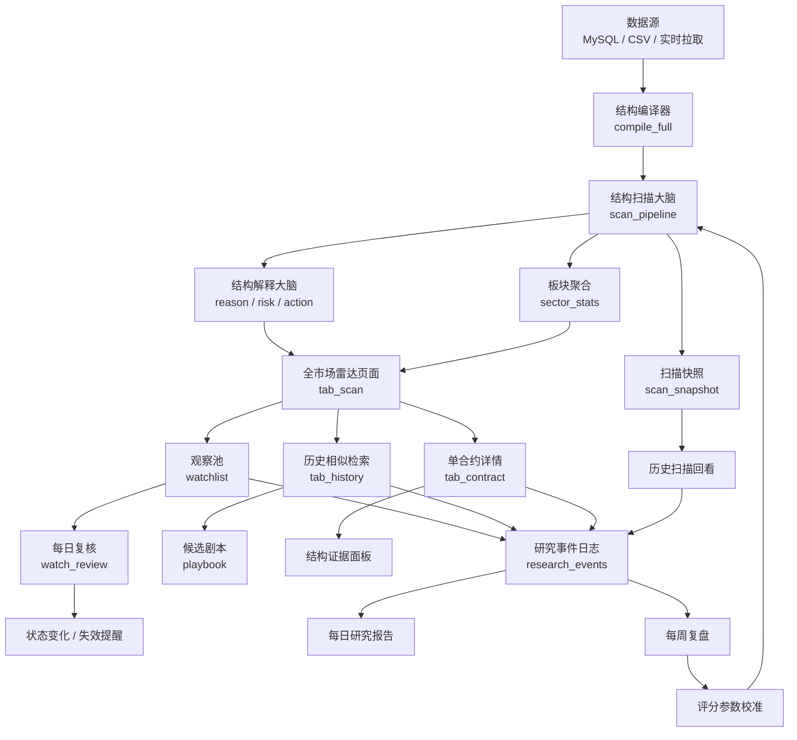

### **你的方案方向是对的，但还不够“产品化”：真正要改的不是再加几个筛选项，而是把全市场扫描做成一个“从发现机会 → 缩小候选 → 查看证据 → 进入历史对照”的工作流。**

我建议把 `tab_scan.py` 从“扫描后展示一张大表”升级成“市场结构雷达”：先有 44 合约全局状态，再按板块、位置、阶段、活跃度快速切片，最后点选某个合约进入详情、历史检索或加入观察池。代码上则要把扫描计算、结构归一化、筛选排序、UI 渲染彻底拆开，否则后面越改越难维护。

你现在这版改动已经比原来好很多了，尤其是 `tab_scan.py` 已经有了成交量驱动扫描、稳态序列、价格位置、运动阶段、通量、质量层和离稳态活跃度等字段；`data_layer.py` 也已经提供了 MySQL 优先、CSV 降级、全品种发现和单品种编译的公共能力。这说明系统的“数据基础”已经具备，问题主要出在页面组织、状态管理、筛选维度和代码分层上。 [GitHub](https://raw.githubusercontent.com/doubc/The_Theory_of_Difference/main/10-%E6%9C%9F%E8%B4%A7%E4%BB%B7%E6%A0%BC%E7%BB%93%E6%9E%84%E6%A3%80%E7%B4%A2%E7%B3%BB%E7%BB%9F/price-structure/src/workbench/tab_scan.py) [GitHub](https://raw.githubusercontent.com/doubc/The_Theory_of_Difference/main/10-%E6%9C%9F%E8%B4%A7%E4%BB%B7%E6%A0%BC%E7%BB%93%E6%9E%84%E6%A3%80%E7%B4%A2%E7%B3%BB%E7%BB%9F/price-structure/src/workbench/data_layer.py)

### **一、先判断你这个方案是不是更好**

是更好的，尤其是你提出的三个问题非常准确：

第一，当前筛选机制确实还不够“研究者友好”。现在 `tab_scan.py` 里已经有方向、运动阶段、质量层、趋势、最低成交量等筛选，也有成交量、现价、通量、质量、离稳态、Zone 价格等排序。但缺少更关键的“价格位置筛选”和“板块筛选”。对期货结构研究来说，“价格在稳态内、边界试探、向上破缺、向下破缺”比单纯的现价高低更重要。你提到“没有按位置排序/筛选”，这是非常核心的 UX 缺口。

第二，合约结构全景没有真正打通。现在页面里虽然叫“合约结构全景”，但它更多是扫描结果表格，而不是一个可以帮助用户理解 44 个合约整体分布的总览。真正的全景应该回答：“今天哪个板块最活跃？哪些合约正在离开稳态？哪些是同板块共振？哪些是孤立异动？哪些只是成交量大但结构不重要？”

第三，页面规划确实还需要从“功能堆叠”改成“决策路径”。现在 `tab_scan.py` 里同一个页面包含全市场扫描、筛选排序、表格、详情展开、跨品种一致性、每日变化、导出、历史扫描回看、当前品种结构展示，信息太多，层级不够清晰。用户打开后不知道先看哪里，也不知道哪些是主信息，哪些是辅助信息。

所以，你的改进方向是对的。但我会建议再进一步：不要只做“筛选 + 分组”，而是做一个“市场结构工作台”。

---

### **二、我建议的更好版本：从“表格仪表盘”升级为“结构雷达”**

你现在的布局是：

```text
筛选条件 + 全局指标卡 + 板块热力图 + 合约列表 + 重点合约详情
```

这个已经不错，但我建议改成更明确的五层：

```text
1. 今日市场状态总览
2. 板块/品种热力分布
3. 机会队列，也就是候选合约列表
4. 选中合约的结构证据面板
5. 行动入口：历史对照 / 合约详情 / 加入观察 / 导出
```

这样用户不是“看一张表”，而是完成一个研究流程。

#### **1. 顶部：今日市场状态总览**

顶部不要放太多控件，应该先告诉用户今天市场结构是什么状态。比如：

```text
活跃合约：44
离稳态高活跃：8
破缺中：5
确认中：3
稳态内：21
板块共振：黑色系偏强 / 化工分歧 / 有色低活跃
```

这里的重点不是罗列数据，而是把全市场压缩成一个“今天先看什么”的入口。

你可以设计几个核心指标：

| 指标 | 含义 |
|---|---|
| 活跃合约数 | 通过成交量阈值且识别到结构的合约数 |
| 高离稳态数 | `departure_score >= 75` 的合约数 |
| 破缺/确认数 | 运动阶段进入关键变化的合约数 |
| 板块共振数 | 同一板块内同方向合约占比超过 60% |
| 高质量结构数 | A/B 层结构数量 |

#### **2. 第二层：板块热力图**

这部分是你当前方案里最值得补的。用户不应该先看 44 行表格，而应该先看到“哪几个板块有结构变化”。

热力图可以按两个维度设计：

```text
横轴：板块
纵轴：指标
颜色：强弱
```

例如：

| 板块 | 活跃合约 | 平均离稳态 | 破缺数 | 确认数 | 方向一致性 |
|---|---:|---:|---:|---:|---:|
| 黑色系 | 8 | 72 | 3 | 2 | 75% |
| 有色系 | 6 | 48 | 1 | 1 | 50% |
| 化工 | 12 | 61 | 2 | 3 | 58% |
| 贵金属 | 2 | 80 | 1 | 0 | 100% |

如果暂时不做 Plotly 热力图，也可以先用 `st.dataframe` + `column_config.ProgressColumn` 或者简单的分组卡片实现。

#### **3. 第三层：机会队列**

这里不是普通“合约列表”，而是“候选队列”。你现在的字段很多，但排序逻辑还偏散。建议新增一个综合排序分数 `priority_score`，默认按它排序：

```python
priority_score = (
    departure_score * 0.35
    + quality_score * 0.25
    + phase_score * 0.20
    + volume_score * 0.10
    + sector_sync_score * 0.10
)
```

这样用户一打开就看到“今天最值得看的前 10 个合约”，而不是自己在一堆字段里试错。

其中：

```python
phase_score:
  confirmation = 100
  breakout = 90
  boundary_test = 75
  forming = 55
  stable = 30

price_position_score:
  break_up / break_down = 100
  test_upper / test_lower = 75
  in_zone = 40
```

你原来用 `departure_score` 是对的，但它还不够。`departure_score` 衡量“离稳态活跃”，但不等于“研究优先级”。一个合约可能离稳态很高，但质量层差、成交量低、板块不共振，就不一定值得排最前。

#### **4. 第四层：选中合约详情，不要每行都 expander**

现在 `tab_scan.py` 里对前 20 个结果逐个生成 `st.expander`。这会让页面非常长，而且用户要一个一个展开。更好的交互是：

```text
左侧：候选合约表
右侧：当前选中合约详情
```

Streamlit 可以用 `st.dataframe(..., selection_mode="single-row", on_select="rerun")` 来做选中行。如果你当前 Streamlit 版本不支持，也可以用 `st.selectbox` 选择合约。

详情面板应该展示：

```text
合约：RB / 螺纹钢
最新价 / 成交量 / 板块 / 质量层
最近 Zone / Zone 宽度 / 价格位置
稳态序列：4300 → 4180 → 4050
运动阶段：确认中
通量：+0.42
离稳态：82
候选剧本
失效条件
按钮：进入历史对照 / 进入合约详情 / 加入观察
```

这样比现在的“表格 + 20 个折叠项”清爽很多。

#### **5. 第五层：观察池**

这是我认为你方案里还缺的一块。

用户体验不好的根本原因之一，是用户每次都要重新扫描、重新筛选、重新判断。你可以加一个“今日观察池”：

```text
加入观察
标记为重点
标记为已看
写一句备注
```

这可以直接复用你已经有的 `activity_log.py`。现在 `tab_scan.py` 已经会把扫描结果保存到活动日志，`tab_contract.py` 也会保存合约检索结果，说明你已经有了记录行为的基础。下一步应该把日志从“后台记录”变成“前台工作流”。 [GitHub](https://raw.githubusercontent.com/doubc/The_Theory_of_Difference/main/10-%E6%9C%9F%E8%B4%A7%E4%BB%B7%E6%A0%BC%E7%BB%93%E6%9E%84%E6%A3%80%E7%B4%A2%E7%B3%BB%E7%BB%9F/price-structure/src/workbench/tab_contract.py)

---

### **三、当前代码里最应该先修的体验问题**

#### **1. 扫描结果会因为控件交互而丢失**

这是 Streamlit 里最常见的问题。你现在的核心渲染逻辑大部分写在：

```python
if run_scan:
    dashboard_data = _build_dashboard_data(...)
    ...
    # 筛选、排序、表格、导出都在这里
```

但 `st.button()` 只在点击那一次 rerun 时返回 `True`。用户点击扫描后，只要改一个筛选框，页面重新运行，`run_scan` 就变成 `False`，扫描结果和筛选面板可能就消失了。

这个问题会直接造成“用户体验不好”。

应该改成：

```python
if run_scan or "dashboard_data" not in st.session_state:
    st.session_state["dashboard_data"] = _build_dashboard_data(
        ALL_SYMBOLS, load_bars, compile_full, sensitivity
    )

dashboard_data = st.session_state.get("dashboard_data", [])
```

更稳一点：

```python
if st.button("🔍 全市场扫描", type="primary", use_container_width=True, key="btn_market_scan"):
    with st.spinner(f"🔍 正在扫描 {len(ALL_SYMBOLS)} 个品种..."):
        st.session_state["dashboard_data"] = _build_dashboard_data(
            ALL_SYMBOLS,
            load_bars,
            compile_full,
            sensitivity,
            min_volume=st.session_state.get("dash_min_vol", 20000),
        )
        st.session_state["dashboard_scan_time"] = datetime.now().isoformat()

dashboard_data = st.session_state.get("dashboard_data", [])

if not dashboard_data:
    st.info("点击「全市场扫描」开始生成市场结构全景")
    return

render_dashboard_controls_and_table(dashboard_data)
```

这是第一优先级，应该先改。

---

#### **2. `tab_scan.py` 里计算、筛选、渲染混在一起**

现在 `_build_dashboard_data()` 已经很长了，里面同时做了：

```text
加载数据
成交量过滤
截取 lookback
编译结构
提取 Zone
判断趋势
判断稳态关系
判断价格位置
判断运动阶段
计算质量
计算离稳态
组装 UI 字段
```

这会导致一个问题：后面你想加“位置筛选”“板块热力图”“活跃度分组”“综合排序”，都会继续往这个函数里塞逻辑，最后很难维护。

建议拆成 4 层：

```text
scanner_service.py
  负责扫描和生成结构摘要

scan_filters.py
  负责筛选、排序、分组、评分

scan_components.py
  负责 Streamlit UI 渲染

tab_scan.py
  只负责组织页面流程
```

结构可以这样：

```text
src/workbench/
  tab_scan.py
  scan_service.py
  scan_filters.py
  scan_components.py
  sector_map.py
```

`tab_scan.py` 最终应该变得很短：

```python
def render(ctx: dict):
    st.markdown("#### 📡 市场结构雷达")

    controls = render_scan_header(ctx)

    if controls.run_scan:
        st.session_state["scan_df"] = run_market_scan(ctx, controls)

    scan_df = st.session_state.get("scan_df")
    if scan_df is None or scan_df.empty:
        render_empty_scan_state()
        return

    filtered_df = apply_scan_filters(scan_df, controls.filters)

    render_market_summary(filtered_df)
    render_sector_heatmap(filtered_df)
    selected = render_opportunity_table(filtered_df)
    render_contract_detail(selected)
    render_scan_history()
```

这样后续功能继续加，也不会把一个文件堆到几千行。

---

#### **3. 表格不要手搓 Markdown**

你现在在 `tab_scan.py` 里手动拼 Markdown 表格：

```python
html_parts.append(...)
st.markdown("".join(html_parts), unsafe_allow_html=True)
```

这个方式有几个问题：

```text
不能真正排序
不能很好筛选
不能固定列
不能点击选择
长字段会撑爆页面
样式不稳定
维护成本高
```

建议直接用 `st.dataframe`，配合 `column_config`：

```python
display_df = pd.DataFrame(table_rows)

st.dataframe(
    display_df,
    use_container_width=True,
    hide_index=True,
    column_config={
        "成交量": st.column_config.NumberColumn("成交量", format="%d"),
        "离稳态": st.column_config.ProgressColumn(
            "离稳态",
            min_value=0,
            max_value=100,
            format="%d",
        ),
        "质量分": st.column_config.ProgressColumn(
            "质量分",
            min_value=0,
            max_value=100,
            format="%d",
        ),
    },
)
```

如果要支持点击选择：

```python
event = st.dataframe(
    display_df,
    use_container_width=True,
    hide_index=True,
    selection_mode="single-row",
    on_select="rerun",
)

selected_rows = event.selection.rows
if selected_rows:
    selected_row = filtered_df.iloc[selected_rows[0]]
    render_contract_detail(selected_row)
```

这一步会明显改善体验。

---

### **四、建议新增的核心字段**

你现在已有字段包括：

```text
symbol
symbol_name
volume
last_price
zones
latest_zone_center
latest_zone_bw
zone_trend
zone_relation
zone_count
price_position
motion
motion_label
flux
direction
tier
score
cycles
is_blind
departure_score
```

建议再补这些标准化字段：

| 字段 | 作用 |
|---|---|
| `sector` | 板块筛选、板块热力图、板块共振 |
| `price_position_code` | 稳态内、上边界、下边界、向上破缺、向下破缺 |
| `phase_code` | breakout、confirmation、forming、stable、breakdown |
| `movement_type` | trend_up、trend_down、oscillation、reversal |
| `activity_bucket` | 高活跃、中活跃、低活跃 |
| `volume_rank_pct` | 成交量分位，而不是绝对成交量 |
| `sector_sync_score` | 板块同向一致性 |
| `priority_score` | 默认综合排序分数 |
| `watch_flag` | 是否加入观察 |
| `note` | 用户备注 |

其中最重要的是 `price_position_code`。现在 `price_position` 是中文字符串，比如：

```text
↑ 破缺上行 +2.3%
↓ 破缺下行 -1.7%
! 试探边界
· 稳态内
```

这对展示友好，但对筛选不友好。建议同时保存一个机器字段：

```python
def classify_price_position(last_price: float, z_center: float, z_bw: float) -> tuple[str, str, float]:
    upper = z_center + z_bw
    lower = z_center - z_bw

    if z_bw <= 0 or z_center <= 0:
        return "unknown", "未知", 0.0

    if last_price > upper:
        distance = (last_price - upper) / z_bw
        pct = (last_price - z_center) / z_center * 100
        return "break_up", f"向上破缺 +{pct:.1f}%", distance

    if last_price < lower:
        distance = (lower - last_price) / z_bw
        pct = (z_center - last_price) / z_center * 100
        return "break_down", f"向下破缺 -{pct:.1f}%", distance

    pos = (last_price - z_center) / z_bw

    if pos >= 0.7:
        return "test_upper", "试探上沿", pos
    if pos <= -0.7:
        return "test_lower", "试探下沿", pos

    return "inside_zone", "稳态内", pos
```

然后筛选可以变得很清楚：

```python
position_filter = st.multiselect(
    "价格位置",
    ["向上破缺", "向下破缺", "试探上沿", "试探下沿", "稳态内"],
    default=[],
)

position_map = {
    "向上破缺": "break_up",
    "向下破缺": "break_down",
    "试探上沿": "test_upper",
    "试探下沿": "test_lower",
    "稳态内": "inside_zone",
}

if position_filter:
    codes = [position_map[x] for x in position_filter]
    filtered = filtered[filtered["price_position_code"].isin(codes)]
```

---

### **五、板块分组不要写死在页面里，应该单独做映射层**

你计划里的板块划分是对的，但建议不要直接写在 `tab_scan.py`。应该新增：

```text
src/workbench/sector_map.py
```

例如：

```python
SECTOR_MAP = {
    "黑色系": ["RB", "HC", "I", "J", "JM", "SF", "SM"],
    "有色系": ["CU", "AL", "ZN", "PB", "NI", "SN", "AO"],
    "化工": ["MA", "TA", "EG", "PP", "L", "V", "RU", "BU", "SA", "UR"],
    "贵金属": ["AU", "AG"],
    "能源": ["SC", "FU", "LU", "PG"],
    "农产品": ["M", "Y", "P", "A", "C", "CS", "JD", "LH"],
    "软商品": ["SR", "CF", "CY"],
    "金融": ["IF", "IH", "IC", "IM", "T", "TF", "TS", "TL"],
}

def normalize_symbol(symbol: str) -> str:
    s = symbol.upper()
    # rb2510 -> RB, cu0 -> CU
    letters = "".join(ch for ch in s if ch.isalpha())
    return letters.upper()

def get_sector(symbol: str) -> str:
    root = normalize_symbol(symbol)
    for sector, roots in SECTOR_MAP.items():
        if root in roots:
            return sector
    return "其他"
```

然后在扫描结果里加：

```python
sector = get_sector(sym)
```

这样你可以在全局筛选、板块热力图、板块一致性里复用。

---

### **六、综合排序建议：不要让用户一上来自己选排序**

你的方案里列了很多排序维度：

```text
成交量
波动率
结构数量
离稳态活跃度
时间
```

这些都应该有，但默认排序应该是一个“研究优先级”分数，而不是成交量。

可以这样写：

```python
def compute_priority_score(r: dict) -> float:
    dep = r.get("departure_score", 0)
    quality = r.get("score", 0)
    volume_score = r.get("volume_score", 50)
    sector_sync = r.get("sector_sync_score", 50)

    phase = r.get("phase_code", "")
    phase_score_map = {
        "confirmation": 100,
        "breakout": 90,
        "breakdown": 80,
        "forming": 55,
        "stable": 35,
    }
    phase_score = phase_score_map.get(phase, 40)

    pos = r.get("price_position_code", "")
    position_score_map = {
        "break_up": 100,
        "break_down": 100,
        "test_upper": 75,
        "test_lower": 75,
        "inside_zone": 35,
    }
    position_score = position_score_map.get(pos, 40)

    blind_penalty = 10 if r.get("is_blind") else 0

    return round(
        dep * 0.30
        + quality * 0.20
        + phase_score * 0.20
        + position_score * 0.15
        + volume_score * 0.10
        + sector_sync * 0.05
        - blind_penalty,
        1,
    )
```

默认排序：

```python
filtered = sorted(filtered, key=lambda x: x.get("priority_score", 0), reverse=True)
```

用户仍然可以切换成：

```text
研究优先级
离稳态
成交量
波动率
质量
结构数
最新更新时间
```

这样体验会比单纯排序维度更好。

---

### **七、波动率字段应该补上，但不一定叫 amplitude**

你方案里提到 `amplitude`，但在扫描里建议计算为近 N 日波动率或振幅：

```python
def calc_recent_amplitude(bars, n: int = 20) -> float:
    recent = bars[-n:]
    if not recent:
        return 0.0

    highs = [b.high for b in recent]
    lows = [b.low for b in recent]
    last_close = recent[-1].close

    if last_close <= 0:
        return 0.0

    return round((max(highs) - min(lows)) / last_close * 100, 2)
```

保存字段：

```python
"amplitude_20d": calc_recent_amplitude(bars_data, 20)
```

展示时叫：

```text
20日振幅
```

比“波动率”更直观，也更符合你当前的数据结构。

---

### **八、把全景扫描结果统一转成 DataFrame，会让后续简单很多**

现在 `_build_dashboard_data()` 返回 `list[dict]`，这没问题。但进入 UI 层后，建议立刻转成 DataFrame：

```python
scan_df = pd.DataFrame(dashboard_data)
```

筛选和分组会更清楚：

```python
def apply_filters(df: pd.DataFrame, filters: dict) -> pd.DataFrame:
    out = df.copy()

    if filters.get("sectors"):
        out = out[out["sector"].isin(filters["sectors"])]

    if filters.get("directions"):
        out = out[out["direction"].isin(filters["directions"])]

    if filters.get("phases"):
        out = out[out["phase_code"].isin(filters["phases"])]

    if filters.get("positions"):
        out = out[out["price_position_code"].isin(filters["positions"])]

    min_volume = filters.get("min_volume", 0)
    if min_volume:
        out = out[out["volume"] >= min_volume]

    min_departure = filters.get("min_departure", 0)
    if min_departure:
        out = out[out["departure_score"] >= min_departure]

    return out
```

板块聚合：

```python
sector_df = (
    scan_df
    .groupby("sector")
    .agg(
        合约数=("symbol", "count"),
        平均离稳态=("departure_score", "mean"),
        平均质量=("score", "mean"),
        破缺数=("phase_code", lambda x: (x == "breakout").sum()),
        确认数=("phase_code", lambda x: (x == "confirmation").sum()),
        偏多数=("direction", lambda x: (x == "up").sum()),
        偏空数=("direction", lambda x: (x == "down").sum()),
        总成交量=("volume", "sum"),
    )
    .reset_index()
)
```

再算方向一致性：

```python
sector_df["方向一致性"] = sector_df.apply(
    lambda r: max(r["偏多数"], r["偏空数"]) / max(r["合约数"], 1) * 100,
    axis=1,
)
```

---

### **九、建议的新页面布局代码骨架**

可以先把 `tab_scan.py` 改成这种结构：

```python
def render(ctx: dict):
    st.markdown("#### 📡 市场结构雷达")
    st.caption("从全市场扫描中识别正在形成、确认、破缺或离开稳态的合约")

    controls = render_scan_controls(ctx)

    if controls["run_scan"]:
        with st.spinner(f"正在扫描 {len(ctx['ALL_SYMBOLS'])} 个品种..."):
            data = _build_dashboard_data(
                ctx["ALL_SYMBOLS"],
                load_bars,
                compile_full,
                controls["sensitivity"],
                min_volume=controls["min_volume"],
            )
            df = pd.DataFrame(data)
            if not df.empty:
                df = enrich_scan_df(df)
            st.session_state["market_scan_df"] = df
            st.session_state["market_scan_time"] = datetime.now()

    scan_df = st.session_state.get("market_scan_df")

    if scan_df is None or scan_df.empty:
        render_scan_empty_state()
        render_history_scan()
        return

    filtered_df = render_filter_panel(scan_df)

    render_global_metrics(filtered_df)
    render_sector_overview(filtered_df)
    selected_row = render_opportunity_table(filtered_df)
    render_selected_contract_panel(selected_row, ctx)
    render_scan_exports(filtered_df)
    render_history_scan()
```

其中：

```python
def enrich_scan_df(df: pd.DataFrame) -> pd.DataFrame:
    df = df.copy()

    df["activity_bucket"] = pd.cut(
        df["departure_score"],
        bins=[-1, 50, 75, 100],
        labels=["低活跃", "中活跃", "高活跃"],
    )

    df["priority_score"] = df.apply(lambda r: compute_priority_score(r.to_dict()), axis=1)

    return df
```

---

### **十、合约详情、历史检索、全景扫描要打通**

你现在的问题是页面之间功能割裂：

```text
tab_scan.py：全市场看机会
tab_contract.py：单合约详情
tab_history.py：历史对照
dashboard.py：结构总览
```

但用户的真实路径是：

```text
我在全市场看到 RB 很活跃
→ 我想点进去看 RB 的结构详情
→ 我想用 RB 当前结构做历史检索
→ 我想把结果保存到今日研究日志
```

所以你应该让 `tab_scan.py` 选中某个合约后，提供三个动作：

```text
查看合约详情
做历史对照
加入观察池
```

实现方式可以先用 `st.session_state`：

```python
if st.button("查看合约详情"):
    st.session_state["selected_symbol"] = selected["symbol"]
    st.session_state["target_tab"] = "contract"

if st.button("历史对照"):
    st.session_state["selected_symbol"] = selected["symbol"]
    st.session_state["target_tab"] = "history"

if st.button("加入观察"):
    add_to_watchlist(selected)
```

如果主 `app.py` 是用 `st.tabs`，不能真正跳 tab，但可以至少把 `selected_symbol` 写入全局状态，让用户切过去时默认就是这个合约。

---

### **十一、你当前代码里还有几个顺手可修的 bug / 隐患**

#### **1. `tab_history.py` 里 `compile_structures` 返回值疑似用反了**

`data_layer.py` 里的函数是：

```python
def compile_structures(...):
    ...
    return result, bars
```

但 `tab_history.py` 里有一段：

```python
_, sym_result = compile_structures(
    sym, sens["min_amp"], sens["min_dur"], sens["min_cycles"]
)
if sym_result:
    all_hist_structures.extend(sym_result.structures)
```

这里 `sym_result` 实际上应该是 `bars`，不是 `result`，所以后面的 `sym_result.structures` 会出错，只是被外层 `try/except` 吃掉了。应该改成：

```python
sym_result, sym_bars = compile_structures(
    sym,
    sens["min_amp"],
    sens["min_dur"],
    sens["min_cycles"],
)

if sym_result:
    all_hist_structures.extend(sym_result.structures)
```

这个会影响“候选剧本 — 历史前半程后续走势”的稳定性。 [GitHub](https://raw.githubusercontent.com/doubc/The_Theory_of_Difference/main/10-%E6%9C%9F%E8%B4%A7%E4%BB%B7%E6%A0%BC%E7%BB%93%E6%9E%84%E6%A3%80%E7%B4%A2%E7%B3%BB%E7%BB%9F/price-structure/src/workbench/tab_history.py)

#### **2. `tab_history.py` 保存检索日志时字段名不一致**

你构造候选项时字段是：

```python
"score": sc,
"move": move,
```

但保存日志时用了：

```python
"similarity": round(c.get("similarity", 0), 4),
"outcome": round(c.get("outcome_move", 0), 4),
```

这会导致日志里相似度和结果可能总是 0。应该改成：

```python
"similarity": round(c["score"].total, 4),
"outcome": round(c.get("move", 0), 4),
```

#### **3. `tab_scan.py` 里的 `signal_score` 还是 placeholder**

现在离稳态评分里：

```python
"signal_score": 0.5,  # placeholder
```

这会让 `departure_score` 的一部分固定为 12.5 分，导致分数解释性不够。建议用质量评分和方向一致性替代：

```python
signal_score = min(max(qa.score, 0), 1)
```

或者：

```python
signal_score = (
    qa.score * 0.7
    + (1.0 if abs(flux_val) > 0.3 else 0.5) * 0.3
)
```

#### **4. “回落 breakdown” 的判断可能无效**

你在筛选中有：

```python
motion_map = {
    "破缺": "breakout",
    "确认": "confirmation",
    "形成": "forming",
    "稳态": "stable",
    "回落": "breakdown",
}
```

但前面的 `shared.py` 里更多使用的是：

```text
→breakout
→confirmation
→inversion
stable
forming
```

如果结构对象里并没有 `breakdown`，那“回落”筛选会永远筛不到。建议统一阶段枚举，不要 UI 一套、模型一套。

---

### **十二、具体迭代顺序：不要一次性大改**

我建议按 4 个小版本推进。

#### **v1：先修体验断点**

这一版目标是“不丢结果、能筛位置、能按综合分排序”。

要改：

```text
1. 扫描结果放入 st.session_state
2. 新增 price_position_code
3. 新增 sector
4. 新增 priority_score
5. 默认按 priority_score 排序
6. 用 st.dataframe 替代手搓 Markdown 表格
```

这版改完，用户体验会立刻提升。

#### **v2：做板块视角**

这一版目标是“用户先看板块，再看合约”。

要改：

```text
1. 新增 sector_map.py
2. 新增板块筛选
3. 新增板块聚合表
4. 新增板块方向一致性
5. 新增板块热力展示
```

暂时不用做复杂图，先用表格和指标卡就可以。

#### **v3：做选中合约详情面板**

这一版目标是“从全景表进入单合约证据”。

要改：

```text
1. 表格支持选中合约
2. 右侧或下方展示选中合约详情
3. 展示稳态序列、价格位置、运动阶段、候选剧本、失效条件
4. 加入「历史对照」「合约详情」「加入观察#### **v3：做选中合约详情面板，打通“扫描 → 证据 → 下一步动作”**

这一版目标是把全景页从“看一堆结果”变成“选择一个合约后，立刻看到为什么它值得关注”。

你现在 `tab_scan.py` 的详情逻辑是：

```python
for i, row in enumerate(table_rows[:20]):
    with st.expander(...):
        ...
```

这种方式的问题是：页面会变长，用户不知道应该展开哪一个，而且每个合约详情都散落在列表里。更好的方式是：

```text
上方：全局概览
中间：合约候选表
下方或右侧：当前选中合约详情
```

如果你的 Streamlit 版本支持 dataframe selection，可以这样做：

```python
event = st.dataframe(
    display_df,
    use_container_width=True,
    hide_index=True,
    selection_mode="single-row",
    on_select="rerun",
)

selected_rows = event.selection.rows

if selected_rows:
    selected_idx = selected_rows[0]
    selected_symbol = display_df.iloc[selected_idx]["symbol"]
    selected = filtered_df[filtered_df["symbol"] == selected_symbol].iloc[0].to_dict()
else:
    selected = filtered_df.iloc[0].to_dict() if not filtered_df.empty else None

if selected:
    render_selected_contract_panel(selected)
```

如果你暂时不想依赖 `st.dataframe` 的选择功能，可以先用 `selectbox`：

```python
options = [
    f"{r['symbol']} · {r['symbol_name']} · {r['motion_label']} · 离稳态{r['departure_score']:.0f}"
    for _, r in filtered_df.iterrows()
]

selected_label = st.selectbox("选择重点合约", options, key="scan_selected_contract")
selected_idx = options.index(selected_label)
selected = filtered_df.iloc[selected_idx].to_dict()

render_selected_contract_panel(selected)
```

详情面板可以这样写：

```python
def render_selected_contract_panel(r: dict):
    st.markdown("---")
    st.markdown(f"#### 🔎 重点合约：{r['symbol']} · {r['symbol_name']}")

    c1, c2, c3, c4, c5 = st.columns(5)

    c1.metric("最新价", f"{r['last_price']:.1f}")
    c2.metric("成交量", f"{r['volume']:,}")
    c3.metric("离稳态", f"{r['departure_score']:.0f}")
    c4.metric("质量", f"{r['tier']}层 {r['score']:.0f}")
    c5.metric("通量", f"{r['flux']:+.3f}")

    left, right = st.columns([1.2, 1])

    with left:
        st.markdown("**结构位置**")
        st.markdown(
            f"""
            - 最近稳态：Zone {r['latest_zone_center']:.0f} ± {r['latest_zone_bw']:.0f}
            - 价格位置：{r['price_position']}
            - 稳态趋势：{r['zone_trend']}
            - 稳态关系：{r['zone_relation']}
            - 运动阶段：{r['motion_label']} / `{r['motion']}`
            """
        )

        zones = r.get("zones", [])
        if zones:
            st.markdown("**稳态序列**")
            zone_text = " → ".join(
                f"{z['center']:.0f}" for z in zones[-5:]
            )
            st.markdown(f"`{zone_text}`")

    with right:
        st.markdown("**研究提示**")
        st.info(build_scan_hint(r))

    a1, a2, a3 = st.columns(3)

    with a1:
        if st.button("📚 用它做历史对照", use_container_width=True, key=f"hist_{r['symbol']}"):
            st.session_state["selected_symbol"] = r["symbol"]
            st.session_state["scan_action"] = "history"

    with a2:
        if st.button("🔎 查看合约详情", use_container_width=True, key=f"contract_{r['symbol']}"):
            st.session_state["selected_symbol"] = r["symbol"]
            st.session_state["scan_action"] = "contract"

    with a3:
        if st.button("⭐ 加入观察池", use_container_width=True, key=f"watch_{r['symbol']}"):
            add_to_watchlist(r)
            st.success(f"已加入观察池：{r['symbol']}")
```

这里的 `build_scan_hint()` 可以先做成规则函数：

```python
def build_scan_hint(r: dict) -> str:
    direction = r.get("direction")
    position = r.get("price_position_code")
    phase = r.get("phase_code")
    flux = r.get("flux", 0)
    dep = r.get("departure_score", 0)
    tier = r.get("tier", "?")

    if phase == "confirmation" and dep >= 75 and tier in ("A", "B"):
        if direction == "up":
            return "高优先级：结构进入确认阶段，离稳态活跃度高，偏多信号较强。重点观察是否能站稳最近 Zone 上沿。"
        if direction == "down":
            return "高优先级：结构进入确认阶段，离稳态活跃度高，偏空信号较强。重点观察是否持续跌离最近 Zone 下沿。"

    if position in ("test_upper", "test_lower"):
        return "边界试探：价格接近稳态边界，适合等待破缺或回落确认。"

    if position in ("break_up", "break_down") and abs(flux) < 0.2:
        return "价格已离开稳态，但通量不强，可能是假破缺或等待确认。"

    if dep < 40:
        return "当前仍偏稳态，结构活跃度不高，适合放入低优先级观察。"

    return "结构已有变化迹象，建议结合历史对照和同板块共振进一步判断。"
```

这一步会让页面从“数据展示”变成“研究助手”。

---

#### **v4：做观察池和每日工作流**

你现在已经有 `activity_log.py`，并且 `tab_scan.py`、`tab_contract.py`、`tab_history.py` 都有自动保存行为。下一步应该把它显性化：让用户知道“我今天看过什么、关注什么、哪些需要复盘”。

观察池可以先简单做，不需要数据库，JSONL 就够。

建议新增文件：

```text
src/workbench/watchlist.py
```

示例：

```python
from __future__ import annotations

import json
from pathlib import Path
from datetime import datetime

WATCHLIST_PATH = Path("data/activity/watchlist.jsonl")


def add_watch_item(item: dict):
    WATCHLIST_PATH.parent.mkdir(parents=True, exist_ok=True)

    record = {
        "created_at": datetime.now().isoformat(),
        "date": datetime.now().strftime("%Y-%m-%d"),
        "symbol": item.get("symbol"),
        "symbol_name": item.get("symbol_name"),
        "sector": item.get("sector"),
        "last_price": item.get("last_price"),
        "volume": item.get("volume"),
        "zone_center": item.get("latest_zone_center"),
        "zone_bw": item.get("latest_zone_bw"),
        "motion": item.get("motion"),
        "motion_label": item.get("motion_label"),
        "direction": item.get("direction"),
        "flux": item.get("flux"),
        "score": item.get("score"),
        "tier": item.get("tier"),
        "departure_score": item.get("departure_score"),
        "price_position": item.get("price_position"),
        "price_position_code": item.get("price_position_code"),
        "note": item.get("note", ""),
        "status": "watching",
    }

    with WATCHLIST_PATH.open("a", encoding="utf-8") as f:
        f.write(json.dumps(record, ensure_ascii=False) + "\n")


def load_watchlist(date: str | None = None) -> list[dict]:
    if not WATCHLIST_PATH.exists():
        return []

    rows = []
    with WATCHLIST_PATH.open("r", encoding="utf-8") as f:
        for line in f:
            if not line.strip():
                continue
            try:
                obj = json.loads(line)
                if date is None or obj.get("date") == date:
                    rows.append(obj)
            except Exception:
                continue

    return rows
```

然后在 `tab_scan.py` 里：

```python
def add_to_watchlist(r: dict):
    from src.workbench.watchlist import add_watch_item
    add_watch_item(r)
```

在全景页底部加一个“今日观察池”：

```python
def render_today_watchlist():
    from src.workbench.watchlist import load_watchlist

    today = datetime.now().strftime("%Y-%m-%d")
    items = load_watchlist(today)

    st.markdown("---")
    st.markdown("#### ⭐ 今日观察池")

    if not items:
        st.caption("暂无观察合约。可以在上方重点合约面板点击「加入观察池」。")
        return

    df = pd.DataFrame(items)

    display_cols = [
        "symbol", "symbol_name", "sector", "motion_label",
        "direction", "price_position", "departure_score",
        "tier", "score", "note",
    ]

    display_cols = [c for c in display_cols if c in df.columns]

    st.dataframe(
        df[display_cols],
        use_container_width=True,
        hide_index=True,
    )
```

这会极大增强“每日研究”的连续性。用户不再只是看扫描结果，而是在构建自己的日内观察清单。

---

### **十三、页面布局我建议最终变成这样**

你原来的布局已经有方向，但我建议调整成下面这种更符合研究流程的版本：

```text
┌──────────────────────────────────────────────────────────────┐
│ 📡 市场结构雷达                                                │
│ 最近扫描时间：2026-04-29 19:33    [重新扫描] [刷新数据]         │
├──────────────────────────────────────────────────────────────┤
│ 今日总览                                                       │
│ 活跃合约 44 | 高离稳态 8 | 破缺 5 | 确认 3 | 板块共振 2         │
├──────────────────────────────────────────────────────────────┤
│ 筛选区                                                         │
│ 板块 | 价格位置 | 运动阶段 | 方向 | 质量层 | 活跃度 | 排序方式   │
├──────────────────────────────────────────────────────────────┤
│ 板块热力图 / 板块状态表                                        │
│ 黑色系 偏多共振 | 化工 分歧 | 有色 稳态内 | 贵金属 高活跃        │
├──────────────────────────────────────────────────────────────┤
│ 机会队列                                                       │
│ 默认按 priority_score 排序                                     │
│ # | 合约 | 板块 | 位置 | 阶段 | 通量 | 离稳态 | 质量 | 成交量     │
├──────────────────────────────────────────────────────────────┤
│ 选中合约证据面板                                                │
│ 稳态序列 | 当前价格位置 | 候选剧本 | 失效条件 | 历史对照入口      │
├──────────────────────────────────────────────────────────────┤
│ 今日观察池 / 历史扫描回看 / 导出                                │
└──────────────────────────────────────────────────────────────┘
```

这里有一个关键点：历史扫描回看和导出不应该放得太靠前。它们是“辅助功能”，不是主决策路径。主路径应该始终是：

```text
全局状态 → 板块 → 候选 → 证据 → 行动
```

---

### **十四、具体可以怎么改 `_build_dashboard_data()`**

你现在 `_build_dashboard_data()` 已经在做很多事情。短期内不用完全重构，可以先在原函数里补字段。

在计算价格位置的地方，把字符串判断改成结构化结果：

```python
price_position_code = "unknown"
price_position_value = 0.0

if last_price > z_upper:
    pct_above = (last_price - z_center) / z_center * 100 if z_center > 0 else 0
    price_position = f"↑ 破缺上行 +{pct_above:.1f}%"
    price_position_code = "break_up"
    price_position_value = (last_price - z_upper) / z_bw if z_bw > 0 else 0

elif last_price < z_lower:
    pct_below = (z_center - last_price) / z_center * 100 if z_center > 0 else 0
    price_position = f"↓ 破缺下行 -{pct_below:.1f}%"
    price_position_code = "break_down"
    price_position_value = (z_lower - last_price) / z_bw if z_bw > 0 else 0

else:
    zone_pos = (last_price - z_center) / z_bw if z_bw > 0 else 0

    if zone_pos >= 0.7:
        price_position = "↑ 试探上沿"
        price_position_code = "test_upper"
    elif zone_pos <= -0.7:
        price_position = "↓ 试探下沿"
        price_position_code = "test_lower"
    else:
        price_position = "· 稳态内"
        price_position_code = "inside_zone"

    price_position_value = zone_pos
```

然后在 `results.append()` 里加：

```python
"price_position_code": price_position_code,
"price_position_value": round(price_position_value, 3),
```

运动阶段也建议加 `phase_code`：

```python
phase_code = "unknown"

if "breakout" in phase_str:
    phase_code = "breakout"
    motion_label = "🔴 破缺"
elif "confirmation" in phase_str:
    phase_code = "confirmation"
    motion_label = "🟢 确认"
elif "forming" in phase_str:
    phase_code = "forming"
    motion_label = "🔵 形成"
elif "stable" in phase_str:
    phase_code = "stable"
    motion_label = "⚪ 稳态"
elif "breakdown" in phase_str:
    phase_code = "breakdown"
    motion_label = "🟠 回落"
else:
    motion_label = "—"
```

再加进结果：

```python
"phase_code": phase_code,
```

板块字段：

```python
from src.workbench.sector_map import get_sector

sector = get_sector(sym)
```

加入：

```python
"sector": sector,
```

振幅字段：

```python
amplitude_20d = calc_recent_amplitude(bars_data, 20)
```

加入：

```python
"amplitude_20d": amplitude_20d,
```

综合优先级：

```python
priority_score = compute_priority_score({
    "departure_score": dep_score,
    "score": qa.score * 100,
    "phase_code": phase_code,
    "price_position_code": price_position_code,
    "volume": latest_vol,
    "is_blind": p.is_blind if p else False,
})
```

加入：

```python
"priority_score": priority_score,
```

这样你不需要一次性大重构，就能把筛选和排序体验做起来。

---

### **十五、筛选控件建议重新设计，不要一排塞 6 个 selectbox**

现在你是：

```python
fc1, fc2, fc3, fc4, fc5, fc6 = st.columns(6)
```

这在宽屏还行，但字段一多就拥挤。建议改成两个层级：

第一层是高频筛选：

```text
板块 / 价格位置 / 运动阶段 / 排序
```

第二层放进 expander：

```text
成交量 / 质量层 / 离稳态阈值 / 方向 / 趋势 / 高压缩
```

代码示例：

```python
def render_scan_filters(scan_df: pd.DataFrame) -> dict:
    st.markdown("#### 🎛️ 筛选与排序")

    c1, c2, c3, c4 = st.columns(4)

    with c1:
        sectors = sorted(scan_df["sector"].dropna().unique().tolist())
        selected_sectors = st.multiselect(
            "板块",
            sectors,
            default=[],
            key="scan_filter_sectors",
        )

    with c2:
        selected_positions = st.multiselect(
            "价格位置",
            ["向上破缺", "向下破缺", "试探上沿", "试探下沿", "稳态内"],
            default=[],
            key="scan_filter_positions",
        )

    with c3:
        selected_phases = st.multiselect(
            "运动阶段",
            ["破缺", "确认", "形成", "稳态", "回落"],
            default=[],
            key="scan_filter_phases",
        )

    with c4:
        sort_by = st.selectbox(
            "排序",
            ["研究优先级", "离稳态", "成交量", "20日振幅", "质量", "通量绝对值", "结构数"],
            key="scan_sort_by",
        )

    with st.expander("更多筛选", expanded=False):
        e1, e2, e3, e4 = st.columns(4)

        with e1:
            directions = st.multiselect(
                "方向",
                ["偏多", "偏空", "不明"],
                default=[],
                key="scan_filter_directions",
            )

        with e2:
            tiers = st.multiselect(
                "质量层",
                ["A", "B", "C", "D"],
                default=[],
                key="scan_filter_tiers",
            )

        with e3:
            min_departure = st.slider(
                "最低离稳态",
                0,
                100,
                0,
                key="scan_min_departure",
            )

        with e4:
            min_volume = st.number_input(
                "最低成交量",
                value=20000,
                step=5000,
                key="scan_filter_min_volume",
            )

        hide_blind = st.checkbox(
            "隐藏高压缩结构",
            value=False,
            key="scan_hide_blind",
        )

    return {
        "sectors": selected_sectors,
        "positions": selected_positions,
        "phases": selected_phases,
        "directions": directions,
        "tiers": tiers,
        "min_departure": min_departure,
        "min_volume": min_volume,
        "hide_blind": hide_blind,
        "sort_by": sort_by,
    }
```

这个体验会明显比“一排 6 个控件”好。

---

### **十六、板块热力图可以先做成“板块状态卡”，比复杂图更有效**

Plotly 热力图当然可以做，但第一版不一定要上复杂图。对研究工作台来说，清楚比炫酷重要。

可以先做板块卡片：

```python
def render_sector_cards(df: pd.DataFrame):
    if df.empty or "sector" not in df.columns:
        return

    st.markdown("#### 🧭 板块状态")

    sector_stats = []
    for sector, g in df.groupby("sector"):
        total = len(g)
        up = (g["direction"] == "up").sum()
        down = (g["direction"] == "down").sum()
        avg_dep = g["departure_score"].mean()
        avg_score = g["score"].mean()
        breakout = (g["phase_code"] == "breakout").sum()
        confirm = (g["phase_code"] == "confirmation").sum()

        if up > down and up >= total * 0.6:
            bias = "偏多共振"
            tone = "success"
        elif down > up and down >= total * 0.6:
            bias = "偏空共振"
            tone = "error"
        else:
            bias = "分歧"
            tone = "warning"

        sector_stats.append({
            "sector": sector,
            "total": total,
            "up": up,
            "down": down,
            "avg_dep": avg_dep,
            "avg_score": avg_score,
            "breakout": breakout,
            "confirm": confirm,
            "bias": bias,
            "tone": tone,
        })

    sector_stats = sorted(sector_stats, key=lambda x: x["avg_dep"], reverse=True)

    cols = st.columns(min(4, max(1, len(sector_stats))))

    for i, s in enumerate(sector_stats):
        with cols[i % len(cols)]:
            text = (
                f"**{s['sector']}**  \n"
                f"{s['bias']} · 合约{s['total']}个  \n"
                f"离稳态 {s['avg_dep']:.0f} · 质量 {s['avg_score']:.0f}  \n"
                f"破缺{s['breakout']} / 确认{s['confirm']} · 📈{s['up']} / 📉{s['down']}"
            )

            if s["tone"] == "success":
                st.success(text)
            elif s["tone"] == "error":
                st.error(text)
            else:
                st.warning(text)
```

这比一个大热力图更直观。后面你想做 Plotly 热力图，再加也不迟。

---

### **十七、再进一步：区分“结构全景”和“机会扫描”**

你现在把两个东西混在一起了：

```text
结构全景：所有合约现在处在什么结构状态
机会扫描：今天哪些合约最值得看
```

这两者不是一回事。

结构全景应该尽量完整，强调覆盖：

```text
44 个合约，每个合约当前状态如何
```

机会扫描应该强调优先级：

```text
今天先看哪 5 个
```

所以我建议页面里明确分成两个子区域：

```python
view_mode = st.radio(
    "视图模式",
    ["机会优先", "全景浏览"],
    horizontal=True,
    key="scan_view_mode",
)
```

如果是“机会优先”：

```text
默认过滤：高活跃 + A/B/C质量 + 破缺/确认/边界试探
默认排序：priority_score
展示：Top 10
```

如果是“全景浏览”：

```text
不过滤或少过滤
默认排序：板块 + 成交量
展示：所有合约
```

代码：

```python
if view_mode == "机会优先":
    base_df = scan_df[
        (scan_df["departure_score"] >= 50)
        | (scan_df["phase_code"].isin(["breakout", "confirmation"]))
        | (scan_df["price_position_code"].isin(["break_up", "break_down", "test_upper", "test_lower"]))
    ].copy()
else:
    base_df = scan_df.copy()
```

这个设计对用户很友好，因为有些时候用户想“找机会”，有些时候只是想“看全市场地图”。

---

### **十八、当前 `dashboard.py` 应该怎么处理**

你现在的 `dashboard.py` 是早期研究工作台入口，功能包括编译参数、结构总览、结构详情、相似检索、研究日志。但从你现在的项目结构看，真正的主界面已经拆到了多个 `tab_*.py`，`dashboard.py` 可能已经变成旧版入口。

建议不要继续在 `dashboard.py` 上加功能。它可以保留为“单品种结构研究实验台”，但不要再承担 44 合约全景职责。

我建议定位如下：

```text
tab_scan.py：今天看什么，全市场雷达
tab_history.py：历史相似案例和候选剧本
tab_contract.py：单合约即时检索和结构详情
dashboard.py：旧版研究工作台或开发调试入口
```

如果要更清楚，可以把 `dashboard.py` 改名或页面标题改成：

```python
st.title("🔬 单品种结构研究实验台")
```

而不是继续叫“价格结构形式系统 — 研究工作台”。否则用户会困惑：到底哪个页面才是主工作台？

---

### **十九、代码重构建议：先抽 `ScanRecord` 数据结构**

为了避免字段名到处乱飞，可以定义一个轻量数据结构。比如新增：

```text
src/workbench/scan_models.py
```

```python
from __future__ import annotations

from dataclasses import dataclass, asdict
from typing import Any


@dataclass
class ScanRecord:
    symbol: str
    symbol_name: str
    sector: str
    volume: int
    last_price: float
    last_date: str

    latest_zone_center: float
    latest_zone_bw: float
    zone_trend: str
    zone_relation: str
    zone_count: int
    zones: list[dict[str, Any]]

    price_position: str
    price_position_code: str
    price_position_value: float

    motion: str
    motion_label: str
    phase_code: str
    movement_type: str
    direction: str
    flux: float

    tier: str
    score: float
    cycles: int
    is_blind: bool

    departure_score: float
    priority_score: float
    amplitude_20d: float

    breakout_date: str = ""

    def to_dict(self) -> dict:
        return asdict(self)
```

然后 `_build_dashboard_data()` 里不要随手 append dict，而是：

```python
record = ScanRecord(
    symbol=sym,
    symbol_name=_symbol_name(sym),
    sector=sector,
    volume=int(latest_vol),
    last_price=round(last_price, 1),
    last_date=last_date,
    latest_zone_center=latest_zone["center"],
    latest_zone_bw=latest_zone["bw"],
    zone_trend=zone_trend,
    zone_relation=zone_relation,
    zone_count=len(zones_info),
    zones=zones_info,
    price_position=price_position,
    price_position_code=price_position_code,
    price_position_value=round(price_position_value, 3),
    motion=phase_str or "—",
    motion_label=motion_label,
    phase_code=phase_code,
    movement_type=movement_type,
    direction=direction,
    flux=flux_val,
    tier=qa.tier.value,
    score=round(qa.score * 100, 1),
    cycles=latest_struct.cycle_count,
    is_blind=p.is_blind if p else False,
    departure_score=round(dep_score, 1),
    priority_score=priority_score,
    amplitude_20d=amplitude_20d,
    breakout_date=breakout_date,
)

results.append(record.to_dict())
```

这样后面字段不会越写越乱，导出 JSON、活动日志、观察池也都可以复用同一个结构。

---

### **二十、性能优化：全市场扫描要避免每次重新编译全部合约**

现在 `_build_dashboard_data()` 每次会对所有合约执行：

```python
bars_data = load_bars_fn(sym)
cr = compile_fn(bars_data, cfg, symbol=sym)
```

44 个合约还可以接受，但如果以后扩到更多品种，或者用户频繁切灵敏度，会慢。

短期建议：

#### **1. 给单合约扫描加缓存**

```python
@st.cache_data(ttl=300, show_spinner=False)
def scan_one_symbol_cached(sym: str, sens_key: str, min_volume: float):
    bars_data = load_bars(sym)
    if not bars_data or len(bars_data) < 30:
        return None

    latest_vol = bars_data[-1].volume
    if latest_vol < min_volume:
        return None

    return build_one_symbol_scan_record(sym, bars_data, sens_key)
```

然后：

```python
def _build_dashboard_data(ALL_SYMBOLS, sens_key: str, min_volume: float = 20000):
    results = []

    for sym in ALL_SYMBOLS:
        rec = scan_one_symbol_cached(sym, sens_key, min_volume)
        if rec:
            results.append(rec)

    results.sort(key=lambda x: x["priority_score"], reverse=True)
    return results
```

#### **2. 把 `min_volume` 的处理分两层**

如果 `min_volume` 参与缓存 key，用户每次改最低成交量都会导致重新扫描。更好的方式是：扫描时用一个较低基础阈值，比如 0 或 5000；UI 筛选时再按用户输入过滤。

```python
dashboard_data = _build_dashboard_data(
    ALL_SYMBOLS,
    load_bars,
    compile_full,
    sensitivity,
    min_volume=0,
)
```

然后 UI：

```python
filtered = filtered[filtered["volume"] >= min_volume]
```

这样用户改最低成交量不会重新编译。

#### **3. 增加扫描时间显示**

用户需要知道数据是不是新鲜的：

```python
scan_time = st.session_state.get("market_scan_time")
if scan_time:
    st.caption(f"最近扫描：{scan_time:%Y-%m-%d %H:%M:%S}")
```

---

### **二十一、可以加一个“扫描进度逐合约反馈”**

你现在用了：

```python
prog = st.progress(0, text=f"准备扫描 {total_syms} 个品种...")
dashboard_data = _build_dashboard_data(...)
prog.progress(1.0, ...)
```

但 `_build_dashboard_data()` 内部没有更新进度，所以用户会看到进度条卡住，然后突然完成。

可以让扫描函数接受回调：

```python
def _build_dashboard_data(
    ALL_SYMBOLS,
    load_bars_fn,
    compile_fn,
    sens_key: str,
    min_volume: float = 20000,
    progress_cb=None,
) -> list[dict]:
    results = []
    total = len(ALL_SYMBOLS)

    for i, sym in enumerate(ALL_SYMBOLS):
        if progress_cb:
            progress_cb(i + 1, total, sym)

        ...
```

调用：

```python
prog = st.progress(0, text="准备扫描...")

def update_progress(i, total, sym):
    prog.progress(
        i / total,
        text=f"[{i}/{total}] 正在扫描 {sym}..."
    )

dashboard_data = _build_dashboard_data(
    ALL_SYMBOLS,
    load_bars,
    compile_full,
    sensitivity,
    min_volume=0,
    progress_cb=update_progress,
)
```

这对用户体验很重要，因为全市场扫描天然会耗时。

---

### **二十二、让“位置筛选”成为第一优先级**

你最开始提到“没有按位置排序/筛选”，这个确实应该放在筛选区最前面。因为位置比方向更原子。

建议价格位置选项分成五类：

```text
向上破缺
向下破缺
试探上沿
试探下沿
稳态内
```

而不是笼统的：

```text
突破 / 回落 / 稳态内
```

原因是“试探上沿”和“向上破缺”是完全不同的状态：

```text
试探上沿：还在 Zone 内，等待选择方向
向上破缺：已经离开 Zone，需要判断真假破缺
```

这两个状态对研究者的动作不同：

```text
试探上沿 → 观察确认
向上破缺 → 查历史案例 / 找失效条件
稳态内 → 降低优先级或做区间策略
```

所以我建议你的 UI 里直接写：

```python
position_filter = st.multiselect(
    "价格位置",
    ["向上破缺", "向下破缺", "试探上沿", "试探下沿", "稳态内"],
    default=[],
)
```

---

### **二十三、不要只按“板块”分组，还要有“状态分组”**

板块分组回答的是：

```text
哪个行业/品类在动？
```

但状态分组回答的是：

```text
今天哪些结构状态最值得看？
```

可以加一个“状态分组视图”：

```python
group_mode = st.radio(
    "分组方式",
    ["不分组", "按板块", "按运动阶段", "按价格位置", "按活跃度"],
    horizontal=True,
)
```

如果按活跃度：

```python
def activity_bucket(score: float) -> str:
    if score >= 75:
        return "高活跃"
    if score >= 50:
        return "中活跃"
    return "低活跃"
```

展示：

```python
if group_mode == "按活跃度":
    for bucket in ["高活跃", "中活跃", "低活跃"]:
        g = filtered_df[filtered_df["activity_bucket"] == bucket]
        if g.empty:
            continue

        with st.expander(f"{bucket} · {len(g)} 个", expanded=(bucket == "高活跃")):
            render_opportunity_table(g)
```

这种分组对“找机会”很好。

---

### **二十四、合约全景表的字段应该减少，详情里再展开**

现在你的表格字段偏多：

```text
品种、成交量、现价、趋势、稳态序列、稳态关系、价格位置、运动阶段、确认日、通量、质量、离稳态
```

这已经接近表格可读性的上限了。建议主表只保留最关键的 9 列：

```text
优先级
合约
板块
位置
阶段
方向
离稳态
质量
成交量
```

稳态序列、稳态关系、确认日、通量、现价等放到详情面板。

主表建议：

```python
table_df = filtered_df.assign(
    合约=filtered_df["symbol"] + " · " + filtered_df["symbol_name"],
    板块=filtered_df["sector"],
    位置=filtered_df["price_position"],
    阶段=filtered_df["motion_label"],
    方向=filtered_df["direction"].map({
        "up": "📈 偏多",
        "down": "📉 偏空",
        "unclear": "➡️ 不明",
    }),
    优先级=filtered_df["priority_score"].round(0),
    离稳态=filtered_df["departure_score"].round(0),
    质量=filtered_df["tier"] + "层 " + filtered_df["score"].round(0).astype(str),
    成交量=filtered_df["volume"],
)

st.dataframe(
    table_df[["优先级", "合约", "板块", "位置", "阶段", "方向", "离稳态", "质量", "成交量"]],
    use_container_width=True,
    hide_index=True,
    column_config={
        "优先级": st.column_config.ProgressColumn("优先级", min_value=0, max_value=100),
        "离稳态": st.column_config.ProgressColumn("离稳态", min_value=0, max_value=100),
        "成交量": st.column_config.NumberColumn("成交量", format="%d"),
    },
)
```

这样用户第一眼更容易抓住重点。

---

### **二十五、导出也应该跟着新字段升级**

你现在的导出已经有 JSON 和 Markdown，这是好习惯。建议导出时加上：

```text
sector
price_position_code
phase_code
priority_score
amplitude_20d
activity_bucket
```

示例：

```python
"results": [{
    "rank": i + 1,
    "symbol": r["symbol"],
    "symbol_name": r["symbol_name"],
    "sector": r.get("sector", "其他"),
    "priority_score": r.get("priority_score", 0),
    "volume": r["volume"],
    "last_price": r["last_price"],
    "amplitude_20d": r.get("amplitude_20d", 0),
    "latest_zone_center": r["latest_zone_center"],
    "latest_zone_bw": r["latest_zone_bw"],
    "zone_trend": r["zone_trend"],
    "zone_relation": r["zone_relation"],
    "price_position": r["price_position"],
    "price_position_code": r.get("price_position_code",### **二十六、导出结果应该区分“原始扫描导出”和“研究结论导出”**

你现在导出 JSON 和 Markdown 是对的，但可以进一步分成两类：

```text
1. 机器可读导出：JSON / CSV
2. 人类可读导出：Markdown / 每日研究简报
```

JSON 应该保留尽可能完整的字段，方便以后回测、复盘、再导入。Markdown 则不应该只是把扫描结果机械列出来，而应该生成一份“今日结构简报”。

比如 Markdown 导出可以变成：

```markdown
# 全市场结构扫描 2026-04-29

灵敏度：标准  
活跃合约：44  
高离稳态：8  
破缺：5  
确认：3  

## 今日最值得关注

### 1. RB 螺纹钢
- 板块：黑色系
- 状态：确认中 / 偏多
- 价格位置：向上破缺 +1.8%
- 最近稳态：Zone 3420 ± 35
- 离稳态：82
- 质量：A层 88分
- 研究提示：结构进入确认阶段，关注能否站稳 Zone 上沿。

### 2. AU 黄金
...
```

代码可以这样封装：

```python
def build_scan_markdown(df: pd.DataFrame, sensitivity: str) -> str:
    today = datetime.now().strftime("%Y-%m-%d")

    n_total = len(df)
    n_high_dep = int((df["departure_score"] >= 75).sum()) if "departure_score" in df else 0
    n_breakout = int((df["phase_code"] == "breakout").sum()) if "phase_code" in df else 0
    n_confirm = int((df["phase_code"] == "confirmation").sum()) if "phase_code" in df else 0

    lines = [
        f"# 全市场结构扫描 {today}",
        "",
        f"灵敏度：{sensitivity}",
        f"活跃合约：{n_total}",
        f"高离稳态：{n_high_dep}",
        f"破缺：{n_breakout}",
        f"确认：{n_confirm}",
        "",
        "## 今日最值得关注",
        "",
    ]

    top_df = df.sort_values("priority_score", ascending=False).head(10)

    for i, r in enumerate(top_df.to_dict("records"), 1):
        lines.extend([
            f"### {i}. {r.get('symbol', '')} {r.get('symbol_name', '')}",
            f"- 板块：{r.get('sector', '其他')}",
            f"- 状态：{r.get('motion_label', '—')} / {format_direction(r.get('direction'))}",
            f"- 价格位置：{r.get('price_position', '—')}",
            f"- 最近稳态：Zone {r.get('latest_zone_center', 0):.0f} ± {r.get('latest_zone_bw', 0):.0f}",
            f"- 离稳态：{r.get('departure_score', 0):.0f}",
            f"- 优先级：{r.get('priority_score', 0):.0f}",
            f"- 质量：{r.get('tier', '?')}层 {r.get('score', 0):.0f}分",
            f"- 通量：{r.get('flux', 0):+.3f}",
            f"- 研究提示：{build_scan_hint(r)}",
            "",
        ])

    return "\n".join(lines)


def format_direction(direction: str) -> str:
    return {
        "up": "偏多",
        "down": "偏空",
        "unclear": "不明",
    }.get(direction, "不明")
```

这样导出的 Markdown 才是真正能复盘、能留档、能做研究日志的东西。

---

### **二十七、建议加“扫描快照版本”，否则历史对比会越来越乱**

你现在有历史扫描回看，这是非常好的方向。但如果以后字段变多，旧扫描记录和新扫描记录字段不一致，历史回看可能会出现各种小问题。

建议每次保存扫描结果时加一个 schema 版本：

```python
SCAN_SCHEMA_VERSION = "2026-04-29.v2"
```

导出和保存时：

```python
scan_export = {
    "schema_version": SCAN_SCHEMA_VERSION,
    "date": _today_key,
    "sensitivity": sensitivity,
    "scan_time": datetime.now().isoformat(),
    "total": len(export_results),
    "results": [...],
}
```

活动日志也一样：

```python
ActivityLog().save_scan(
    scan_for_log,
    sensitivity=sensitivity,
    schema_version=SCAN_SCHEMA_VERSION,
)
```

如果 `ActivityLog.save_scan()` 现在不支持这个参数，可以先在每条记录里加：

```python
"schema_version": SCAN_SCHEMA_VERSION
```

为什么这很重要？因为你这个系统会持续演化。今天你加 `price_position_code`，明天加 `priority_score`，后天加 `sector_sync_score`。如果没有版本，历史记录里哪些字段可信、哪些字段缺失，就不好判断。

---

### **二十八、历史扫描回看应该从“列表回看”升级为“变化追踪”**

你现在的历史回看已经能选择过去日期，查看当天扫描结果，还能和今天对比。这很好，但可以更进一步：重点不是“过去有什么”，而是“状态发生了什么变化”。

用户真正想知道的是：

```text
哪些合约从稳态内变成破缺？
哪些合约从破缺变成确认？
哪些合约离稳态分数快速上升？
哪些合约方向反转？
哪些合约退出高优先级？
```

所以历史对比可以新增一个“变化事件表”。

定义变化事件：

```python
def detect_scan_changes(prev_df: pd.DataFrame, curr_df: pd.DataFrame) -> pd.DataFrame:
    if prev_df.empty or curr_df.empty:
        return pd.DataFrame()

    prev = prev_df.set_index("symbol")
    curr = curr_df.set_index("symbol")

    common_symbols = sorted(set(prev.index) & set(curr.index))
    rows = []

    for sym in common_symbols:
        p = prev.loc[sym]
        c = curr.loc[sym]

        events = []

        if p.get("phase_code") != c.get("phase_code"):
            events.append(f"阶段 {p.get('phase_code', '—')} → {c.get('phase_code', '—')}")

        if p.get("price_position_code") != c.get("price_position_code"):
            events.append(f"位置 {p.get('price_position', '—')} → {c.get('price_position', '—')}")

        if p.get("direction") != c.get("direction"):
            events.append(f"方向 {p.get('direction', '—')} → {c.get('direction', '—')}")

        dep_delta = c.get("departure_score", 0) - p.get("departure_score", 0)
        if abs(dep_delta) >= 15:
            events.append(f"离稳态 {p.get('departure_score', 0):.0f} → {c.get('departure_score', 0):.0f}")

        priority_delta = c.get("priority_score", 0) - p.get("priority_score", 0)
        if abs(priority_delta) >= 15:
            events.append(f"优先级 {p.get('priority_score', 0):.0f} → {c.get('priority_score', 0):.0f}")

        if events:
            rows.append({
                "symbol": sym,
                "symbol_name": c.get("symbol_name", ""),
                "sector": c.get("sector", ""),
                "change": "；".join(events),
                "priority_now": c.get("priority_score", 0),
                "departure_now": c.get("departure_score", 0),
                "phase_now": c.get("motion_label", ""),
                "position_now": c.get("price_position", ""),
            })

    return pd.DataFrame(rows).sort_values("priority_now", ascending=False)
```

在页面上：

```python
change_df = detect_scan_changes(prev_df, curr_df)

if not change_df.empty:
    st.markdown("#### 🔄 状态变化")
    st.dataframe(
        change_df,
        use_container_width=True,
        hide_index=True,
        column_config={
            "priority_now": st.column_config.ProgressColumn("当前优先级", min_value=0, max_value=100),
            "departure_now": st.column_config.ProgressColumn("当前离稳态", min_value=0, max_value=100),
        },
    )
else:
    st.caption("与上一快照相比，暂无显著状态变化。")
```

这个功能会非常实用，因为它能把“扫描”变成“跟踪”。

---

### **二十九、可以做一个“状态跃迁矩阵”**

你的理论体系里已经有“稳态跃迁”“破缺”“确认”“形成”等概念。既然如此，页面上可以专门展示状态跃迁：

```text
stable → forming
forming → breakout
breakout → confirmation
confirmation → stable
breakout → stable
confirmation → reversal
```

这个矩阵会帮助用户理解市场结构的整体演化，而不是只看单个合约。

比如历史对比时生成：

```python
def build_transition_matrix(prev_df: pd.DataFrame, curr_df: pd.DataFrame) -> pd.DataFrame:
    prev = prev_df.set_index("symbol")
    curr = curr_df.set_index("symbol")

    common = sorted(set(prev.index) & set(curr.index))
    rows = []

    for sym in common:
        from_phase = prev.loc[sym].get("phase_code", "unknown")
        to_phase = curr.loc[sym].get("phase_code", "unknown")

        rows.append({
            "from": from_phase,
            "to": to_phase,
            "symbol": sym,
        })

    if not rows:
        return pd.DataFrame()

    raw = pd.DataFrame(rows)

    matrix = (
        raw
        .groupby(["from", "to"])
        .size()
        .reset_index(name="count")
        .sort_values("count", ascending=False)
    )

    return matrix
```

显示：

```python
matrix = build_transition_matrix(prev_df, curr_df)

if not matrix.empty:
    st.markdown("#### 🧬 状态跃迁")
    st.dataframe(matrix, use_container_width=True, hide_index=True)
```

如果以后想更直观，可以用 Sankey 图或者 Mermaid 流程图。但第一版用表格就够。

---

### **三十、可以把“板块共振”从描述升级成可计算指标**

现在你有跨品种一致性分析，但它偏展示型。建议明确计算 `sector_sync_score`，并把它纳入 `priority_score`。

计算逻辑可以这样：

```python
def add_sector_sync_score(df: pd.DataFrame) -> pd.DataFrame:
    if df.empty or "sector" not in df.columns or "direction" not in df.columns:
        df["sector_sync_score"] = 50.0
        return df

    out = df.copy()
    out["sector_sync_score"] = 50.0

    for sector, g in out.groupby("sector"):
        total = len(g)
        if total <= 1:
            out.loc[g.index, "sector_sync_score"] = 50.0
            continue

        up = (g["direction"] == "up").sum()
        down = (g["direction"] == "down").sum()
        unclear = (g["direction"] == "unclear").sum()

        dominant = max(up, down)
        sync_ratio = dominant / total

        if sync_ratio >= 0.8:
            score = 100
        elif sync_ratio >= 0.6:
            score = 75
        elif sync_ratio >= 0.5:
            score = 60
        else:
            score = 40

        # 如果当前合约方向等于板块主方向，加分；否则降分。
        main_dir = "up" if up >= down else "down"

        for idx, row in g.iterrows():
            if row["direction"] == main_dir:
                out.at[idx, "sector_sync_score"] = score
            elif row["direction"] == "unclear":
                out.at[idx, "sector_sync_score"] = max(40, score - 20)
            else:
                out.at[idx, "sector_sync_score"] = max(20, score - 40)

    return out
```

然后 `priority_score` 可以重算：

```python
df = add_sector_sync_score(df)
df["priority_score"] = df.apply(lambda r: compute_priority_score(r.to_dict()), axis=1)
```

这样就实现了一个很重要的产品逻辑：

```text
同样是破缺，板块共振的破缺优先级更高；
同样是确认，孤立确认的优先级略低。
```

---

### **三十一、可以加一个“孤立异动”标签**

板块共振重要，但孤立异动也重要。比如某个合约在整个板块都平静时突然离稳态很高，这可能是品种自身基本面或流动性变化导致的异动。

可以加：

```python
def classify_sector_context(row: dict) -> str:
    dep = row.get("departure_score", 0)
    sync = row.get("sector_sync_score", 50)

    if dep >= 75 and sync >= 75:
        return "板块共振"

    if dep >= 75 and sync <= 45:
        return "孤立异动"

    if dep < 40 and sync >= 75:
        return "板块跟随"

    return "普通"
```

加入字段：

```python
df["sector_context"] = df.apply(lambda r: classify_sector_context(r.to_dict()), axis=1)
```

筛选项增加：

```python
sector_context_filter = st.multiselect(
    "板块语境",
    ["板块共振", "孤立异动", "板块跟随", "普通"],
    default=[],
    key="scan_sector_context_filter",
)
```

这会让你的系统比普通行情软件更有“研究味”。

---

### **三十二、可以做一个“候选理由解释器”**

当你按 `priority_score` 排序时，用户会问：“为什么这个合约排第一？”

所以每个候选都应该有 `reason` 字段。不要只给一个分数，要给一句解释。

```python
def build_priority_reason(r: dict) -> str:
    reasons = []

    dep = r.get("departure_score", 0)
    if dep >= 75:
        reasons.append("离稳态高")
    elif dep >= 50:
        reasons.append("离稳态中等")

    phase = r.get("phase_code")
    if phase == "confirmation":
        reasons.append("进入确认阶段")
    elif phase == "breakout":
        reasons.append("正在破缺")
    elif phase == "forming":
        reasons.append("结构形成中")

    pos = r.get("price_position_code")
    if pos == "break_up":
        reasons.append("价格向上离开稳态")
    elif pos == "break_down":
        reasons.append("价格向下离开稳态")
    elif pos == "test_upper":
        reasons.append("试探上沿")
    elif pos == "test_lower":
        reasons.append("试探下沿")

    tier = r.get("tier")
    if tier in ("A", "B"):
        reasons.append(f"{tier}层质量")

    sync = r.get("sector_sync_score", 50)
    if sync >= 75:
        reasons.append("板块同向")
    elif r.get("sector_context") == "孤立异动":
        reasons.append("孤立异动")

    if r.get("is_blind"):
        reasons.append("高压缩，需谨慎")

    return "、".join(reasons) if reasons else "常规结构观察"
```

加到表里：

```python
df["reason"] = df.apply(lambda r: build_priority_reason(r.to_dict()), axis=1)
```

主表可以增加一列：

```text
入选理由
```

这比纯数字排序更容易让用户信任系统。

---

### **三十三、评分体系要可解释，不要变成黑箱**

你现在已经有质量层、离稳态、通量等概念。后续加 `priority_score` 时，一定要让用户看到分数构成。否则用户会觉得“这个 87 分是怎么来的？”

可以在详情面板里加：

```python
def render_score_breakdown(r: dict):
    st.markdown("**优先级构成**")

    components = pd.DataFrame([
        {"项目": "离稳态", "分数": r.get("departure_score", 0), "权重": "30%"},
        {"项目": "结构质量", "分数": r.get("score", 0), "权重": "20%"},
        {"项目": "运动阶段", "分数": phase_to_score(r.get("phase_code")), "权重": "20%"},
        {"项目": "价格位置", "分数": position_to_score(r.get("price_position_code")), "权重": "15%"},
        {"项目": "成交量", "分数": r.get("volume_score", 50), "权重": "10%"},
        {"项目": "板块共振", "分数": r.get("sector_sync_score", 50), "权重": "5%"},
    ])

    st.dataframe(
        components,
        hide_index=True,
        use_container_width=True,
        column_config={
            "分数": st.column_config.ProgressColumn("分数", min_value=0, max_value=100),
        },
    )
```

辅助函数：

```python
def phase_to_score(phase: str) -> float:
    return {
        "confirmation": 100,
        "breakout": 90,
        "breakdown": 80,
        "forming": 55,
        "stable": 35,
    }.get(phase, 40)


def position_to_score(pos: str) -> float:
    return {
        "break_up": 100,
        "break_down": 100,
        "test_upper": 75,
        "test_lower": 75,
        "inside_zone": 35,
    }.get(pos, 40)
```

这会极大提升系统可信度。

---

### **三十四、质量层和优先级要分开，不要混为一谈**

这是一个很关键的产品判断。

```text
质量层：这个结构本身可靠吗？
优先级：今天它值不值得先看？
```

一个 A 层结构可能很稳定，没有变化，优先级不高。一个 B 层结构可能正在确认，优先级反而很高。一个 C 层结构如果离稳态很强，也可以进入观察，但要提示风险。

所以主表里应该同时展示：

```text
质量：A层 / B层 / C层
优先级：91 / 76 / 54
```

不要把它们合并成一个“综合评分”。你的 `qa.score` 可以继续代表结构质量，`priority_score` 代表研究优先级。

这点非常重要，因为它符合研究流程：

```text
先用优先级找对象，再用质量层判断信号可信度。
```

---

### **三十五、可以加入“风险提示标签”，而不是只显示高压缩**

你现在有 `is_blind`，显示“⚠️ 高压缩”。这是一个风险提示。还可以扩展出几个风险标签：

```text
高压缩
低质量
成交量不足
板块背离
通量弱
位置过远
```

生成函数：

```python
def build_risk_tags(r: dict) -> list[str]:
    tags = []

    if r.get("is_blind"):
        tags.append("高压缩")

    if r.get("tier") in ("C", "D"):
        tags.append("质量偏低")

    if r.get("volume", 0) < 20000:
        tags.append("成交量不足")

    if r.get("sector_sync_score", 50) <= 35 and r.get("departure_score", 0) >= 70:
        tags.append("板块背离")

    if abs(r.get("flux", 0)) < 0.15 and r.get("phase_code") in ("breakout", "confirmation"):
        tags.append("通量偏弱")

    pos = r.get("price_position_value", 0)
    if r.get("price_position_code") in ("break_up", "break_down") and abs(pos) > 2.0:
        tags.append("离稳态过远")

    return tags
```

加入字段：

```python
df["risk_tags"] = df.apply(lambda r: "、".join(build_risk_tags(r.to_dict())), axis=1)
```

详情面板展示：

```python
risk_tags = build_risk_tags(r)
if risk_tags:
    st.warning("风险标签：" + " / ".join(risk_tags))
```

这会让系统更专业，不是单纯“推荐”，而是同时告诉用户为什么要谨慎。

---

### **三十六、可以加“下一步建议动作”**

除了研究提示，还可以给每个合约一个建议动作：

```text
立即历史对照
等待确认
加入观察池
低优先级
谨慎处理
```

函数：

```python
def recommend_next_action(r: dict) -> str:
    dep = r.get("departure_score", 0)
    phase = r.get("phase_code")
    pos = r.get("price_position_code")
    tier = r.get("tier")
    flux = abs(r.get("flux", 0))
    risk_tags = build_risk_tags(r)

    if "高压缩" in risk_tags and tier in ("C", "D"):
        return "谨慎处理"

    if phase == "confirmation" and dep >= 70 and tier in ("A", "B"):
        return "立即历史对照"

    if phase == "breakout" and flux >= 0.25:
        return "等待确认并查历史"

    if pos in ("test_upper", "test_lower"):
        return "加入观察池"

    if dep < 40 and phase == "stable":
        return "低优先级"

    return "继续观察"
```

主表里可以放一列：

```text
建议动作
```

这样用户可以更快行动。

---

### **三十七、UI 上可以用“三选”机制降低认知负担**

全景表有 44 个合约，即使用了筛选，也可能还是太多。你可以在顶部自动给出“今日三选”：

```text
1. 最强确认：优先级最高的 confirmation
2. 最强破缺：优先级最高的 breakout
3. 最强边界试探：优先级最高的 test_upper/test_lower
```

代码：

```python
def pick_today_three(df: pd.DataFrame) -> list[dict]:
    picks = []

    rules = [
        ("最强确认", lambda x: x["phase_code"] == "confirmation"),
        ("最强破缺", lambda x: x["phase_code"] == "breakout"),
        ("边界试探", lambda x: x["price_position_code"].isin(["test_upper", "test_lower"])),
    ]

    used_symbols = set()

    for label, cond in rules:
        sub = df[cond(df)].copy()
        sub = sub[~sub["symbol"].isin(used_symbols)]

        if sub.empty:
            continue

        row = sub.sort_values("priority_score", ascending=False).iloc[0].to_dict()
        row["_pick_label"] = label
        picks.append(row)
        used_symbols.add(row["symbol"])

    if len(picks) < 3:
        rest = df[~df["symbol"].isin(used_symbols)].sort_values("priority_score", ascending=False)
        for _, row in rest.head(3 - len(picks)).iterrows():
            item = row.to_dict()
            item["_pick_label"] = "综合优先"
            picks.append(item)

    return picks
```

展示：

```python
def render_today_three(df: pd.DataFrame):
    picks = pick_today_three(df)

    if not picks:
        return

    st.markdown("#### 🎯 今日三选")

    cols = st.columns(3)

    for col, r in zip(cols, picks):
        with col:
            st.markdown(f"**{r['_pick_label']}**")
            st.metric(
                f"{r['symbol']} · {r['symbol_name']}",
                f"优先级 {r.get('priority_score', 0):.0f}",
                delta=f"离稳态 {r.get('departure_score', 0):.0f}",
            )
            st.caption(
                f"{r.get('sector', '其他')} · {r.get('motion_label', '—')} · "
                f"{r.get('price_position', '—')}"
            )
            st.caption(build_priority_reason(r))
```

这个功能对用户体验提升非常明显，因为它帮用户从 44 个合约里先抓 3 个。

---

### **三十八、可以做“今日三不看”**

这听起来有点反直觉，但很有用。研究系统不只要告诉用户看什么，也要告诉用户什么暂时不用看。

比如：

```text
低成交量
低离稳态
结构质量差
通量弱
稳态内无变化
```

函数：

```python
def pick_low_priority(df: pd.DataFrame) -> pd.DataFrame:
    if df.empty:
        return df

    low = df[
        (df["departure_score"] < 35)
        & (df["phase_code"].isin(["stable", "forming"]))
        & (df["price_position_code"] == "inside_zone")
    ].copy()

    return low.sort_values("priority_score", ascending=True).head(5)
```

展示可以放在 expander 里：

```python
with st.expander("📋 暂时低优先级", expanded=False):
    low_df = pick_low_priority(filtered_df)
    if low_df.empty:
        st.caption("当前没有明显低优先级合约。")
    else:
        st.dataframe(
            low_df[["symbol", "symbol_name", "sector", "phase_code", "departure_score", "priority_score"]],
            use_container_width=True,
            hide_index=True,
        )
```

这样用户不会被所有信息牵着走。

---

### **三十九、可以加“用户偏好记忆”**

如果用户经常只看黑色系、有色系，或者经常选择“机会优先”，系统应该记住这些设置。

Streamlit 里可以用 `st.session_state` 先做短期记忆：

```python
DEFAULT_SCAN_PREFS = {
    "view_mode": "机会优先",
    "sort_by": "研究优先级",
    "min_departure": 0,
    "hide_blind": False,
    "sectors": [],
}


def get_scan_prefs() -> dict:
    if "scan_prefs" not in st.session_state:
        st.session_state["scan_prefs"] = DEFAULT_SCAN_PREFS.copy()
    return st.session_state["scan_prefs"]


def update_scan_pref(key: str, value):
    prefs = get_scan_prefs()
    prefs[key] = value
    st.session_state["scan_prefs"] = prefs
```

以后可以保存到本地 JSON：

```python
data/activity/user_prefs.json
```

但第一版用 session 就够。

---

### **四十、可以加“快速筛选按钮”，比下拉框更快**

对高频筛选，用户不一定想每次都点多选框。可以加几个按钮：

```text
只看破缺
只看确认
只看高离稳态
只看板块共振
只看边界试探
重置筛选
```

实现：

```python
quick_cols = st.columns(6)

if quick_cols[0].button("只看破缺", use_container_width=True):
    st.session_state["scan_filter_phases"] = ["破缺"]

if quick_cols[1].button("只看确认", use_container_width=True):
    st.session_state["scan_filter_phases"] = ["确认"]

if quick_cols[2].button("高离稳态", use_container_width=True):
    st.session_state["scan_min_departure"] = 75

if quick_cols[3].button("边界试探", use_container_width=True):
    st.session_state["scan_filter_positions"] = ["试探上沿", "试探下沿"]

if quick_cols[4].button("板块共振", use_container_width=True):
    st.session_state["scan_sector_context_filter"] = ["板块共振"]

if quick_cols[5].button("重置", use_container_width=True):
    reset_scan_filters()
```

重置函数：

```python
def reset_scan_filters():
    keys = [
        "scan_filter_sectors",
        "scan_filter_positions",
        "scan_filter_phases",
        "scan_filter_directions",
        "scan_filter_tiers",
        "scan_min_departure",
        "scan_filter_min_volume",
        "scan_hide_blind",
        "scan_sector_context_filter",
    ]

    for k in keys:
        if k in st.session_state:
            del st.session_state[k]
```

注意：Streamlit 有时不允许在控件创建后直接改同 key 的 `session_state`，所以按钮最好放在控件渲染之前，或者通过设置一个 `pending_filter_action`，下一轮 rerun 再应用。

---

### **四十一、可以给“价格位置”做一个小型可视化**

价格相对 Zone 的位置，是你的系统核心之一。只用文字描述还不够直观。

可以做一个简单的进度条式位置显示：

```text
下沿 |--------- 当前价 ---------| 上沿
```

在 Streamlit 里可以先用 `st.progress` 表示 Zone 内位置。如果价格在 Zone 内，把位置映射到 0\~100：

```python
def zone_position_progress(r: dict) -> int:
    code = r.get("price_position_code")
    val = r.get("price_position_value", 0)

    if code == "inside_zone":
        # val: -1 到 +1，映射到 0 到 100
        return int((val + 1) / 2 * 100)

    if code == "test_lower":
        return 5

    if code == "test_upper":
        return 95

    if code == "break_down":
        return 0

    if code == "break_up":
        return 100

    return 50
```

详情面板：

```python
st.markdown("**价格相对稳态位置**")
st.progress(zone_position_progress(r), text=r.get("price_position", "—"))
```

如果后续想更漂亮，可以用 Plotly 画一个水平线段，标出 lower、center、upper、last_price。

---

### **四十二、可以在详情面板里直接画“小 K 线 + Zone”**

现在 `tab_scan.py` 在页面底部有当前品种的 K 线图，但全市场扫描里的选中合约详情如果没有图，证据感还是不够。

当用户选中合约后，可以临时加载该合约 bars，画最近 120 根 K 线：

```python
def render_selected_contract_chart(r: dict):
    sym = r.get("symbol")
    if not sym:
        return

    bars_data = load_bars(sym)
    if not bars_data:
        st.caption("暂无 K 线数据")
        return

    fig = make_candlestick(bars_data[-120:], title=f"{sym} · 最近120根K线")

    zc = r.get("latest_zone_center")
    bw = r.get("latest_zone_bw")

    if zc and bw:
        fig.add_hline(
            y=zc,
            line_dash="dot",
            line_color="#4a90d9",
            annotation_text=f"Zone {zc:.0f}",
        )
        fig.add_hrect(
            y0=zc - bw,
            y1=zc + bw,
            fillcolor="#4a90d9",
            opacity=0.08,
            line_width=0,
        )

    st.plotly_chart(fig, use_container_width=True)
```

放在详情面板里：

```python
with st.expander("📈 K线与最近稳态", expanded=True):
    render_selected_contract_chart(r)
```

这个体验会比纯表格好很多。用户不用跳到 `tab_contract.py` 就能先快速验证形态。

---

### **四十三、可以预加载 Top N 图表，避免点击时慢**

如果每次选中合约才 `load_bars(sym)`，会有一点延迟。但这不是第一优先级。可以先只加载选中合约。

如果以后想优化，可以在扫描结束后缓存 Top 10 的 bars：

```python
@st.cache_data(ttl=300, show_spinner=False)
def load_recent_bars_cached(sym: str, n: int = 120):
    bars_data = load_bars(sym)
    return bars_data[-n:] if bars_data else []
```

然后详情图用：

```python
bars_data = load_recent_bars_cached(sym, 120)
```

---

### **四十四、可以把“历史对照入口”做成带参数的**

现在 `tab_history.py` 是基于当前 `selected_symbol`、当前结构来做历史检索。如果从扫描页进入历史对照，最好把这些参数带过去：

```python
st.session_state["selected_symbol"] = r["symbol"]
st.session_state["history_query_zone"] = r["latest_zone_center"]
st.session_state["history_query_phase"] = r["phase_code"]
st.session_state["history_query_position"] = r["price_position_code"]
st.session_state["history_query_from_scan"] = True
```

然后在 `tab_history.py` 里，如果检测到：

```python
if st.session_state.get("history_query_from_scan"):
    target_zone = st.session_state.get("history_query_zone")
```

选择当前结构时优先匹配最接近的 Zone：

```python
def pick_structure_by_zone(structures, target_zone: float):
    if not structures or target_zone is None:
        return 0

    distances = [
        abs(s.zone.price_center - target_zone) if s.zone else float("inf")
        for s in structures
    ]

    return distances.index(min(distances))
```

在 selectbox 里：

```python
default_idx = pick_structure_by_zone(recent_structures, st.session_state.get("history_query_zone"))
sel = st.selectbox("选择当前结构", options, index=default_idx)
```

这样用户从扫描页点“历史对照”，切过去后不需要重新找结构。

---

### **四十五、可以把“合约详情入口”也做成带参数的**

同理，`tab_contract.py` 现在允许预置合约或自由输入。如果从扫描页跳过去，应该默认填入这个合约：

```python
default_contract = st.session_state.get("selected_symbol", "cu0").lower()
```

在自由输入里：

```python
contract_code = st.text_input(
    "合约代码",
    value=default_contract,
    placeholder="输入合约代码，如 cu2507、rb2510、cad、usdcny",
    key="free_contract",
).strip().lower()
```

如果当前是预置合约模式，也可以尝试自动匹配。

不过要注意 Streamlit 控件的 key 如果已经存在，直接改 `value` 不一定生效。更稳的方法是在用户点击扫描页按钮时设置：

```python
st.session_state["free_contract"] = r["symbol"].lower()
st.session_state["contract_mode"] = "✏️ 自由输入"
```

但这个需要确保 `tab_contract.py` 的 key 一致。

---

### **四十六、可以增加“研究备注”并挂到观察池**

观察池如果只有合约，没有人的判断，价值有限。建议加一个备注框：

```python
note = st.text_area(
    "研究备注",
    placeholder="例如：黑色系共振，RB确认中，关注回踩 Zone 上沿是否守住。",
    key=f"watch_note_{r['symbol']}",
    height=80,
)
```

加入观察池时：

```python
item = dict(r)
item["note"] = note
add_watchlist(item)
```

观察池展示时显示备注：

```python
st.dataframe(
    df[["symbol", "symbol_name", "sector", "motion_label", "price_position", "departure_score", "note"]],
    use_container_width=True,
   太好了，那我继续往下讲。前面我们已经把“全市场扫描页”的核心体验讲到了：筛选、排序、板块、观察池、详情面板、历史对照入口、研究备注。接下来可以继续往更深的层面走：**怎么让这个系统从一个 Streamlit 页面，进化成一个真正可长期使用的“研究工作流系统”**。

---

### **四十七、观察池应该有状态流转，而不是只保存一条记录**

刚才说了“加入观察池”，但更进一步，观察池不应该只是收藏夹。它应该是一个小型研究任务流。

一个合约被加入观察池后，应该有状态：

```text
待观察
重点跟踪
已验证
已失效
已归档
```

这样用户每天打开系统，不只是看到“我收藏过哪些合约”，而是看到：

```text
哪些还没看？
哪些需要继续跟踪？
哪些信号已经确认？
哪些已经失效？
哪些可以归档？
```

可以给观察池记录增加字段：

```python
"watch_status": "watching",
"review_status": "pending",
"created_at": datetime.now().isoformat(),
"updated_at": datetime.now().isoformat(),
"resolved_at": "",
"resolution": "",
```

状态建议定义成：

```python
WATCH_STATUS_OPTIONS = {
    "watching": "待观察",
    "tracking": "重点跟踪",
    "confirmed": "已确认",
    "invalidated": "已失效",
    "archived": "已归档",
}
```

展示时可以允许用户改状态：

```python
def render_watchlist_item_editor(item: dict, idx: int):
    st.markdown(f"**{item['symbol']} · {item.get('symbol_name', '')}**")

    status = st.selectbox(
        "观察状态",
        list(WATCH_STATUS_OPTIONS.keys()),
        format_func=lambda x: WATCH_STATUS_OPTIONS[x],
        index=list(WATCH_STATUS_OPTIONS.keys()).index(item.get("watch_status", "watching")),
        key=f"watch_status_{idx}",
    )

    note = st.text_area(
        "备注",
        value=item.get("note", ""),
        key=f"watch_note_edit_{idx}",
        height=80,
    )

    if st.button("保存修改", key=f"save_watch_{idx}"):
        update_watch_item(idx, {
            "watch_status": status,
            "note": note,
            "updated_at": datetime.now().isoformat(),
        })
        st.success("已保存")
```

这件事的价值很大。因为你的系统不是单次查询工具，而是“结构变化研究系统”。只要引入状态流转，用户就能形成稳定的每日工作流。

---

### **四十八、观察池应该支持“今日复核”**

每次用户打开系统时，系统应该自动检查观察池里的合约，看看它们现在的结构状态是否变化。

比如昨天加入观察池时：

```text
RB：试探上沿，离稳态 62，阶段 forming
```

今天重新扫描后：

```text
RB：向上破缺，离稳态 84，阶段 breakout
```

系统应该提示：

```text
RB 状态升级：试探上沿 → 向上破缺，离稳态 62 → 84
```

可以实现一个函数：

```python
def review_watchlist_against_scan(watch_items: list[dict], scan_df: pd.DataFrame) -> pd.DataFrame:
    if not watch_items or scan_df.empty:
        return pd.DataFrame()

    scan_map = {
        row["symbol"]: row
        for row in scan_df.to_dict("records")
    }

    rows = []

    for item in watch_items:
        sym = item.get("symbol")
        if sym not in scan_map:
            rows.append({
                "symbol": sym,
                "symbol_name": item.get("symbol_name", ""),
                "change_type": "未在本次扫描中出现",
                "detail": "可能成交量不足、数据缺失或结构不再显著",
                "priority": "低",
            })
            continue

        curr = scan_map[sym]
        changes = []

        old_phase = item.get("phase_code") or item.get("motion")
        new_phase = curr.get("phase_code") or curr.get("motion")

        if old_phase != new_phase:
            changes.append(f"阶段 {old_phase} → {new_phase}")

        old_pos = item.get("price_position_code")
        new_pos = curr.get("price_position_code")

        if old_pos != new_pos:
            changes.append(f"位置 {item.get('price_position', '—')} → {curr.get('price_position', '—')}")

        old_dep = item.get("departure_score", 0)
        new_dep = curr.get("departure_score", 0)

        if abs(new_dep - old_dep) >= 15:
            changes.append(f"离稳态 {old_dep:.0f} → {new_dep:.0f}")

        old_flux = item.get("flux", 0)
        new_flux = curr.get("flux", 0)

        if abs(new_flux - old_flux) >= 0.25:
            changes.append(f"通量 {old_flux:+.2f} → {new_flux:+.2f}")

        if changes:
            priority = "高" if new_dep >= 75 or new_phase in ("breakout", "confirmation") else "中"
            rows.append({
                "symbol": sym,
                "symbol_name": curr.get("symbol_name", item.get("symbol_name", "")),
                "change_type": "状态变化",
                "detail": "；".join(changes),
                "priority": priority,
                "current_priority_score": curr.get("priority_score", 0),
                "current_departure_score": curr.get("departure_score", 0),
            })

    if not rows:
        return pd.DataFrame()

    return pd.DataFrame(rows).sort_values(
        ["priority", "current_priority_score"],
        ascending=[True, False],
    )
```

在页面里：

```python
def render_watchlist_review(scan_df: pd.DataFrame):
    from src.workbench.watchlist import load_watchlist

    items = load_watchlist()
    review_df = review_watchlist_against_scan(items, scan_df)

    st.markdown("#### 🔁 观察池复核")

    if review_df.empty:
        st.caption("观察池中的合约暂无显著状态变化。")
        return

    st.dataframe(
        review_df,
        use_container_width=True,
        hide_index=True,
        column_config={
            "current_priority_score": st.column_config.ProgressColumn(
                "当前优先级",
                min_value=0,
                max_value=100,
            ),
            "current_departure_score": st.column_config.ProgressColumn(
                "当前离稳态",
                min_value=0,
                max_value=100,
            ),
        },
    )
```

这会让系统非常像一个研究助理：不是只展示数据，而是提醒你“你昨天关心的东西今天变了”。

---

### **四十九、应该有“失效条件自动复核”**

你现在 `shared.py` 里已经有 `struct_invalidation(s)`，可以根据结构类型生成失效条件。这个概念很好，但目前更多是展示型。下一步可以把它结构化。

现在的失效条件是文字：

```text
失效：价格跌回 3400 以下 → 趋势中断
```

建议同时生成机器字段：

```python
{
    "invalidation_type": "below_price",
    "invalidation_price": 3400,
    "invalidation_text": "价格跌回 3400 以下 → 趋势中断"
}
```

例如：

```python
def build_invalidation_rule_from_scan_record(r: dict) -> dict:
    mt = r.get("movement_type")
    zc = r.get("latest_zone_center", 0)
    bw = r.get("latest_zone_bw", 0)

    upper = zc + bw
    lower = zc - bw

    if mt == "trend_up" or r.get("direction") == "up":
        return {
            "type": "below_price",
            "price": lower,
            "text": f"价格跌回 {lower:.0f} 以下，偏多结构失效",
        }

    if mt == "trend_down" or r.get("direction") == "down":
        return {
            "type": "above_price",
            "price": upper,
            "text": f"价格涨回 {upper:.0f} 以上，偏空结构失效",
        }

    if r.get("price_position_code") in ("test_upper", "test_lower", "inside_zone"):
        return {
            "type": "outside_zone",
            "upper": upper,
            "lower": lower,
            "text": f"价格突破 {upper:.0f} 或跌破 {lower:.0f}，震荡结构结束",
        }

    return {
        "type": "none",
        "text": "暂无明确失效条件",
    }
```

复核时：

```python
def check_invalidation(item: dict, curr: dict) -> tuple[bool, str]:
    rule = item.get("invalidation_rule") or {}
    last_price = curr.get("last_price", 0)

    if rule.get("type") == "below_price":
        price = rule.get("price", 0)
        if last_price < price:
            return True, f"当前价 {last_price:.1f} 已跌破失效价 {price:.1f}"

    if rule.get("type") == "above_price":
        price = rule.get("price", 0)
        if last_price > price:
            return True, f"当前价 {last_price:.1f} 已突破失效价 {price:.1f}"

    if rule.get("type") == "outside_zone":
        upper = rule.get("upper", 0)
        lower = rule.get("lower", 0)
        if last_price > upper or last_price < lower:
            return True, f"当前价 {last_price:.1f} 已离开区间 {lower:.1f}~{upper:.1f}"

    return False, ""
```

这样观察池就能自动告诉用户：

```text
AU：观察条件仍有效
RB：偏多结构失效，价格跌回 Zone 下沿
TA：震荡结构结束，进入向上破缺
```

这比单纯保存备注强很多。

---

### **五十、可以建立“研究对象生命周期”**

当你有扫描、观察池、历史对照、失效复核以后，就可以定义一个完整生命周期：

```text
发现 → 入池 → 跟踪 → 验证 → 归档 → 复盘
```

每个阶段对应页面动作：

| 生命周期 | 页面动作 |
|---|---|
| 发现 | 全市场扫描产生候选 |
| 入池 | 用户点击加入观察池 |
| 跟踪 | 每日扫描自动复核 |
| 验证 | 进入历史对照或合约详情 |
| 归档 | 用户标记已确认、已失效或已完成 |
| 复盘 | 每周查看观察池结果统计 |

代码上可以统一事件记录：

```python
def log_research_event(symbol: str, event_type: str, payload: dict):
    path = Path("data/activity/research_events.jsonl")
    path.parent.mkdir(parents=True, exist_ok=True)

    record = {
        "time": datetime.now().isoformat(),
        "date": datetime.now().strftime("%Y-%m-%d"),
        "symbol": symbol,
        "event_type": event_type,
        "payload": payload,
    }

    with path.open("a", encoding="utf-8") as f:
        f.write(json.dumps(record, ensure_ascii=False) + "
")
```

事件类型可以是：

```text
scan_detected
watch_added
watch_updated
history_checked
contract_reviewed
signal_confirmed
signal_invalidated
archived
note_added
```

以后你可以非常容易做复盘统计：

```text
本周加入观察 18 个
进入历史对照 9 个
确认 4 个
失效 3 个
仍在观察 11 个
```

这就是从“页面应用”变成“研究系统”的关键。

---

### **五十一、可以做“每日研究闭环”页面**

你现在有 `daily_report.py`，但可以进一步把它和扫描、观察池、历史对照打通。每天结束时生成一个“研究闭环报告”：

```text
今日扫描了什么？
今日加入观察了什么？
哪些结构发生状态变化？
哪些信号确认？
哪些失效？
明日需要继续看什么？
```

报告结构建议：

```markdown
# 每日结构研究报告 2026-04-29

## 一、市场结构概览
- 活跃合约：44
- 高离稳态：8
- 破缺：5
- 确认：3
- 板块共振：黑色系、贵金属

## 二、今日三选
1. RB：确认中，离稳态 84，黑色系共振
2. AU：向上破缺，离稳态 79，质量 A
3. TA：试探下沿，化工分歧

## 三、观察池变化
- RB：形成 → 破缺
- AU：破缺 → 确认
- MA：离稳态下降，降为低优先级

## 四、已失效结构
- HC：跌回 Zone 内，昨日向上破缺失效

## 五、明日跟踪清单
- RB：关注是否站稳 Zone 上沿
- AU：关注通量是否继续增强
- TA：等待方向选择
```

生成函数：

```python
def build_daily_research_report(
    scan_df: pd.DataFrame,
    watch_review_df: pd.DataFrame,
    watch_items: list[dict],
    sensitivity: str,
) -> str:
    today = datetime.now().strftime("%Y-%m-%d")

    lines = [
        f"# 每日结构研究报告 {today}",
        "",
        f"灵敏度：{sensitivity}",
        "",
        "## 一、市场结构概览",
    ]

    if scan_df.empty:
        lines.append("今日暂无扫描结果。")
        return "
".join(lines)

    n_total = len(scan_df)
    n_high = int((scan_df["departure_score"] >= 75).sum())
    n_breakout = int((scan_df["phase_code"] == "breakout").sum())
    n_confirm = int((scan_df["phase_code"] == "confirmation").sum())

    lines.extend([
        f"- 活跃合约：{n_total}",
        f"- 高离稳态：{n_high}",
        f"- 破缺：{n_breakout}",
        f"- 确认：{n_confirm}",
        "",
        "## 二、今日三选",
    ])

    picks = pick_today_three(scan_df)
    for i, r in enumerate(picks, 1):
        lines.extend([
            f"{i}. **{r['symbol']} {r.get('symbol_name', '')}**",
            f"   - 板块：{r.get('sector', '其他')}",
            f"   - 状态：{r.get('motion_label', '—')} / {r.get('price_position', '—')}",
            f"   - 优先级：{r.get('priority_score', 0):.0f}",
            f"   - 理由：{build_priority_reason(r)}",
        ])

    lines.extend(["", "## 三、观察池变化"])

    if watch_review_df is not None and not watch_review_df.empty:
        for _, row in watch_review_df.iterrows():
            lines.append(
                f"- **{row.get('symbol', '')}**：{row.get('detail', '')}"
            )
    else:
        lines.append("- 观察池暂无显著变化。")

    lines.extend(["", "## 四、明日跟踪清单"])

    active_watch = [
        x for x in watch_items
        if x.get("watch_status") in ("watching", "tracking")
    ]

    if active_watch:
        for item in active_watch[:10]:
            lines.append(
                f"- **{item.get('symbol', '')}**：{item.get('note') or item.get('invalidation_text', '继续观察')}"
            )
    else:
        lines.append("- 暂无待跟踪对象。")

    return "
".join(lines)
```

这样你的系统就能每天沉淀研究记录。

---

### **五十二、每周复盘比每日扫描更有价值**

当你有每日事件和观察池记录后，可以做一个“每周复盘”。

每周复盘不是看行情，而是看系统的有效性：

```text
系统推荐的高优先级对象，后来有多少进入确认？
加入观察池的合约，有多少被验证？
哪些板块最常出现高离稳态？
哪些类型的信号最容易失效？
```

这会帮助你反过来优化评分模型。

可以做几个统计：

```python
def build_weekly_review(events: list[dict]) -> dict:
    total_watch = sum(1 for e in events if e["event_type"] == "watch_added")
    total_confirmed = sum(1 for e in events if e["event_type"] == "signal_confirmed")
    total_invalidated = sum(1 for e in events if e["event_type"] == "signal_invalidated")
    total_history_checked = sum(1 for e in events if e["event_type"] == "history_checked")

    confirm_rate = total_confirmed / total_watch if total_watch else 0
    invalid_rate = total_invalidated / total_watch if total_watch else 0

    return {
        "total_watch": total_watch,
        "total_confirmed": total_confirmed,
        "total_invalidated": total_invalidated,
        "total_history_checked": total_history_checked,
        "confirm_rate": confirm_rate,
        "invalid_rate": invalid_rate,
    }
```

页面展示：

```python
def render_weekly_review():
    events = load_research_events(days=7)
    stats = build_weekly_review(events)

    st.markdown("#### 📆 每周复盘")

    c1, c2, c3, c4 = st.columns(4)
    c1.metric("加入观察", stats["total_watch"])
    c2.metric("已确认", stats["total_confirmed"], f"{stats['confirm_rate']:.0%}")
    c3.metric("已失效", stats["total_invalidated"], f"{stats['invalid_rate']:.0%}")
    c4.metric("历史对照", stats["total_history_checked"])
```

这一步非常关键：系统开始自我反馈。你会知道哪些规则有用，哪些分数设计不好。

---

### **五十三、优先级评分应该逐步从“规则评分”进化为“可校准评分”**

一开始我们用规则：

```python
priority_score = 离稳态 * 0.30 + 质量 * 0.20 + 阶段 * 0.20 + ...
```

这是非常合理的起点。但长期来看，你应该让系统根据复盘结果调参。

比如你发现：

```text
confirmation 阶段后续验证率最高
breakout 假信号较多
test_upper 更适合观察而不是立即检索
高压缩结构失效率高
板块共振确实提高成功率
```

那就应该调整权重。

可以把权重放到配置文件，而不是写死在代码里。

新增：

```text
config/scan_score.yaml
```

内容：

```yaml
priority_weights:
  departure: 0.30
  quality: 0.20
  phase: 0.20
  position: 0.15
  volume: 0.10
  sector_sync: 0.05

phase_scores:
  confirmation: 100
  breakout: 90
  breakdown: 80
  forming: 55
  stable: 35
  unknown: 40

position_scores:
  break_up: 100
  break_down: 100
  test_upper: 75
  test_lower: 75
  inside_zone: 35
  unknown: 40

penalties:
  is_blind: 10
  low_quality: 8
  weak_flux: 5
```

加载：

```python
import yaml
from pathlib import Path

@st.cache_data
def load_scan_score_config():
    path = Path("config/scan_score.yaml")
    if not path.exists():
        return DEFAULT_SCORE_CONFIG

    with path.open("r", encoding="utf-8") as f:
        return yaml.safe_load(f)
```

评分函数：

```python
def compute_priority_score(r: dict, cfg: dict) -> float:
    weights = cfg["priority_weights"]
    phase_scores = cfg["phase_scores"]
    position_scores = cfg["position_scores"]
    penalties = cfg.get("penalties", {})

    dep = r.get("departure_score", 0)
    quality = r.get("score", 0)
    phase_score = phase_scores.get(r.get("phase_code", "unknown"), phase_scores.get("unknown", 40))
    pos_score = position_scores.get(r.get("price_position_code", "unknown"), position_scores.get("unknown", 40))
    volume_score = r.get("volume_score", 50)
    sector_sync = r.get("sector_sync_score", 50)

    score = (
        dep * weights["departure"]
        + quality * weights["quality"]
        + phase_score * weights["phase"]
        + pos_score * weights["position"]
        + volume_score * weights["volume"]
        + sector_sync * weights["sector_sync"]
    )

    if r.get("is_blind"):
        score -= penalties.get("is_blind", 10)

    if r.get("tier") in ("C", "D"):
        score -= penalties.get("low_quality", 8)

    if abs(r.get("flux", 0)) < 0.15 and r.get("phase_code") in ("breakout", "confirmation"):
        score -= penalties.get("weak_flux", 5)

    return round(max(0, min(100, score)), 1)
```

这样你的评分体系会变得可解释、可调整、可复盘。

---

### **五十四、可以做一个“参数调试面板”，但不要给普通用户太多参数**

你现在已经有灵敏度：

```text
粗糙 / 标准 / 精细
```

这是好设计。不要把所有编译参数都暴露给主界面，否则用户会被复杂性淹没。

建议主界面只保留：

```text
灵敏度
最低成交量
视图模式
```

高级参数放进折叠区：

```python
with st.expander("高级扫描参数", expanded=False):
    min_amp = st.slider("最小摆动幅度", 0.005, 0.10, sens["min_amp"], 0.005)
    min_dur = st.slider("最小持续天数", 1, 10, sens["min_dur"])
    min_cycles = st.slider("最小 Cycle 数", 1, 5, sens["min_cycles"])
    lookback_days = st.slider("回看天数", 60, 360, sens.get("lookback_days", 180), step=30)
```

但注意：如果用户调了高级参数，应该清楚提示：

```text
当前使用自定义参数，结果可能与标准扫描不一致。
```

代码：

```python
if custom_params_enabled:
    st.warning("当前使用自定义扫描参数，历史快照和标准扫描可能不可直接比较。")
```

---

### **五十五、扫描结果应该标记“数据新鲜度”**

你的数据来自 MySQL 或 CSV，可能有些合约最后一根数据不是今天。全市场扫描时，如果某个品种数据滞后，但仍被纳入排名，会误导用户。

建议加字段：

```python
days_since_last_bar
freshness_label
freshness_score
```

计算：

```python
def compute_data_freshness(last_date_str: str) -> tuple[int, str, float]:
    try:
        last_date = datetime.strptime(last_date_str, "%Y-%m-%d").date()
    except Exception:
        return 999, "未知", 0.0

    today = datetime.now().date()
    days = (today - last_date).days

    if days <= 1:
        return days, "实时", 100.0
    if days <= 3:
        return days, "较新", 80.0
    if days <= 7:
        return days, "需刷新", 50.0
    return days, "过期", 20.0
```

加入：

```python
days_since_last_bar, freshness_label, freshness_score = compute_data_freshness(last_date)
```

扫描结果：

```python
"days_since_last_bar": days_since_last_bar,
"freshness_label": freshness_label,
"freshness_score": freshness_score,
```

风险标签也加：

```python
if r.get("freshness_score", 100) < 60:
    tags.append("数据需刷新")
```

主表里可以显示：

```text
数据：实时 / 较新 / 需刷新 / 过期
```

这对用户信任很重要。

---

### **五十六、数据源也应该进入结果字段**

`data_layer.py` 现在是 MySQL 优先、CSV 降级，但扫描结果里最好知道每个合约来自哪里。

可以改 `load_bars()`，让它返回更多信息。不过为了不破坏现有函数，可以新增：

```python
def load_bars_with_source(symbol: str, source: str = "auto") -> tuple[list[Bar], str]:
    # 先尝试 MySQL，成功返回 "mysql"
    # 再尝试 CSV，成功返回 "csv"
    ...
```

或者短期内在扫描函数里加简化判断：

```python
bars_data = load_bars_fn(sym)
data_source = "unknown"
```

更好的方式是修改 `data_layer.py`：

```python
@st.cache_data
def load_bars_with_meta(symbol: str, source: str = "auto") -> dict:
    bars = []
    data_source = ""

    if source in ("auto", "mysql"):
        try:
            password = os.getenv("MYSQL_PASSWORD", "")
            loader = MySQLLoader(password=password, db="sina")
            bars = loader.get(symbol=symbol, freq="1d")
            if bars:
                return {
                    "bars": bars,
                    "source": "mysql",
                    "symbol": symbol,
                    "count": len(bars),
                    "last_date": bars[-1].timestamp.strftime("%Y-%m-%d"),
                }
        except Exception:
            pass

    if source in ("auto", "csv"):
        ...
        if path.exists():
            loader = CSVLoader(str(path), symbol=symbol)
            bars = loader.get()
            return {
                "bars": bars,
                "source": "csv",
                "symbol": symbol,
                "count": len(bars),
                "last_date": bars[-1].timestamp.strftime("%Y-%m-%d") if bars else "",
            }

    return {
        "bars": [],
        "source": "none",
        "symbol": symbol,
        "count": 0,
        "last_date": "",
    }
```

扫描结果里加：

```python
"data_source": data_meta["source"],
"data_count": data_meta["count"],
```

这能帮助排查问题：

```text
为什么某个品种没出现？
为什么某个品种数据过期？
是 MySQL 没有，还是 CSV 旧了？
```

---

### **五十七、全市场扫描应该显示“漏扫原因”**

现在如果某个合约没有进入结果，用户不知道原因：

```text
没数据？
成交量不够？
结构识别不到？
编译异常？
被筛选掉了？
```

建议扫描函数除了返回 `results`，也返回 `diagnostics`：

```python
{
    "symbol": "RB",
    "status": "ok",
    "reason": "",
}

{
    "symbol": "XX",
    "status": "skipped",
    "reason": "成交量低于阈值",
}

{
    "symbol": "YY",
    "status": "error",
    "reason": "编译异常: ..."
}
```

扫描函数：

```python
def _build_dashboard_data(...):
    results = []
    diagnostics = []

    for sym in ALL_SYMBOLS:
        try:
            bars_data = load_bars_fn(sym)

            if not bars_data:
                diagnostics.append({
                    "symbol": sym,
                    "status": "skipped",
                    "reason": "无数据",
                })
                continue

            if len(bars_data) < 30:
                diagnostics.append({
                    "symbol": sym,
                    "status": "skipped",
                    "reason": "数据不足30根",
                })
                continue

            latest_vol = bars_data[-1].volume
            if latest_vol < min_volume:
                diagnostics.append({
                    "symbol": sym,
                    "status": "skipped",
                    "reason": f"成交量不足：{latest_vol:.0f}",
                })
                continue

            ...

            if not cr.ranked_structures:
                diagnostics.append({
                    "symbol": sym,
                    "status": "skipped",
                    "reason": "未识别到结构",
                })
                continue

            results.append(record)
            diagnostics.append({
                "symbol": sym,
                "status": "ok",
                "reason": "",
            })

        except Exception as ex:
            diagnostics.append({
                "symbol": sym,
                "status": "error",
                "reason": str(ex),
            })

    return results, diagnostics
```

页面里：

```python
with st.expander("扫描诊断", expanded=False):
    diag_df = pd.DataFrame(st.session_state.get("scan_diagnostics", []))
    if not diag_df.empty:
        st.dataframe(diag_df, use_container_width=True, hide_index=True)
```

这个功能对开发和用户都非常有用。

---

### **五十八、错误不要静默吞掉，至少要进入诊断**

你现在代码里有不少：

```python
except Exception:
    pass
```

这在早期快速开发时可以理解，但后面会让问题很难排查。

比如：

```python
try:
    ActivityLog().save_scan(...)
except Exception:
    pass
```

建议改成：

```python
except Exception as ex:
    st.session_state.setdefault("runtime_warnings", []).append({
        "where": "save_scan",
        "error": str(ex),
        "time": datetime.now().isoformat(),
    })
```

页面底部或诊断区显示：

```python
def render_runtime_warnings():
    warnings = st.session_state.get("runtime_warnings", [])
    if not warnings:
        return

    with st.expander(f"运行警告（{len(warnings)}）", expanded=False):
        st.dataframe(pd.DataFrame(warnings), use_container_width=True, hide_index=True)
```

这样用户不会被错误打断，但开发者能看到问题。

---

### **五十九、建议建立统一的 `ui_formatters.py`**

你现在很多地方都有类似格式化逻辑：

```text
direction → 图标
motion → 标签
tier → 颜色
price_position → 文案
```

这些最好统一，不要散落在 `tab_scan.py`、`tab_history.py`、`tab_contract.py` 里。

新增：

```text
src/workbench/ui_formatters.py
```

内容：

```python
def fmt_direction(direction: str) -> str:
    return {
        "up": "📈 偏多",
        "down": "📉 偏空",
        "unclear": "➡️ 不明",
    }.get(direction, "➡️ 不明")


def fmt_phase(phase_code: str) -> str:
    return {
        "breakout": "🔴 破缺",
        "confirmation": "🟢 确认",
        "forming": "🔵 形成",
        "stable": "⚪ 稳态",
        "breakdown": "🟠 回落",
        "unknown": "—",
    }.get(phase_code, "—")


def fmt_position(code: str) -> str:
    return {
        "break_up": "向上破缺",
        "break_down": "向下破缺",
        "test_upper": "试探上沿",
        "test_lower": "试探下沿",
        "inside_zone": "稳态内",
        "unknown": "未知",
    }.get(code, "未知")


def fmt_volume(v: float) -> str:
    try:
        return f"{int(v):,}"
    except Exception:
        return "—"


def fmt_score(v: float) -> str:
    try:
        return f"{float(v):.0f}"
    except Exception:
        return "—"
```

这样你整个 workbench 的显示语言会统一，后期改文案也只改一处。

---

### **六十、建议建立统一的 `scan_pipeline.py`**

现在 `_build_dashboard_data()` 放在 `tab_scan.py` 里。后续功能越来越多后，建议抽成：

```text
src/workbench/scan_pipeline.py
```

里面分为：

```python
def scan_market(symbols, scan_config) -> ScanResult:
    ...

def scan_one_symbol(symbol, scan_config) -> dict | None:
    ...

def enrich_scan_records(records) -> pd.DataFrame:
    ...

def apply_scan_filters(df, filters) -> pd.DataFrame:
    ...

def build_sector_stats(df) -> pd.DataFrame:
    ...

def detect_scan_changes(prev_df, curr_df) -> pd.DataFrame:
    ...
```

定义结果对象：

```python
from dataclasses import dataclass
import pandas as pd

@dataclass
class MarketScanResult:
    records: list[dict]
    diagnostics: list[dict]
    started_at: str
    finished_at: str
    sensitivity: str

    def to_dataframe(self) -> pd.DataFrame:
        return pd.DataFrame(self.records)
```

这样 `tab_scan.py` 就只负责页面，真正计算逻辑可以单独测试。

---

### **六十一、给扫描逻辑写最小单元测试**

这类项目最容易出现“改一个字段，页面还能跑，但结果悄悄错了”。建议至少给几个纯函数写测试：

```text
classify_price_position
compute_priority_score
build_risk_tags
build_priority_reason
detect_scan_changes
get_sector
```

测试文件：

```text
tests/workbench/test_scan_logic.py
```

示例：

```python
def test_classify_price_position_break_up():
    code, label, value = classify_price_position(
        last_price=112,
        z_center=100,
        z_bw=10,
    )

    assert code == "break_up"
    assert "向上" in label or "破缺" in label
    assert value > 0


def test_classify_price_position_inside_zone():
    code, label, value = classify_price_position(
        last_price=101,
        z_center=100,
        z_bw=10,
    )

    assert code == "inside_zone"
    assert -1 <= value <= 1


def test_priority_score_penalizes_blind():
    base = {
        "departure_score": 80,
        "score": 80,
        "phase_code": "confirmation",
        "price_position_code": "break_up",
        "volume_score": 70,
        "sector_sync_score": 70,
        "is_blind": False,
        "tier": "A",
        "flux": 0.4,
    }

    blind = dict(base)
    blind["is_blind"] = True

    assert compute_priority_score(blind, DEFAULT_SCORE_CONFIG) < compute_priority_score(base, DEFAULT_SCORE_CONFIG)
```

即使你不做完整测试，只测这些核心函数，也能让后面迭代稳很多。

---

### **六十二、扫描配置应该可保存为“预设”**

不同使用场景会需要不同扫描方式：

```text
确实，你这个判断非常准确：它已经不只是“把期货结构结果展示出来”的个人面板，而是在往一个**个人研究流程系统 / 交易辅助决策系统 / 市场结构助理**的方向发展。

更重要的是，这个系统的价值不在于“告诉你买什么卖什么”，而在于它能稳定回答几个研究者每天真正关心的问题：

```text
今天市场哪里在动？
哪些结构刚刚离开稳态？
哪些是板块共振，哪些是孤立异动？
哪些值得进入观察池？
昨天关注的对象今天发生了什么变化？
哪些信号确认了，哪些失效了？
历史上类似结构后来怎么走？
我的判断和系统提示有没有偏差？
长期来看，哪些结构类型最有效？
```

如果它能持续回答这些问题，它就不是一个 dashboard，而是一个真正的**个人结构研究操作系统**。

---

### **六十三、下一步应该明确系统定位：不是交易系统，而是研究决策辅助系统**

这点非常关键。

你现在这个项目千万不要把目标定义成：

```text
自动交易系统
自动下单系统
预测涨跌系统
```

这样会把问题带偏，也会让系统变得很危险、很难验证。

更合适的定位是：

```text
市场结构研究助理
个人交易研究工作台
结构信号扫描与复盘系统
历史相似案例检索系统
每日观察与验证系统
```

它的核心不是“给答案”，而是：

```text
发现结构
组织证据
提示变化
沉淀样本
辅助复盘
降低遗漏
统一研究流程
```

这个定位非常稳，也非常有长期价值。

---

### **六十四、系统可以分成五个大脑**

如果继续升级，我建议把整个系统抽象成五个“大脑”：

```text
扫描大脑
解释大脑
记忆大脑
检索大脑
复盘大脑
```

这五个大脑对应五类能力。

#### **1. 扫描大脑：今天市场发生了什么**

它负责全市场扫描，输出结构化结果：

```text
合约
板块
价格位置
运动阶段
稳态序列
通量
质量层
离稳态
优先级
风险标签
建议动作
```

这就是我们前面一直在改的 `tab_scan.py`，后面可以抽成 `scan_pipeline.py`。

#### **2. 解释大脑：为什么这个合约值得关注**

它负责生成解释：

```text
入选理由
风险标签
候选剧本
失效条件
下一步建议动作
优先级分数构成
```

它不只是把数据展示出来，而是把数据翻译成研究语言。

例如：

```text
RB 当前优先级较高，原因是：离稳态 84，进入确认阶段，价格向上离开最近稳态区间，黑色系内部方向一致性较强，结构质量为 A 层。风险是当前价格已经离开 Zone 较远，需要等待回踩或确认。
```

这就是解释大脑。

#### **3. 记忆大脑：我之前关注过什么**

它负责观察池、研究备注、历史扫描快照、事件日志。

它回答：

```text
我昨天关注了什么？
今天它变了吗？
我当时为什么关注它？
它后来确认还是失效了？
这个结构有没有被我复盘过？
```

没有记忆，系统只是工具。有了记忆，它才像助理。

#### **4. 检索大脑：历史上类似结构后来如何**

它负责 `tab_history.py` 里的历史对照、相似检索、候选剧本。

它回答：

```text
历史上类似结构有多少个？
后续上涨和下跌比例如何？
平均涨跌幅如何？
类似结构通常几天内兑现？
哪些品种出现过相似结构？
这个结构更像哪一类历史剧本？
```

这个部分会让你的系统从“静态扫描”进化到“经验引用”。

#### **5. 复盘大脑：我的系统和判断有没有变好**

它负责周报、月报、样本统计、信号有效性分析。

它回答：

```text
过去一周系统推荐了多少个高优先级结构？
多少进入确认？
多少失效？
哪些板块的信号更有效？
哪些阶段最容易假破缺？
哪些风险标签最常导致失败？
我的观察池命中率如何？
```

这个部分最有长期价值，因为它让系统会“自我修正”。

---

### **六十五、可以设计一个总架构图**

如果用 Mermaid 表示，整个系统可以这样理解：



这个图非常重要，因为它说明系统不是一堆页面，而是闭环：

```text
扫描 → 解释 → 观察 → 验证 → 复盘 → 调参 → 再扫描
```

一旦形成闭环，系统会越来越像你的研究助手。

---

### **六十六、可以把页面重新划分为 7 个核心模块**

你现在有很多 `tab_*.py` 文件，未来可以明确成 7 个核心页面：

```text
1. 今日雷达
2. 观察池
3. 历史对照
4. 合约详情
5. 扫描回看
6. 研究日志
7. 复盘中心
```

每个页面的职责要非常清楚。

| 页面 | 主要问题 | 核心输出 |
|---|---|---|
| 今日雷达 | 今天先看什么 | Top 候选、板块状态、结构全景 |
| 观察池 | 我正在跟踪什么 | 待观察、状态变化、失效提醒 |
| 历史对照 | 类似结构历史如何 | 相似案例、后验统计、候选剧本 |
| 合约详情 | 单个合约证据是否充分 | K 线、Zone、结构不变量、失效条件 |
| 扫描回看 | 昨天/前天发生过什么 | 历史快照、状态跃迁 |
| 研究日志 | 我当时怎么判断 | 备注、导出、事件记录 |
| 复盘中心 | 系统和判断是否有效 | 命中率、失效率、结构类型统计 |

这样用户打开系统时就很清楚：

```text
早盘看今日雷达
盘中看观察池
发现重点进历史对照
收盘写研究日志
周末进复盘中心
```

这就是一个完整的研究日程。

---

### **六十七、可以设计“每日使用流程”**

一个好的系统不只是功能强，还要让用户知道怎么用。你可以把它设计成固定流程。

#### **早盘流程**

```text
1. 点击全市场扫描
2. 查看今日三选
3. 看板块状态
4. 筛选高离稳态 / 破缺 / 确认
5. 把 3 到 8 个合约加入观察池
```

#### **盘中流程**

```text
1. 打开观察池
2. 查看状态变化
3. 对升级为破缺/确认的合约做历史对照
4. 更新备注
5. 标记重点跟踪或等待确认
```

#### **收盘流程**

```text
1. 再跑一次扫描
2. 对比早盘扫描
3. 标记确认 / 失效 / 继续观察
4. 生成每日研究报告
5. 保存观察池和快照
```

#### **周末流程**

```text
1. 打开复盘中心
2. 查看本周观察池结果
3. 查看哪些结构最有效
4. 调整优先级评分参数
5. 沉淀样本库
```

这个流程一旦固化，你的系统就会从“工具”变成“研究习惯”。

---

### **六十八、下一阶段最值得做的不是更多功能，而是“统一数据模型”**

前面讲了很多功能，但真正要落地，最重要的是统一数据模型。

你现在不同页面里字段可能不统一：

```text
motion
motion_label
phase_tendency
phase_code
movement_type
direction
price_position
zone_center
latest_zone_center
zone_bw
latest_zone_bw
score
quality_score
departure_score
```

如果不统一，后面功能越多，bug 越多。

我建议先定义几个核心模型：

```text
ScanRecord
WatchItem
ResearchEvent
HistoryCase
DailyReport
```

#### **ScanRecord**

代表一次扫描中的一个合约结构状态。

```python
@dataclass
class ScanRecord:
    symbol: str
    symbol_name: str
    sector: str

    volume: int
    last_price: float
    last_date: str
    data_source: str
    freshness_label: str

    latest_zone_center: float
    latest_zone_bw: float
    zone_trend: str
    zone_relation: str
    zone_count: int
    zones: list[dict]

    price_position: str
    price_position_code: str
    price_position_value: float

    motion: str
    motion_label: str
    phase_code: str
    movement_type: str
    direction: str
    flux: float

    tier: str
    score: float
    cycles: int
    is_blind: bool

    departure_score: float
    priority_score: float
    sector_sync_score: float
    sector_context: str
    amplitude_20d: float

    reason: str
    risk_tags: list[str]
    next_action: str
```

#### **WatchItem**

代表用户主动关注的对象。

```python
@dataclass
class WatchItem:
    id: str
    created_at: str
    updated_at: str
    symbol: str
    symbol_name: str
    sector: str

    source_scan_time: str
    source_record: dict

    watch_status: str
    note: str

    invalidation_rule: dict
    last_review_at: str
    last_review_result: str
```

#### **ResearchEvent**

代表用户或系统发生的一次研究事件。

```python
@dataclass
class ResearchEvent:
    id: str
    time: str
    date: str
    symbol: str
    event_type: str
    payload: dict
```

一旦这几个模型稳定，后面页面怎么变都不会乱。

---

### **六十九、可以做一个“系统导航首页”**

现在用户可能进入某个 tab，但如果系统变大，最好有一个首页。首页不展示全部细节，只展示今天的工作状态。

首页可以叫：

```text
研究驾驶舱
```

内容：

```text
今日是否已扫描：是/否
最近扫描时间
今日高优先级结构数量
观察池待复核数量
状态变化数量
失效提醒数量
今日研究报告是否生成
一键入口：开始扫描 / 查看观察池 / 生成日报
```

代码上可以做一个 `tab_home.py`：

```python
def render_home(ctx: dict):
    st.markdown("#### 🧭 研究驾驶舱")

    scan_df = st.session_state.get("market_scan_df")
    scan_time = st.session_state.get("market_scan_time")

    watch_items = load_watchlist()
    today_events = load_research_events(days=1)

    c1, c2, c3, c4 = st.columns(4)

    c1.metric("最近扫描", scan_time.strftime("%H:%M") if scan_time else "未扫描")
    c2.metric("高优先级", count_high_priority(scan_df))
    c3.metric("观察池", len(watch_items))
    c4.metric("今日事件", len(today_events))

    if scan_df is None or scan_df.empty:
        st.warning("今日尚未完成全市场扫描。")
    else:
        st.success("今日扫描已完成。")

    render_today_tasks(scan_df, watch_items, today_events)
```

今日任务可以这样：

```python
def render_today_tasks(scan_df, watch_items, events):
    st.markdown("#### ✅ 今日待办")

    tasks = []

    if scan_df is None or scan_df.empty:
        tasks.append(("未完成", "运行全市场扫描"))

    if watch_items:
        tasks.append(("待处理", f"复核观察池 {len(watch_items)} 个对象"))

    high_df = scan_df[scan_df["priority_score"] >= 80] if scan_df is not None and not scan_df.empty else pd.DataFrame()
    if not high_df.empty:
        tasks.append(("重点", f"查看 {len(high_df)} 个高优先级结构"))

    if not any(e.get("event_type") == "daily_report_generated" for e in events):
        tasks.append(("待完成", "生成每日研究报告"))

    for status, text in tasks:
        st.markdown(f"- **{status}**：{text}")
```

这样系统一打开就像一个助理告诉你：

```text
你今天还没扫描；
观察池有 6 个对象需要复核；
有 3 个高优先级结构；
日报还没生成。
```

---

### **七十、可以加入“提醒优先级”，让系统主动告诉你先处理什么**

当观察池和扫描结果变多时，用户还会面临信息过载。可以设计一个提醒队列：

```text
最高优先级：失效提醒、状态确认
高优先级：观察池对象发生阶段跃迁
中优先级：新出现高优先级结构
低优先级：数据过期、低质量结构
```

定义：

```python
def build_alerts(scan_df: pd.DataFrame, watch_review_df: pd.DataFrame) -> list[dict]:
    alerts = []

    if watch_review_df is not None and not watch_review_df.empty:
        for _, row in watch_review_df.iterrows():
            priority = row.get("priority", "中")
            alerts.append({
                "level": "high" if priority == "高" else "medium",
                "title": f"{row.get('symbol')} 状态变化",
                "message": row.get("detail", ""),
                "symbol": row.get("symbol"),
                "action": "查看观察池",
            })

    if scan_df is not None and not scan_df.empty:
        new_high = scan_df[scan_df["priority_score"] >= 85]
        for _, r in new_high.head(5).iterrows():
            alerts.append({
                "level": "medium",
                "title": f"{r['symbol']} 高优先级结构",
                "message": build_priority_reason(r.to_dict()),
                "symbol": r["symbol"],
                "action": "查看结构详情",
            })

    level_order = {"critical": 0, "high": 1, "medium": 2, "low": 3}
    alerts.sort(key=lambda x: level_order.get(x["level"], 9))

    return alerts
```

首页展示：

```python
def render_alerts(alerts: list[dict]):
    st.markdown("#### 🔔 研究提醒")

    if not alerts:
        st.caption("暂无重要提醒。")
        return

    for alert in alerts[:10]:
        level = alert.get("level")

        text = f"**{alert['title']}**  
{alert['message']}"

        if level == "critical":
            st.error(text)
        elif level == "high":
            st.warning(text)
        else:
            st.info(text)
```

这一步会让系统从“用户主动查”变成“系统主动提醒”。

---

### **七十一、可以把“今日三选”升级成“今日任务包”**

“今日三选”是候选合约，但“任务包”更完整。

比如系统自动生成：

```text
今日任务包：
1. 立即历史对照：RB、AU
2. 加入观察池：TA、MA、AG
3. 等待确认：HC、I
4. 暂不处理：低优先级结构 12 个
```

函数：

```python
def build_today_task_pack(df: pd.DataFrame) -> dict:
    if df.empty:
        return {
            "history_now": [],
            "watch": [],
            "wait_confirm": [],
            "ignore": [],
        }

    records = df.to_dict("records")

    history_now = [
        r for r in records
        if recommend_next_action(r) == "立即历史对照"
    ]

    watch = [
        r for r in records
        if recommend_next_action(r) == "加入观察池"
    ]

    wait_confirm = [
        r for r in records
        if recommend_next_action(r) in ("等待确认并查历史", "继续观察")
        and r.get("priority_score", 0) >= 60
    ]

    ignore = [
        r for r in records
        if recommend_next_action(r) == "低优先级"
    ]

    return {
        "history_now": sorted(history_now, key=lambda x: x["priority_score"], reverse=True)[:5],
        "watch": sorted(watch, key=lambda x: x["priority_score"], reverse=True)[:8],
        "wait_confirm": sorted(wait_confirm, key=lambda x: x["priority_score"], reverse=True)[:8],
        "ignore": sorted(ignore, key=lambda x: x["priority_score"])[:10],
    }
```

页面：

```python
def render_today_task_pack(df: pd.DataFrame):
    pack = build_today_task_pack(df)

    st.markdown("#### 📦 今日任务包")

    c1, c2, c3, c4 = st.columns(4)

    c1.metric("立即历史对照", len(pack["history_now"]))
    c2.metric("建议入池", len(pack["watch"]))
    c3.metric("等待确认", len(pack["wait_confirm"]))
    c4.metric("暂不处理", len(pack["ignore"]))

    with st.expander("立即历史对照", expanded=True):
        render_task_records(pack["history_now"])

    with st.expander("建议加入观察池", expanded=False):
        render_task_records(pack["watch"])

    with st.expander("等待确认", expanded=False):
        render_task_records(pack["wait_confirm"])
```

这样系统每天不只是给数据，而是给一组研究任务。

---

### **七十二、需要有“研究纪律”设计**

一个好的交易辅助系统不只是让你发现机会，也要阻止你冲动。

所以可以加入一些纪律提示：

```text
未做历史对照，不建议标记为重点
高压缩结构需要额外确认
低质量结构不能进入高优先级
没有失效条件的观察对象不能入池
观察池超过 10 个时提示减少数量
```

例如：

```python
def validate_watch_item_before_add(r: dict) -> tuple[bool, str]:
    risk_tags = build_risk_tags(r)

    if r.get("priority_score", 0) < 50:
        return False, "优先级低于 50，不建议加入观察池。"

    if r.get("tier") in ("D",):
        return False, "结构质量过低，不建议加入观察池。"

    if "数据需刷新" in risk_tags:
        return False, "数据新鲜度不足，请刷新数据后再加入观察池。"

    if not build_invalidation_rule_from_scan_record(r).get("type"):
        return False, "缺少明确失效条件，暂不建议加入观察池。"

    return True, ""
```

当然，不一定强制阻止，可以提供“仍然加入”：

```python
ok, msg = validate_watch_item_before_add(r)

if not ok:
    st.warning(msg)
    force = st.checkbox("我知道风险，仍然加入", key=f"force_watch_{r['symbol']}")
else:
    force = True

if force and st.button("加入观察池"):
    add_watch_item(r)
```

这会让系统有“纪律感”。

---

### **七十三、可以把“备注”升级成结构化研究记录**

普通备注是自由文本，但长期复盘时不好统计。建议在备注外，再增加几个结构化字段：

```text
关注原因
预期路径
关键验证点
失效条件
计划复核时间
```

加入观察池时：

```python
reason = st.multiselect(
    "关注原因",
    ["高离稳态", "破缺", "确认", "边界试探", "板块共振", "孤立异动", "高质量结构"],
    default=infer_reasons(r),
    key=f"watch_reason_{r['symbol']}",
)

expected_path = st.selectbox(
    "预期路径",
    ["等待确认", "延续突破", "回踩确认", "震荡延续", "可能反转", "不确定"],
    key=f"expected_path_{r['symbol']}",
)

validation_point = st.text_input(
    "关键验证点",
    value=build_default_validation_point(r),
    key=f"validation_point_{r['symbol']}",
)

review_after_days = st.slider(
    "计划复核",
    1,
    10,
    3,
    key=f"review_after_days_{r['symbol']}",
)
```

保存：

```python
item["research_plan"] = {
    "reason": reason,
    "expected_path": expected_path,
    "validation_point": validation_point,
    "review_after_days": review_after_days,
    "created_at": datetime.now().isoformat(),
}
```

这样复盘时你可以统计：

```text
所有“板块共振 + 回踩确认”的观察对象，后来确认率是多少？
所有“孤立异动”的对象，失效率是多少？
```

这就是研究系统的长期价值。

---

### **七十四、可以设计“结构样本沉淀”机制**

你现在已经有 `SampleStore` 和历史检索样本库，这是非常好的基础。下一步可以让观察池对象在完成后自动沉淀为样本。

比如某个观察对象被标记为：

```text
已确认
已失效
```

系统可以问：

```text
是否录入样本库？
标签：确认突破 / 假破缺 / 震荡延续 / 反转失败
结果：后续 5 日、10 日、20 日收益
备注：...
```

流程：

```python
if watch_status in ("confirmed", "invalidated"):
    if st.button("沉淀为样本"):
        save_watch_item_as_sample(item)
```

函数：

```python
def save_watch_item_as_sample(item: dict):
    from src.sample.store import SampleStore

    store = SampleStore("data/samples/library.jsonl")

    label_type = item.get("resolution_label", "watch_result")
    typicality = item.get("source_record", {}).get("priority_score", 0) / 100

    # 这里需要重新加载结构对象，或者保存结构快照。
    # 短期可以先保存元信息，长期再保存完整 Structure。
```

这里会遇到一个关键问题：`SampleStore` 可能需要真实的 `Structure` 对象，而观察池里保存的是 dict 快照。长期最稳的做法是保存：

```text
symbol
scan_time
zone_center
t_start
t_end
structure_id 或 structure_signature
```

需要时重新编译并匹配结构。

---

### **七十五、可以给结构生成“指纹”**

为了把扫描记录、观察池、历史对照、样本库打通，你需要一个结构指纹。否则同一个合约同一个 Zone 在不同页面里很难确定是不是同一个结构。

可以生成：

```python
def build_structure_signature(symbol: str, s) -> str:
    t_start = s.t_start.strftime("%Y%m%d") if s.t_start else "na"
    t_end = s.t_end.strftime("%Y%m%d") if s.t_end else "na"
    zone = f"{s.zone.price_center:.0f}" if s.zone else "na"
    cycles = s.cycle_count

    return f"{symbol.upper()}_{zone}_{t_start}_{t_end}_{cycles}"
```

扫描记录里加：

```python
"structure_signature": build_structure_signature(sym, latest_struct)
```

观察池保存：

```python
"structure_signature": r.get("structure_signature")
```

历史对照保存：

```python
"query_signature": query_st_signature
```

这样以后你能追踪：

```text
这个结构第一次被扫描到是什么时候？
什么时候加入观察池？
什么时候做过历史对照？
最后结果是什么？
```

这就是完整研究链路。

---

### **七十六、可以做“结构时间线”**

有了结构指纹和事件日志，就可以给每个合约或结构画时间线：

```text
2026-04-25 发现：形成中，离稳态 48
2026-04-26 状态变化：试探上沿，离稳态 62
2026-04-27 加入观察池
2026-04-28 破缺，离稳态 81
2026-04-28 做历史对照，历史偏多 63%
2026-04-29 确认，标记重点跟踪
2026-05-02 失效 / 确认完成 / 归档
```

页面函数：

```python
def render_structure_timeline(signature: str):
    events = load_research_events_by_signature(signature)

    if not events:
        st.caption("暂无结构事件。")
        return

    st.markdown("#### 🧵 结构时间线")

    for e in sorted(events, key=lambda x: x["time"]):
        time_text = e["time"][:16].replace("T", " ")
        event_type = e["event_type"]
        payload = e.get("payload", {})

        st.markdown(
            f"**{time_text}** · `{event_type}`  
"
            f"{payload.get('summary', '')}"
        )
```

这会非常高级，也非常适合复盘。

---

### **七十七、可以做“合约画像”**

当系统积累数据后，每个合约都可以有画像：

```text
RB：
- 常出现结构阶段：breakout / confirmation
- 平均离稳态：62
- 高优先级出现频率：每周 2.3 次
- 历史观察确认率：58%
- 常见板块共振：黑色系
- 最容易失效的条件：高压缩 + 通量弱
```

这不是行情画像，而是你的系统内部研究画像。

函数方向：

```python
def build_symbol_profile(symbol: str, events: list[dict], scan_snapshots: list[dict]) -> dict:
    ...
```

页面展示：

```text
合约画像
结构频率
历史有效性
常见风险
典型剧本
```

这可以放在 `tab_contract.py` 里作为“研究画像”区块。

---

### **七十八、可以做“板块画像”**

同理，板块也可以有画像：

```text
黑色系：
- 本周高离稳态次数最多
- 当前方向一致性 75%
- RB、HC、I 同向偏多，JM 分歧
- 最近三天从形成 → 破缺 的合约数量增加
```

这会比单个合约更有宏观结构感。

板块画像可以放在今日雷达的板块热力图下面。

---

### **七十九、现在最推荐的落地顺序**

虽然我们讲了很多，但你真正动手时不要一口吃掉。最推荐的顺序是：

```text
第一步：session_state 保存扫描结果，避免筛选丢失
第二步：补 price_position_code / phase_code / sector / priority_score
第三步：主表改成 st.dataframe，减少手搓 Markdown
第四步：新增详情面板 + 选中合约
第五步：新增观察池 watchlist.jsonl
第六步：新增观察池复核
第七步：新增每日研究报告
第八步：抽 scan_pipeline.py 和 scan_models.py
第九步：新增事件日志 research_events.jsonl
第十步：做复盘中心
```

这里面最立竿见影的是前五步。

如果只做一天，我建议做：

```text
1. 扫描结果持久化到 session_state
2. 增加价格位置筛选
3. 增加板块筛选
4. 默认按 priority_score 排序
5. 增加选中合约详情面板
```

这五个改完，用户体验会马上不一样。

---

### **八十、最终它会变成什么样**

最终你的系统不是这样的：

```text
我打开一个页面，看一张表。
```

而是这样的：

```text
我打开研究驾驶舱。
系统告诉我今天是否已经扫描。
它提示我有 3 个高优先级结构、2 个观察池对象发生状态变化。
我点今日雷达，看板块共振和今日三选。
我把两个对象加入观察池。
系统自动生成失效条件和复核计划。
我对其中一个做历史对照，看到类似结构历史偏多但波动较大。
我写下备注。
收盘后系统提示一个结构确认、一个结构失效。
我生成每日研究报告。
周末复盘发现“确认阶段 + 板块共振 + A/B质量”的有效性最高，于是调整评分权重。
下周系统按新的权重继续扫描。
```

这就是一个真正的个人交易研究助理。

它不替你做决定，但它能帮你：

```text
少遗漏
少冲动
少重复劳动
多留痕
多复盘
多验证
多沉淀
```

这才是长期最强的地方。