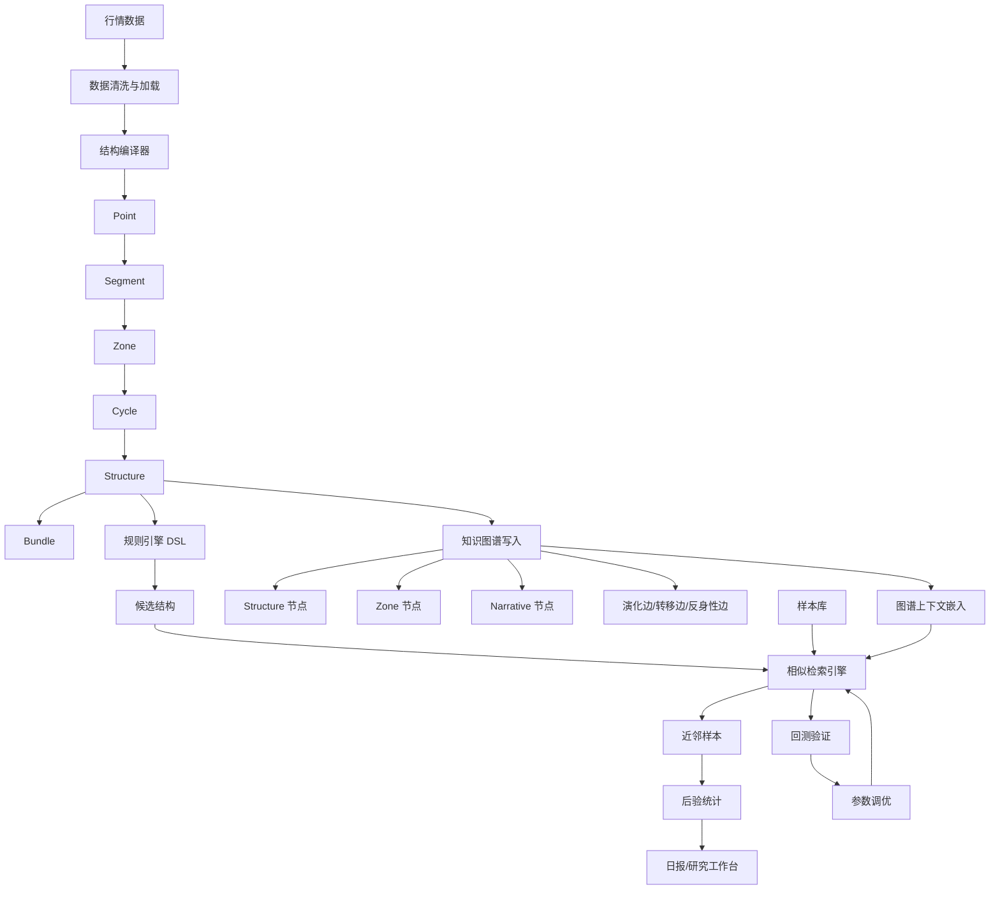

### **建议把系统从“脚本驱动”升级为“领域对象 + 服务编排 + 可回测研究平台”：编译器保持纯净，检索和图谱作为增强层，所有参数、样本、指标、报告都走统一配置和统一流水线。**

你现在的系统已经有很好的雏形：对象模型、结构编译、规则扫描、样本沉淀、相似检索、知识图谱、日更报告都已经存在。下一步最重要的不是继续堆功能，而是把“研究原型”整理成一个稳定的结构化系统，重点解决模型字段不一致、流水线耦合、配置硬编码、时间泄漏、测试不足、图谱与检索解释不足这几个问题。

---

### **一、我对整体结构的核心建议**

#### **1. 把系统分成 7 个稳定层**

你现在的项目已经自然形成了 7 层，只是代码边界还可以更清晰。

```text
数据层
→ 结构编译层
→ 规则与标签层
→ 样本库层
→ 检索与后验层
→ 知识图谱层
→ 研究工作台与报告层
```

每一层都应该有明确输入、明确输出，尽量不要跨层调用。例如，编译器只负责从行情生成 `Structure`，不应该知道样本库、图谱、日报；检索引擎可以使用样本库和图谱，但不应该反向修改编译器；日报只消费结果，不应该重新做核心计算。

---

#### **2. 先统一对象模型，否则后面会频繁出运行时错误**

这是当前代码里最需要优先处理的问题。

你现有 `models.py` 中的 `Structure` 字段包括：

```python
zone
cycles
phases
invariants
typicality
label
symbol
t_start
t_end
```

但 `graph/__init__.py`、`graph/store.py`、`retrieval/engine.py` 里已经在访问一些扩展字段，例如：

```python
st.narrative_context
st.motion
st.projection
st.stability_verdict
st.liquidity_stress
st.fear_index
st.time_compression
st.zone.context_contrast
```

如果这些字段没有统一进入 `models.py`，系统会出现大量 `AttributeError`。所以建议你先做一个“模型对齐版本”，把 V1.6、V2.5、V3.1 新增字段正式放进对象模型，而不是让不同模块各自假设字段存在。

推荐修改 `src/models.py`，至少加入以下可选字段：

```python
@dataclass
class Zone:
    """关键区 — 价格聚集或反复试探的区间"""
    price_center: float
    bandwidth: float
    source: ZoneSource = ZoneSource.PIVOT
    strength: float = 0.0
    touches: list[Point] = field(default_factory=list)

    # 新增：上下文反差类型，供检索过滤和图谱使用
    context_contrast: str = "unknown"
```

```python
@dataclass
class Structure:
    """结构 — 围绕一个区组织的多个 Cycle 的集合"""
    zone: Zone
    cycles: list[Cycle] = field(default_factory=list)
    phases: list[Phase] = field(default_factory=list)
    invariants: dict = field(default_factory=dict)
    typicality: float = 0.0
    label: Optional[str] = None
    symbol: Optional[str] = None
    t_start: Optional[datetime] = None
    t_end: Optional[datetime] = None

    # 新增：叙事、运动、投影、稳定性等扩展上下文
    narrative_context: str = ""
    motion: Optional[object] = None
    projection: Optional[object] = None
    stability_verdict: Optional[object] = None

    # 新增：风险/状态压缩类派生指标
    liquidity_stress: float = 0.0
    fear_index: float = 0.0
    time_compression: float = 0.0
```

更好的方式是进一步定义正式类型，而不是全用 `object`。但在当前阶段，为了先让系统跑通，可以先用兼容字段。

---

#### **3. 把 `daily_pipeline.py` 从脚本改成编排器**

现在 `daily_pipeline.py` 同时做了数据加载、编译、规则扫描、质量分层、生命周期、检索、报告生成。短期可以用，但中期会变得难维护。

建议新增：

```text
src/pipeline/
├── __init__.py
├── config.py
├── context.py
├── daily.py
├── steps.py
└── report.py
```

其中：

- `config.py` 管配置；
- `context.py` 存一次运行中的共享对象；
- `steps.py` 放每一步；
- `daily.py` 负责编排；
- `report.py` 负责输出日报。

这样 `scripts/daily_pipeline.py` 只保留一个入口：

```python
from src.pipeline.daily import run_daily_pipeline

if __name__ == "__main__":
    run_daily_pipeline(config_path="config.yaml")
```

这会让系统从“一个大脚本”变成“可测试、可复用、可扩展的流水线”。

---

#### **4. 配置必须集中化，不能继续硬编码**

当前编译参数、检索参数、图谱路径都散落在脚本里。建议新增根目录配置文件：

```text
price-structure/
└── config.yaml
```

示例：

```yaml
project:
  name: price-structure
  default_symbol: CU000
  timezone: Asia/Shanghai

data:
  root: data
  raw_dir: data/raw
  processed_dir: data/processed

compiler:
  min_amplitude: 0.03
  min_duration: 3
  noise_filter: 0.008
  zone_bandwidth: 0.015
  cluster_eps: 0.02
  cluster_min_points: 2
  min_cycles: 2
  tolerance: 0.03

retrieval:
  sample_store: data/samples/library.jsonl
  top_k: 10
  min_score: 0.3
  filter_contrast: true
  max_lookback_days: 0
  graph_weight: 0.12

graph:
  enabled: true
  base_path: data/graph
  snapshot_enabled: true
  index_rebuild_on_ingest: true

quality:
  enabled: true
  min_typicality: 0.35

report:
  output_dir: output
  include_neighbors: true
  include_graph_score: true
```

新增 `src/pipeline/config.py`：

```python
from __future__ import annotations

from dataclasses import dataclass
from pathlib import Path
import yaml


@dataclass
class CompilerSettings:
    min_amplitude: float
    min_duration: int
    noise_filter: float
    zone_bandwidth: float
    cluster_eps: float
    cluster_min_points: int
    min_cycles: int
    tolerance: float


@dataclass
class RetrievalSettings:
    sample_store: str
    top_k: int
    min_score: float
    filter_contrast: bool
    max_lookback_days: int
    graph_weight: float


@dataclass
class GraphSettings:
    enabled: bool
    base_path: str
    snapshot_enabled: bool = True
    index_rebuild_on_ingest: bool = True


@dataclass
class PipelineConfig:
    symbol: str
    data_root: str
    output_dir: str
    compiler: CompilerSettings
    retrieval: RetrievalSettings
    graph: GraphSettings


def load_config(path: str = "config.yaml") -> PipelineConfig:
    data = yaml.safe_load(Path(path).read_text(encoding="utf-8"))

    return PipelineConfig(
        symbol=data["project"].get("default_symbol", "CU000"),
        data_root=data["data"]["root"],
        output_dir=data["report"]["output_dir"],
        compiler=CompilerSettings(**data["compiler"]),
        retrieval=RetrievalSettings(**data["retrieval"]),
        graph=GraphSettings(**data["graph"]),
    )
```

---

#### **5. 引入统一的 PipelineContext**

不要让每一步通过全局变量或重复加载数据传递结果。建议新增：

```text
src/pipeline/context.py
```

```python
from __future__ import annotations

from dataclasses import dataclass, field
from typing import Any


@dataclass
class PipelineContext:
    symbol: str
    run_date: str

    bars: list[Any] = field(default_factory=list)
    compile_result: Any = None

    rules: list[Any] = field(default_factory=list)
    matches: list[Any] = field(default_factory=list)

    quality_result: Any = None
    lifecycle_records: list[Any] = field(default_factory=list)

    graph_stats: dict = field(default_factory=dict)
    retrieval_results: list[tuple[Any, Any]] = field(default_factory=list)

    report_path: str = ""
    metrics: dict = field(default_factory=dict)
```

这样每个 step 都接受 `ctx` 并返回 `ctx`：

```python
def step_compile(ctx: PipelineContext, config: PipelineConfig) -> PipelineContext:
    ...
    ctx.compile_result = result
    return ctx
```

这比一堆局部变量更适合长期维护。

---

### **二、推荐代码结构**

我建议你最终整理成下面这个结构。

```text
price-structure/
├── config.yaml
├── pyproject.toml
├── requirements.txt
├── README.md
│
├── data/
│   ├── raw/
│   ├── processed/
│   ├── samples/
│   │   └── library.jsonl
│   └── graph/
│       ├── structures.jsonl
│       ├── zones.jsonl
│       ├── narratives.jsonl
│       ├── edges.jsonl
│       ├── index/
│       │   ├── by_zone.json
│       │   ├── by_symbol.json
│       │   └── by_narrative.json
│       └── snapshots/
│
├── src/
│   ├── __init__.py
│   ├── models.py
│   │
│   ├── data/
│   │   ├── __init__.py
│   │   ├── loader.py
│   │   ├── batch_fetcher.py
│   │   ├── local_store.py
│   │   ├── symbol_meta.py
│   │   └── validators.py
│   │
│   ├── compiler/
│   │   ├── __init__.py
│   │   ├── pipeline.py
│   │   ├── pivots.py
│   │   ├── segments.py
│   │   ├── zones.py
│   │   ├── cycles.py
│   │   ├── bundles.py
│   │   └── invariants.py
│   │
│   ├── dsl/
│   │   ├── __init__.py
│   │   ├── rule.py
│   │   ├── scanner.py
│   │   └── rules/
│   │       └── default.yaml
│   │
│   ├── sample/
│   │   ├── __init__.py
│   │   ├── store.py
│   │   ├── outcome.py
│   │   ├── schema.py
│   │   └── labeling.py
│   │
│   ├── retrieval/
│   │   ├── __init__.py
│   │   ├── engine.py
│   │   ├── similarity.py
│   │   ├── posterior.py
│   │   ├── ranker.py
│   │   ├── active_match.py
│   │   ├── opportunity.py
│   │   └── progress.py
│   │
│   ├── graph/
│   │   ├── __init__.py
│   │   ├── store.py
│   │   ├── embedding.py
│   │   ├── queries.py
│   │   ├── builder.py
│   │   └── explain.py
│   │
│   ├── pipeline/
│   │   ├── __init__.py
│   │   ├── config.py
│   │   ├── context.py
│   │   ├── steps.py
│   │   ├── daily.py
│   │   └── report.py
│   │
│   ├── backtest/
│   │   ├── __init__.py
│   │   ├── walk_forward.py
│   │   ├── leakage.py
│   │   ├── metrics.py
│   │   └── experiments.py
│   │
│   ├── learning/
│   │   ├── __init__.py
│   │   ├── features.py
│   │   ├── embedding.py
│   │   ├── dataset.py
│   │   ├── classifier.py
│   │   └── calibration.py
│   │
│   ├── workbench/
│   │   ├── __init__.py
│   │   ├── app.py
│   │   ├── dashboard.py
│   │   ├── tab_scan.py
│   │   ├── tab_structure.py
│   │   ├── tab_retrieval.py
│   │   ├── tab_graph.py
│   │   └── tab_journal.py
│   │
│   ├── quality.py
│   ├── lifecycle.py
│   ├── narrative.py
│   ├── reflexivity.py
│   ├── resonance.py
│   └── utils/
│       ├── __init__.py
│       ├── logging.py
│       ├── jsonl.py
│       ├── time.py
│       └── metrics.py
│
├── scripts/
│   ├── daily_pipeline.py
│   ├── run_pipeline.py
│   ├── build_sample_library.py
│   ├── backtest_walk_forward.py
│   ├── graph_rebuild.py
│   ├── graph_snapshot_diff.py
│   └── launch_workbench.py
│
├── tests/
│   ├── test_models.py
│   ├── test_compiler.py
│   ├── test_dsl.py
│   ├── test_sample_store.py
│   ├── test_similarity.py
│   ├── test_retrieval.py
│   ├── test_graph_store.py
│   ├── test_graph_embedding.py
│   ├── test_pipeline.py
│   └── test_no_leakage.py
│
├── docs/
│   ├── 01_系统总纲.md
│   ├── 02_对象模型规范.md
│   ├── 03_编译器规范.md
│   ├── 04_结构DSL规范.md
│   ├── 05_样本库规范.md
│   ├── 06_相似性定义.md
│   ├── 07_知识图谱集成指南.md
│   ├── 08_回测与验证规范.md
│   └── 09_运维与日更流程.md
│
├── output/
│   ├── daily/
│   ├── backtest/
│   ├── graph/
│   └── metrics/
│
└── logs/
    ├── daily.log
    ├── retrieval.log
    └── graph.log
```

---

### **三、关键模块应该怎么拆**

#### **1. `compiler/`：只做结构编译**

编译器的职责应该非常纯：

```text
行情 bars
→ pivots
→ segments
→ zones
→ cycles
→ structures
→ bundles
```

它不应该知道规则、样本库、图谱、日报。

建议新增：

```text
src/compiler/invariants.py
```

把不变量计算集中放进去：

```python
def compute_structure_invariants(s: Structure) -> dict:
    return {
        "cycle_count": s.cycle_count,
        "avg_speed_ratio": s.avg_speed_ratio,
        "avg_log_speed_ratio": s.avg_log_speed_ratio,
        "avg_time_ratio": s.avg_time_ratio,
        "high_dispersion": s.high_cluster_cv,
        "zone_rel_bw": s.zone.relative_bandwidth,
        "zone_strength": s.zone.strength,
    }
```

这样 `Structure.invariants` 的来源就清楚了。

---

#### **2. `retrieval/`：拆成相似度、排序、后验三部分**

现在 `engine.py` 做了很多事情：过滤、重建结构、计算相似度、排序、聚合后验、生成匹配原因。建议拆开：

```text
src/retrieval/
├── similarity.py   # 纯相似度函数
├── ranker.py       # 负责排序、融合 graph_score
├── posterior.py    # 负责后验统计
└── engine.py       # 编排
```

`ranker.py` 示例：

```python
from dataclasses import dataclass


@dataclass
class RankScore:
    base_score: float
    graph_score: float = 0.0
    recency_score: float = 0.0
    quality_score: float = 0.0
    final_score: float = 0.0


def combine_scores(
    base_score: float,
    graph_score: float = 0.0,
    recency_score: float = 0.0,
    quality_score: float = 0.0,
    weights: dict | None = None,
) -> RankScore:
    weights = weights or {
        "base": 0.78,
        "graph": 0.12,
        "recency": 0.05,
        "quality": 0.05,
    }

    final = (
        weights["base"] * base_score
        + weights["graph"] * graph_score
        + weights["recency"] * recency_score
        + weights["quality"] * quality_score
    )

    return RankScore(
        base_score=base_score,
        graph_score=graph_score,
        recency_score=recency_score,
        quality_score=quality_score,
        final_score=final,
    )
```

这样以后你想调权重，不用动 `engine.py`。

---

#### **3. `graph/`：拆成存储、构建、查询、解释**

你现在 `graph/__init__.py` 里已经有很多图操作，建议进一步拆清楚：

```text
src/graph/
├── store.py       # JSONL 存储
├── builder.py     # 从 Structure 构建节点和边
├── queries.py     # 演化链、叙事链、反身性查询
├── embedding.py   # 图谱上下文向量
└── explain.py     # 图谱匹配解释
```

例如 `graph/explain.py`：

```python
def explain_graph_match(graph_score: float, same_zone: bool, same_symbol: bool) -> str:
    parts = []

    if same_zone:
        parts.append("共享同一关键区")
    if same_symbol:
        parts.append("属于同一品种历史网络")
    if graph_score >= 0.75:
        parts.append("图谱上下文高度相似")
    elif graph_score >= 0.55:
        parts.append("图谱上下文中等相似")

    return "，".join(parts) if parts else "图谱关系较弱"
```

图谱不能只给分数，必须能解释。

---

#### **4. `backtest/`：必须独立出来**

这是后面系统可信度的关键。

你现在有相似检索和后验统计，但必须防止“未来数据污染”。建议建立独立回测模块：

```text
src/backtest/
├── walk_forward.py
├── leakage.py
├── metrics.py
└── experiments.py
```

`leakage.py` 示例：

```python
def assert_no_future_samples(query_end, samples):
    """
    检查样本是否都早于查询结构结束时间。
    """
    bad = []

    for s in samples:
        if s.t_end and s.t_end >= query_end:
            bad.append(s.id)

    if bad:
        raise ValueError(f"发现未来样本泄漏: {bad[:5]}")
```

`walk_forward.py` 应该做这件事：

```text
第 1 段历史 → 建样本库
第 2 段查询 → 检索近邻 → 预测后验
向后滚动
统计命中率、收益分布、回撤、校准度
```

没有这个模块，图谱权重、相似度权重、规则有效性都无法客观评估。

---

#### **5. `workbench/`：研究界面不要混在 pipeline 里**

你后面一定会需要查看：

- 今日结构有哪些；
- 命中了哪些规则；
- 近邻是谁；
- 图谱为什么加分；
- 后验分布如何；
- 某个 Zone 的演化链如何；
- 规则是否正在失效。

这些适合做成 `Streamlit` 或其他轻量研究工作台。

建议结构：

```text
src/workbench/
├── app.py
├── dashboard.py
├── tab_scan.py
├── tab_structure.py
├── tab_retrieval.py
├── tab_graph.py
└── tab_journal.py
```

启动脚本：

```python
# scripts/launch_workbench.py
import subprocess

if __name__ == "__main__":
    subprocess.run(["streamlit", "run", "src/workbench/app.py"])
```

---

### **四、推荐的日更流水线代码结构**

#### **1. `src/pipeline/steps.py`**

```python
from __future__ import annotations

from pathlib import Path

from src.pipeline.context import PipelineContext
from src.pipeline.config import PipelineConfig
from src.data.loader import load_cu0
from src.compiler.pipeline import compile_full, CompilerConfig
from src.dsl.rule import load_rules, scan
from src.sample.store import SampleStore
from src.retrieval.engine import RetrievalEngine
from src.graph.store import GraphStore
from src.quality import stratify_structures
from src.lifecycle import LifecycleTracker


def step_load_data(ctx: PipelineContext, cfg: PipelineConfig) -> PipelineContext:
    loader = load_cu0(cfg.data_root, dedup=True)
    ctx.bars = loader.get()
    ctx.metrics["bars_loaded"] = len(ctx.bars)
    return ctx


def step_compile(ctx: PipelineContext, cfg: PipelineConfig) -> PipelineContext:
    c = cfg.compiler

    compiler_config = CompilerConfig(
        min_amplitude=c.min_amplitude,
        min_duration=c.min_duration,
        noise_filter=c.noise_filter,
        zone_bandwidth=c.zone_bandwidth,
        cluster_eps=c.cluster_eps,
        cluster_min_points=c.cluster_min_points,
        min_cycles=c.min_cycles,
        tolerance=c.tolerance,
    )

    ctx.compile_result = compile_full(ctx.bars, compiler_config)
    ctx.metrics["structures_compiled"] = len(ctx.compile_result.structures)
    return ctx


def step_graph_ingest(ctx: PipelineContext, cfg: PipelineConfig) -> PipelineContext:
    if not cfg.graph.enabled:
        return ctx

    graph_store = GraphStore(cfg.graph.base_path)
    ctx.graph_stats = graph_store.daily_ingest(
        ctx.compile_result.structures,
        symbol=ctx.symbol,
    )

    ctx.metrics["graph_edges"] = ctx.graph_stats.get("edges_ingested", 0)
    return ctx


def step_rule_scan(ctx: PipelineContext, cfg: PipelineConfig) -> PipelineContext:
    rules = load_rules(Path("src/dsl/rules/default.yaml"))
    ctx.rules = rules
    ctx.matches = scan(ctx.compile_result.structures, rules)
    ctx.metrics["rules_matched"] = len(ctx.matches)
    return ctx


def step_quality(ctx: PipelineContext, cfg: PipelineConfig) -> PipelineContext:
    ctx.quality_result = stratify_structures(
        ctx.compile_result.structures,
        ctx.compile_result.system_states,
    )
    return ctx


def step_lifecycle(ctx: PipelineContext, cfg: PipelineConfig) -> PipelineContext:
    tracker = LifecycleTracker()
    ctx.lifecycle_records = tracker.record(
        ctx.symbol,
        ctx.compile_result.structures,
        ctx.compile_result.system_states,
        date_str=ctx.run_date,
    )
    return ctx


def step_retrieval(ctx: PipelineContext, cfg: PipelineConfig) -> PipelineContext:
    sample_store = SampleStore(cfg.retrieval.sample_store)

    graph_store = None
    if cfg.graph.enabled:
        graph_store = GraphStore(cfg.graph.base_path)

    engine = RetrievalEngine(
        sample_store,
        graph_store=graph_store,
        graph_weight=cfg.retrieval.graph_weight,
    )

    results = []
    for m in ctx.matches[: cfg.retrieval.top_k]:
        ret = engine.retrieve(
            m.structure,
            top_k=cfg.retrieval.top_k,
            min_score=cfg.retrieval.min_score,
            filter_contrast=cfg.retrieval.filter_contrast,
            max_lookback_days=cfg.retrieval.max_lookback_days,
        )
        results.append((m, ret))

    ctx.retrieval_results = results
    ctx.metrics["retrieval_queries"] = len(results)
    return ctx
```

---

#### **2. `src/pipeline/daily.py`**

```python
from __future__ import annotations

from datetime import datetime

from src.pipeline.config import load_config
from src.pipeline.context import PipelineContext
from src.pipeline.steps import (
    step_load_data,
    step_compile,
    step_graph_ingest,
    step_rule_scan,
    step_quality,
    step_lifecycle,
    step_retrieval,
)
from src.pipeline.report import render_daily_report


def run_daily_pipeline(config_path: str = "config.yaml") -> PipelineContext:
    cfg = load_config(config_path)

    today = datetime.now().strftime("%Y-%m-%d")

    ctx = PipelineContext(
        symbol=cfg.symbol,
        run_date=today,
    )

    steps = [
        step_load_data,
        step_compile,
        step_graph_ingest,
        step_rule_scan,
        step_quality,
        step_lifecycle,
        step_retrieval,
    ]

    for step in steps:
        ctx = step(ctx, cfg)

    ctx.report_path = render_daily_report(ctx, cfg)

    return ctx
```

---

#### **3. `scripts/daily_pipeline.py`**

```python
#!/usr/bin/env python3

from src.pipeline.daily import run_daily_pipeline


if __name__ == "__main__":
    ctx = run_daily_pipeline("config.yaml")
    print(f"日更完成: {ctx.report_path}")
```

这就是我建议的方向：脚本只做入口，业务逻辑全部回到 `src/pipeline/`。

---

### **五、推荐新增测试结构**

你这个项目属于“研究系统”，最怕的不是代码报错，而是悄悄产生错误结论。所以测试不能只测函数能不能跑，还要测时间切分、样本泄漏、图谱边关系、检索排序是否符合预期。

推荐测试目录：

```text
tests/
├── test_models.py
├── test_compiler.py
├── test_dsl.py
├── test_sample_store.py
├── test_similarity.py
├── test_retrieval.py
├── test_graph_store.py
├── test_graph_embedding.py
├── test_pipeline.py
└── test_no_leakage.py
```

重点测试示例：

```python
def test_graph_score_does_not_dominate_base_score():
    base_score = 0.8
    graph_score = 0.2
    graph_weight = 0.12

    final = (1 - graph_weight) * base_score + graph_weight * graph_score

    assert final > 0.7
    assert final < base_score
```

```python
def test_no_future_sample_leakage(query_structure, sample_store):
    samples = sample_store.load_all()

    for s in samples:
        if s.t_end and query_structure.t_end:
            assert s.t_end < query_structure.t_end
```

```python
def test_structure_has_required_extended_fields(structure):
    assert hasattr(structure, "narrative_context")
    assert hasattr(structure, "motion")
    assert hasattr(structure, "projection")
    assert hasattr(structure, "liquidity_stress")
```

---

### **六、我建议优先做的 10 件事**

| 优先级 | 建议 | 目的 |
|---|---|---|
| P0 | 统一 `models.py` 字段 | 避免图谱、检索、日报运行时报错 |
| P0 | 新增 `config.yaml` | 消除硬编码 |
| P0 | 将 `daily_pipeline.py` 拆成 `src/pipeline/` | 提高可维护性 |
| P0 | 接入知识图谱 `GraphStore.daily_ingest()` | 让图谱真正进入主流程 |
| P1 | 增加 `graph/embedding.py` 和 graph_score | 图谱参与检索重排 |
| P1 | 增加 `backtest/leakage.py` | 防止未来数据污染 |
| P1 | 增加 `retrieval/ranker.py` | 集中管理排序权重 |
| P1 | 增加测试 | 保证结构迭代不破坏系统 |
| P2 | 建立研究工作台 | 提升分析效率 |
| P2 | 引入向量索引或缓存 | 为多品种扩展做准备 |

---

### **七、最终推荐架构图**



---

### **八、我对你这个系统的总体判断**

你的系统现在已经不是一个简单的“形态识别脚本”，而是在向“结构化市场研究平台”演化。下一阶段最关键的不是继续增加指标，而是把以下三件事做扎实：

第一，**对象模型稳定**。所有模块都围绕统一的 `Structure`、`Zone`、`Cycle`、`Sample` 工作，不能每个模块各自假设字段。

第二，**时间边界严格**。相似检索、图谱关系、样本后验都必须保证只使用查询时间以前的信息。

第三，**解释链完整**。一个候选结构为什么被选中，必须能解释为：形态相似、关系相似、运动相似、图谱位置相似、历史后验如何，而不是只输出一个分数。

按这个方向整理后，你的系统会从“可以跑”变成“可以验证、可以解释、可以迭代”。