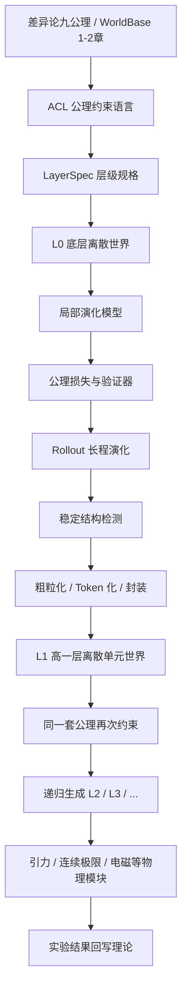

### **这份施工图的核心作用：把“差异论理论体系”变成一个可反复定位、逐层施工、逐步验证的工程地图。**

这个项目不要从“做一个大模型”开始，而要从“建一台公理约束下的递归世界实验机”开始。总施工图的主线是：**九公理 → 公理约束语言 ACL → 层级世界引擎 → 稳定结构封装 → 下一层递归 → 物理模块验证 → 理论回写。**

下面是一份可以长期使用的总施工图。你以后每次回来，都可以按这里的坐标问：我们现在在 **T 层、ACL 层、L0 实验、递归封装、物理模块，还是验证系统**。

---

# **差异论局部世界实验机总施工图 V0.1**

当前日期：2026-04-28  
工程名称建议：**Difference World Engine**  
中文名称建议：**差异论局部世界实验机**  
核心目标：把差异论与 WorldBase 的公理约束转化为一个可运行、可验证、可递归扩展的形式世界实验系统。

---

## **一、总定位：这不是普通物理模拟器，而是公理递归生成机**

这个项目的目标不是一开始就模拟现实宇宙，也不是训练一个会说物理话的大语言模型。它的目标更准确地说是：

> 在九公理约束下，构造一个有限离散世界，观察它能否通过局部演化生成稳定结构；稳定结构被封装为更高层离散单元后，再由同一套公理继续约束，逐层扩展。

因此，整个项目的核心不是“预测下一帧”，而是“验证公理是否能递归地产生层级结构”。

普通 AI 物理模拟器通常问：

> 给定过去状态，能不能预测未来状态？

差异论实验机要多问几层：

> 这个未来状态是否满足公理约束？  
> 演化是否局域？  
> 差异量是否守恒或按规则转化？  
> 是否出现稳定结构？  
> 稳定结构是否有边界、寿命、可压缩性和可交互性？  
> 它能否被封装为下一层单元？  
> 下一层是否仍可被同一套公理约束？

所以这个项目的基本定义是：

> **差异论局部世界实验机 = 公理约束语言 + 层级状态空间 + 局部演化模型 + 稳定结构检测器 + 粗粒化封装器 + 验证器 + 理论回写系统。**

---

## **二、总路线图：从理论文本到递归世界**

整个工程可以画成这样：



这张图就是项目总骨架。任何具体任务都应该能挂回这张图上。如果某个任务挂不上来，就说明它可能是旁支，暂时不要做。

---

## **三、工程坐标系：以后回来找位置就用这个坐标**

为了防止项目变大后迷路，建议建立一个固定坐标系。以后所有讨论、代码、文档、实验，都按这个坐标命名。

### **T：Theory 理论层**

T 层负责管理理论来源。

它回答：

> 这个实验来自哪条公理？  
> 来自 WorldBase 哪一章？  
> 是理论原文、工程解释，还是数学形式？

主要内容包括：

- 差异论九公理；
- WorldBase 第 1、2 章；
- 后续第 3、4、7 章物理模块；
- 每条公理的工程解释；
- 每个实验和理论章节的映射关系。

典型文件：

```text
theory/
    T00_project_position.md
    T01_axioms_original.md
    T02_axioms_engineering_interpretation.md
    T03_worldbase_chapter_map.md
    T04_traceability_rules.md
```

T 层的原则是：**所有工程模块必须能追溯到理论来源。**

---

### **ACL：Axiomatic Constraint Language 公理约束语言层**

ACL 层是整个项目的中枢。

它回答：

> 九个不同定位的公理如何统一进入代码？  
> 如何让同一条公理在不同层级继续生效？  
> 如何把理论约束变成可执行约束？

ACL 不等于某一种编程语言，而是一套“声明式规格 + 可执行约束 + 验证接口”。

典型文件：

```text
acl/
    axioms.yaml
    layer_schema.yaml
    constraint_registry.py
    axiom_base.py
    state_constraints.py
    transition_constraints.py
    invariant_constraints.py
    selection_constraints.py
```

ACL 层的核心接口是：

```python
violation = axiom.violation(
    state=state,
    next_state=next_state,
    layer=layer,
    history=history
)
```

每条公理不直接告诉系统“生成什么”，而是返回一个违背程度。违背程度越高，说明状态或演化越不符合该公理。

总损失可以写成：

$$
\mathcal{L}
=
\mathcal{L}_{pred}
+
\sum_{i=1}^{9}
\lambda_i
\mathcal{V}_{A_i}
$$

其中 $\mathcal{V}_{A_i}$ 是第 $i$ 条公理的违背度，$\lambda_i$ 是该公理在当前实验中的权重。

ACL 层的原则是：**公理不写死在某个格点规则里，而是写成可迁移的层级约束接口。**

---

### **L：Layer 层级世界层**

L 层负责定义每一层世界是什么。

它回答：

> 当前层的基本单元是什么？  
> 当前层的状态空间是什么？  
> 当前层的邻域关系是什么？  
> 当前层如何演化？  
> 当前层如何粗粒化成下一层？

每一层都必须实现同一个五元组：

$$
\mathcal{W}^{(l)}
=
(
\mathcal{S}^{(l)},
\mathcal{N}^{(l)},
T^{(l)},
Q^{(l)},
C^{(l)}
)
$$

其中：

- $\mathcal{S}^{(l)}$ 是第 $l$ 层状态空间；
- $\mathcal{N}^{(l)}$ 是第 $l$ 层邻域结构；
- $T^{(l)}$ 是第 $l$ 层演化规则；
- $Q^{(l)}$ 是第 $l$ 层可观测量或守恒量；
- $C^{(l)}$ 是第 $l$ 层到第 $l+1$ 层的粗粒化映射。

典型文件：

```text
layers/
    layer_base.py
    L0_binary_lattice.py
    L1_pattern_graph.py
    L2_cluster_field.py
    coarse_grain.py
    tokenization.py
```

L 层的原则是：**每一层材料可以不同，但接口必须相同。**

底层可能是二元格点，高层可能是稳定结构图，再高层可能是场结构或符号结构。但只要都提供状态、邻域、演化、守恒量、粗粒化五个接口，九公理就能继续作用。

---

### **E：Engine 世界引擎层**

E 层负责让世界跑起来。

它回答：

> 当前状态如何进入下一状态？  
> 演化是规则驱动、神经网络驱动，还是混合驱动？  
> 公理约束如何参与每一步演化？  
> 如何做长程 rollout？

典型文件：

```text
engine/
    world_engine.py
    rollout.py
    scheduler.py
    boundary_conditions.py
    interaction_graph.py
    random_initializers.py
```

E 层的基本循环是：

```python
for t in range(steps):
    next_state = model(state, layer)
    axiom_loss, report = axiom_engine.loss(
        state=state,
        next_state=next_state,
        layer=layer,
        history=history
    )
    state = project_to_valid_space(next_state, layer)
    history.append(state)
```

E 层的原则是：**每一步演化都要留下公理违背报告。**

不能只保存 loss，也要保存每条公理的违背度。例如：

```text
step 32:
    A1_difference: 0.02
    A2_discreteness: 0.00
    A3_locality: 0.04
    A4_minimal_variation: 0.11
    A5_conservation: 0.01
    A6_coupling: 0.08
    A7_stability: 0.03
    A8_symmetry_preference: 0.06
    A9_minimal_sufficient: 0.09
```

这可以让你以后知道：某次实验失败，到底是因为不守恒、非局域、过度复杂，还是长期不稳定。

---

### **M：Model 学习模型层**

M 层负责具体的预测器或生成器。

它回答：

> 用什么模型学习状态演化？  
> 是 CNN、U-Net、Transformer、GNN，还是 Neural Operator？  
> 不同层级应该用不同模型，还是共享结构？

建议不要一开始就用复杂 Transformer。第一阶段先用简单模型。

典型文件：

```text
models/
    local_conv_model.py
    unet_world_model.py
    graph_world_model.py
    local_transformer_model.py
    neural_operator_model.py
```

不同阶段适合不同模型：

| 阶段 | 推荐模型 | 原因 |
|---|---|---|
| L0 小格点 | CNN / 局部 MLP | 简单、可控、容易调试 |
| 64×64 扩散波动 | U-Net / ConvLSTM | 适合局部场演化 |
| L1 稳定结构图 | GNN | 适合结构单元之间的关系 |
| 高层复杂耦合 | Local Transformer | 适合可控注意力和关系建模 |
| 连续极限 / PDE | Neural Operator | 适合函数到函数的映射 |

M 层的原则是：**模型不是理论本体，只是公理约束下的演化近似器。**

不要让模型夺走项目中心。项目中心是公理约束和递归层级，不是某个网络架构。

---

### **V：Validator 验证层**

V 层负责判断实验是否有效。

它回答：

> 这个系统是否真的满足公理？  
> 结构是否只是视觉上好看，还是可度量地稳定？  
> 结果能否跨尺度、跨初始条件复现？  
> 是否出现了可以进入下一层的结构？

典型文件：

```text
validators/
    axiom_validator.py
    conservation_validator.py
    locality_validator.py
    rollout_stability_validator.py
    emergence_detector.py
    coarse_grain_validator.py
    scale_generalization_validator.py
    continuous_limit_validator.py
```

验证层至少要有七类指标：

| 验证项 | 作用 |
|---|---|
| 单步预测误差 | 检查短期演化是否准确 |
| 多步 rollout 稳定性 | 检查长期是否崩溃或爆炸 |
| 守恒误差 | 检查差异量或指定守恒量是否保持 |
| 局域性违背 | 检查是否出现非法远程影响 |
| 变易成本 | 检查演化是否过度跳跃 |
| 稳定结构检测 | 检查是否出现可封装结构 |
| 跨尺度泛化 | 检查结构是否只是格点偶然物 |

V 层的原则是：**没有验证器的现象，不能称为结果。**

看到一个好看的图案，不等于发现了结构。只有通过寿命、边界、压缩、交互、复现等指标，它才有资格被提升为下一层单元。

---

### **R：Recursion 递归封装层**

R 层是这个项目区别于普通物理模拟器的关键。

它回答：

> 底层稳定结构如何变成高层离散单元？  
> 什么结构有资格被 token 化？  
> 下一层状态空间如何生成？  
> 九公理如何继续约束下一层？

典型文件：

```text
recursion/
    stable_pattern_detector.py
    boundary_extractor.py
    lifetime_tracker.py
    compression_measure.py
    interaction_measure.py
    unit_tokenizer.py
    next_layer_builder.py
```

一个结构要进入下一层，至少要通过五个条件：

| 条件 | 含义 |
|---|---|
| 寿命 | 结构必须持续足够长 |
| 内部闭合 | 结构内部不能完全混乱 |
| 边界清晰 | 结构与环境要可区分 |
| 可交互 | 结构能与其他结构发生稳定关系 |
| 可压缩 | 结构能被更短符号描述 |

可以写成一个封装评分：

$$
Score(P)
=
w_1 Life(P)
+
w_2 Boundary(P)
+
w_3 Closure(P)
+
w_4 Interaction(P)
+
w_5 Compression(P)
$$

当 $Score(P)$ 超过阈值时，结构 $P$ 被封装为高层单元。

R 层的原则是：**稳定结构不是被观察者主观命名，而是被封装协议筛选出来。**

---

### **P：Physics 物理模块层**

P 层负责逐步引入 WorldBase 第 3 到第 8 章。

它回答：

> 什么时候引入引力？  
> 什么时候引入连续极限？  
> 什么时候引入电磁？  
> 强力、弱力、量子何时进入？

典型文件：

```text
physics_modules/
    gravity/
        potential_kernel.py
        radial_field_benchmark.py
        dimension_test.py

    continuous_limit/
        resolution_sweep.py
        coarse_to_fine_test.py
        convergence_metrics.py

    electromagnetism/
        lattice_field.py
        discrete_exterior_derivative.py
        gauge_constraint.py
        flux_validator.py

    strong_force/
        internal_state.py
        nonabelian_local_rule.py

    weak_force/
        dag_irreversibility.py
        chirality_constraint.py

    quantum/
        amplitude_state.py
        phase_field.py
        measurement_interface.py
```

P 层的原则是：**物理模块要逐步激活，不能一次全部压上。**

建议顺序是：

```text
第 1 阶段：不引入真实物理模块，只做公理递归世界。
第 2 阶段：引入扩散、波动等标准物理 benchmark。
第 3 阶段：引入引力势、连续极限、电磁格点场。
第 4 阶段：引入内部态、不可逆、手征、强弱相互作用。
第 5 阶段：最后考虑量子状态表示。
```

---

### **D：Documentation 文档与回写层**

D 层负责把每次实验结果写回理论地图。

它回答：

> 这个实验验证了什么？  
> 哪条公理起作用？  
> 哪条公理设计不清楚？  
> 哪个模块只是工程技巧，不属于理论内容？  
> 哪些结果可以写进项目论文或 README？

典型文件：

```text
docs/
    experiment_log_template.md
    theory_feedback_log.md
    failed_experiments.md
    phenomenon_catalog.md
    module_status.md
```

每个实验都应该有一份记录：

```text
实验编号：EXP-L0-001
日期：2026-04-28
来源公理：A2, A3, A4, A5, A7, A9
来源章节：WorldBase 01, 02
层级：L0
状态空间：4×4 binary lattice
模型：LocalConvModel
目标：测试公理约束下是否出现稳定局部结构
结果：出现二周期振荡结构，但边界不稳定
失败项：A7 stability 较高违背
下一步：增加局部变易惩罚，降低随机扰动
```

D 层的原则是：**实验不只是跑代码，而是不断修正理论接口。**

---

## **四、九公理的工程定位**

九个公理不能都写成同一种 loss。它们在工程中应该分为四类：状态空间约束、演化约束、守恒稳定约束、选择压缩约束。

下面是建议的工程定位。

| 公理位置 | 工程角色 | 主要作用 | 代码形态 |
|---|---|---|---|
| A1 差异/层级方向 | 存在条件 | 世界必须有可区分状态和差异结构 | state measure / difference operator |
| A2 二元或离散编码 | 类型约束 | 限制状态空间的基本表达 | state schema / projection |
| A3 有限离散 | 空间约束 | 限制系统为有限可计算结构 | finite lattice / graph |
| A4 局部最小变易 | 演化约束 | 限制状态变化成本 | variation loss |
| A5 守恒律 | 不变量约束 | 检查差异量或通量是否守恒 | conservation loss |
| A6 耦合 / DAG / 关系约束 | 关系约束 | 限制单元之间如何发生作用 | graph constraint / mask |
| A7 稳定性闭合 | 长程约束 | 判断结构能否持续存在 | rollout validator |
| A8 对称偏好 | 选择偏置 | 在可行结构中偏好对称或稳定形式 | symmetry score |
| A9 最小充分实现 | 压缩约束 | 防止引入过多自由度 | complexity penalty |

这里最重要的是：**不同公理在不同层级的具体形式可以变化，但接口不变。**

例如 A5 在 L0 可能是格点总量守恒，在 L1 可能是结构数量或关系通量守恒，在 L2 可能是场通量守恒。它不是同一个变量，但都是“当前层定义的不变量”。

所以 A5 的接口应写成：

```python
def conserved_quantity(layer, state):
    return layer.measure_invariant(state)
```

而不是写死成：

```python
state.sum()
```

---

## **五、项目总目录建议**

建议一开始就把目录搭好，即使很多文件先是空壳。这样项目不会乱。

```text
difference_world_engine/
    README.md
    PROJECT_MAP.md
    ROADMAP.md

    theory/
        T00_project_position.md
        T01_axioms_original.md
        T02_axioms_engineering_interpretation.md
        T03_worldbase_chapter_map.md
        T04_traceability_rules.md

    acl/
        axioms.yaml
        layer_schema.yaml
        axiom_base.py
        constraint_registry.py
        state_constraints.py
        transition_constraints.py
        invariant_constraints.py
        selection_constraints.py

    layers/
        layer_base.py
        L0_binary_lattice.py
        L1_pattern_graph.py
        L2_cluster_field.py
        coarse_grain.py
        tokenization.py

    engine/
        world_engine.py
        rollout.py
        scheduler.py
        boundary_conditions.py
        random_initializers.py

    models/
        local_conv_model.py
        unet_world_model.py
        graph_world_model.py
        local_transformer_model.py
        neural_operator_model.py

    losses/
        prediction_loss.py
        conservation_loss.py
        locality_loss.py
        variation_loss.py
        stability_loss.py
        complexity_loss.py

    validators/
        axiom_validator.py
        conservation_validator.py
        locality_validator.py
        rollout_stability_validator.py
        emergence_detector.py
        coarse_grain_validator.py
        scale_generalization_validator.py
        continuous_limit_validator.py

    recursion/
        stable_pattern_detector.py
        boundary_extractor.py
        lifetime_tracker.py
        compression_measure.py
        interaction_measure.py
        unit_tokenizer.py
        next_layer_builder.py

    physics_modules/
        gravity/
        continuous_limit/
        electromagnetism/
        strong_force/
        weak_force/
        quantum/

    experiments/
        EXP_L0_001_binary_4x4/
        EXP_L0_002_binary_16x16/
        EXP_L0_003_conservative_diffusion/
        EXP_L1_001_pattern_graph/

    visualization/
        lattice_viewer.py
        rollout_viewer.py
        pattern_viewer.py
        hierarchy_viewer.py
        axiom_report_dashboard.py

    docs/
        experiment_log_template.md
        phenomenon_catalog.md
        failed_experiments.md
        theory_feedback_log.md
        module_status.md

    tests/
        test_axioms.py
        test_layers.py
        test_conservation.py
        test_coarse_grain.py
        test_rollout.py
```

这个目录的重点不是“全都马上写完”，而是先把项目空间划出来。这样以后新增代码时不会乱塞。

---

## **六、阶段施工计划**

### **阶段 0：理论到工程接口**

阶段 0 不训练模型，只做理论接口。

目标是把九公理和 WorldBase 第 1、2 章转成工程规格。

主要产物：

```text
PROJECT_MAP.md
T02_axioms_engineering_interpretation.md
axioms.yaml
layer_schema.yaml
experiment_log_template.md
```

这一阶段要回答：

> 每条公理在代码中是什么类型的约束？  
> 哪些是状态约束？  
> 哪些是演化约束？  
> 哪些是守恒约束？  
> 哪些是选择约束？  
> 每条公理如何跨层级复用？

阶段 0 的完成标准是：

```text
九公理都有工程解释；
九公理都有初步接口；
L0 层级规格可以被读取；
实验日志模板可以追踪理论来源。
```

这一阶段非常重要。没有它，后面代码越写越像普通模拟器。

---

### **阶段 1：L0 最小离散世界**

阶段 1 只做最小世界。

建议从 $4 \times 4$ 或 $8 \times 8$ 二元格点开始，不要一开始就上 $64 \times 64$。

目标是验证：

> 公理约束能不能控制一个最小离散世界的演化？

主要产物：

```text
L0_binary_lattice.py
world_engine.py
rollout.py
local_conv_model.py
conservation_loss.py
variation_loss.py
rollout_stability_validator.py
```

第一组实验：

```text
EXP-L0-001：4×4 binary lattice，随机初始状态，局部演化 32 步。
EXP-L0-002：8×8 binary lattice，加入守恒约束，观察是否崩溃。
EXP-L0-003：16×16 binary lattice，加入局部最小变易，观察稳定结构。
```

这一阶段不要追求真实物理，只检查四件事：

```text
能不能跑；
能不能约束；
能不能记录；
能不能发现失败原因。
```

阶段 1 的完成标准是：

```text
L0 可以 rollout；
每一步有公理违背报告；
至少 A2、A3、A4、A5、A7、A9 可计算；
可视化能显示状态演化；
失败实验有日志。
```

---

### **阶段 2：稳定结构检测与封装**

阶段 2 是项目的关键转折点。

目标不是让 L0 跑得更漂亮，而是识别哪些 L0 结构能成为 L1 单元。

主要产物：

```text
stable_pattern_detector.py
boundary_extractor.py
lifetime_tracker.py
compression_measure.py
unit_tokenizer.py
L1_pattern_graph.py
```

要检测的结构包括：

```text
静态块；
周期振荡子；
传播波前；
稳定边界；
局部团簇；
互补对；
循环结构。
```

一个结构成为高层单元，必须通过封装协议：

```text
寿命足够长；
边界足够清楚；
内部变化足够低；
能与其他结构交互；
可以被压缩描述。
```

阶段 2 的完成标准是：

```text
能从 L0 rollout 中自动识别稳定结构；
能给稳定结构打分；
能把结构编码成 token；
能生成 L1 pattern graph；
能记录每个 token 的底层来源。
```

这一阶段完成后，项目才真正进入“递归世界实验机”，不再只是格点模拟器。

---

### **阶段 3：L1 高层单元世界**

阶段 3 的目标是让 L1 自己演化，而不是只作为 L0 的观测结果。

L1 的状态不再是比特格点，而是稳定结构组成的图。

例如：

```text
节点：稳定结构 token
边：结构之间的邻接、影响、耦合、通量
状态：每个 token 的类型、寿命、方向、内部相位、边界状态
```

主要产物：

```text
L1_pattern_graph.py
graph_world_model.py
interaction_measure.py
next_layer_builder.py
```

这一阶段要验证一个核心命题：

> 当 L0 稳定结构被封装为 L1 离散单元后，九公理是否还能继续约束 L1 的演化？

也就是说，A3 局域性在 L1 不再是格点邻域，而是图邻域；A5 守恒在 L1 不再是 bit 总量，而可能是结构通量或关系量；A7 稳定性不再是像素不崩溃，而是结构网络不崩溃。

阶段 3 的完成标准是：

```text
L1 graph 可以 rollout；
ACL 可以对 L1 计算公理违背度；
L1 可以产生新的稳定结构簇；
L1 结果可以追溯回 L0 token 来源。
```

---

### **阶段 4：标准物理 benchmark**

阶段 4 开始引入已知物理系统，但目的仍然不是证明现实物理，而是校准技术链。

建议 benchmark 顺序：

```text
守恒扩散；
波动方程；
弹性碰撞；
简单反应扩散；
元胞自动机经典结构。
```

主要产物：

```text
EXP-PHY-001_conservative_diffusion
EXP-PHY-002_wave_equation
EXP-PHY-003_reaction_diffusion
scale_generalization_validator.py
```

这一阶段要回答：

> 我们的引擎能否学会并保持已知物理系统中的守恒、局域、稳定和尺度泛化？

阶段 4 的完成标准是：

```text
64×64 守恒扩散可以稳定 rollout；
波动传播可视化正常；
守恒误差可控；
不同分辨率下结构趋势一致；
验证器能区分正常演化和错误演化。
```

---

### **阶段 5：WorldBase 物理模块第一批：引力、连续极限、电磁**

阶段 5 开始引入 WorldBase 第 3、4、7 章。

推荐顺序：

```text
先连续极限验证器；
再引力势 benchmark；
再电磁格点场。
```

原因是连续极限是所有物理模块的尺度检查工具，引力势适合作为标量势场 benchmark，电磁适合升级到格点场和离散外微分。

主要产物：

```text
physics_modules/continuous_limit/
physics_modules/gravity/
physics_modules/electromagnetism/
```

实验方向：

```text
不同尺度下的收敛；
离散源密度到势场；
径向势场近似；
格点场散度和旋度；
离散外微分闭合；
边界通量检查。
```

阶段 5 的完成标准是：

```text
连续极限验证器可运行；
引力势模块可在简化条件下测试；
电磁格点场能做基本散度、旋度、通量验证；
物理模块仍能追溯到公理层和层级层。
```

---

### **阶段 6：WorldBase 物理模块第二批：内部态、不可逆、强弱相互作用**

阶段 6 才考虑第 5、6 章。

这一阶段复杂度明显提高，因为系统不再只是外部空间结构，而要引入内部自由度、非阿贝尔关系、DAG 方向性、不可逆演化、手征结构等。

主要产物：

```text
physics_modules/strong_force/internal_state.py
physics_modules/strong_force/nonabelian_local_rule.py
physics_modules/weak_force/dag_irreversibility.py
physics_modules/weak_force/chirality_constraint.py
```

阶段 6 的完成标准不是“复现强弱相互作用”，而是更谨慎地表述为：

```text
系统可以表达内部自由度；
系统可以表达非交换或非阿贝尔式局部关系；
系统可以表达方向性和不可逆约束；
系统可以检测对称破缺或手征偏好。
```

这一阶段不能急。必须等 L0、L1、连续极限、电磁格点场都比较稳定以后再做。

---

### **阶段 7：量子模块**

第 8 章量子模块应该最后引入。

原因是量子模块会改变状态表示本身。此前很多层可以用二元状态、实值场、图节点来表示，但量子模块可能需要：

```text
复振幅；
相位；
叠加；
干涉；
测量；
概率解释；
幺正或近似幺正演化；
非交换观测。
```

主要产物：

```text
physics_modules/quantum/
    amplitude_state.py
    phase_field.py
    unitary_constraint.py
    measurement_interface.py
```

阶段 7 的完成标准应该非常克制：

```text
可以表示复幅度状态；
可以表示相位干涉；
可以定义测量接口；
可以区分概率场和量子幅度；
可以检查演化是否满足基本范数约束。
```

不要一开始就说“推出量子力学”。更合理的目标是：

> 在差异论递归世界实验机中，构造一个可测试的量子样式接口。

---

## **七、第一批具体任务清单**

下面这些是最先应该施工的部分。

### **任务 1：建立 PROJECT_MAP.md**

这个文件是总导航。

内容包括：

```text
项目目标；
工程坐标系；
阶段路线；
目录解释；
当前进度；
下一步施工点；
禁止提前做的事项。
```

这个文件以后每次回来都先看。

---

### **任务 2：建立 axioms.yaml**

先不用完美，先让九公理进入机器可读形式。

示例：

```yaml
axioms:
  A1:
    name: difference_presence
    category: state_condition
    scope: all_layers
    default_weight: 1.0

  A2:
    name: discrete_encoding
    category: type_constraint
    scope: all_layers
    default_weight: 1.0

  A3:
    name: finite_locality
    category: topology_constraint
    scope: all_layers
    default_weight: 1.0

  A4:
    name: local_minimal_variation
    category: transition_constraint
    scope: all_layers
    default_weight: 0.8

  A5:
    name: conservation
    category: invariant_constraint
    scope: all_layers
    default_weight: 1.0

  A6:
    name: admissible_coupling
    category: relation_constraint
    scope: all_layers
    default_weight: 0.7

  A7:
    name: stability_closure
    category: rollout_constraint
    scope: all_layers
    default_weight: 1.0

  A8:
    name: symmetry_preference
    category: selection_bias
    scope: all_layers
    default_weight: 0.5

  A9:
    name: minimal_sufficient_realization
    category: compression_constraint
    scope: all_layers
    default_weight: 0.7
```

---

### **任务 3：建立 LayerBase**

所有层级都继承这个接口。

```python
class LayerBase:
    name = None

    def valid_state(self, state):
        raise NotImplementedError

    def project_state(self, raw_state):
        raise NotImplementedError

    def neighborhood(self):
        raise NotImplementedError

    def measure_difference(self, state):
        raise NotImplementedError

    def measure_invariant(self, state):
        raise NotImplementedError

    def transition_cost(self, state, next_state):
        raise NotImplementedError

    def detect_stable_structures(self, history):
        raise NotImplementedError

    def coarse_grain(self, stable_structures):
        raise NotImplementedError
```

这就是层级递归的基础。

---

### **任务 4：建立 AxiomBase 和 AxiomEngine**

```python
class AxiomBase:
    name = None

    def violation(self, state, next_state, layer, history):
        raise NotImplementedError


class AxiomBase:
    name = None
    category = None

    def violation(self, state, next_state, layer, history):
        """
        返回当前公理的违背度。
        违背度越低，说明越符合该公理。
        """
        raise NotImplementedError


class AxiomEngine:
    def __init__(self, axioms):
        self.axioms = axioms

    def evaluate(self, state, next_state, layer, history):
        total_loss = 0.0
        report = {}

        for axiom in self.axioms:
            v = axiom.violation(
                state=state,
                next_state=next_state,
                layer=layer,
                history=history
            )

            weight = layer.get_axiom_weight(axiom.name)
            weighted_v = weight * v

            total_loss = total_loss + weighted_v
            report[axiom.name] = {
                "raw": float(v.detach().cpu()) if hasattr(v, "detach") else float(v),
                "weight": weight,
                "weighted": float(weighted_v.detach().cpu()) if hasattr(weighted_v, "detach") else float(weighted_v)
            }

        return total_loss, report
```

这里的核心不是技术细节，而是架构位置。`AxiomEngine` 是整个系统的“公理调度器”。所有层级、所有模型、所有实验都通过它来获得公理约束报告。

也就是说，以后不管你做的是 $4 \times 4$ 二元格点，还是 $64 \times 64$ 守恒扩散，还是 L1 稳定结构图，都不应该绕开 `AxiomEngine`。一旦绕开，实验就失去理论追踪能力。

---

### **任务 5：先实现六条最小可运行公理**

第一阶段不要急着把九条公理全部做得非常精细。应该先实现最小可运行版本。

建议第一批实现：

```text
A2：离散编码
A3：有限局域
A4：局部最小变易
A5：守恒
A7：稳定闭合
A9：最小充分实现
```

A1 可以先作为差异度量接口存在，A6 可以先作为关系约束接口存在，A8 可以先作为选择评分接口存在。它们不必第一天就复杂化。

#### **A2：离散编码**

A2 的作用是保证状态不会漂到无限连续空间里。模型内部可以使用连续 logits，但输出状态必须能投影回当前层允许的状态集合。

```python
class DiscreteEncodingAxiom(AxiomBase):
    name = "A2_discrete_encoding"
    category = "type_constraint"

    def violation(self, state, next_state, layer, history):
        return layer.discreteness_violation(next_state)
```

对于 L0 二元格点，可以这样实现：

```python
def discreteness_violation(self, state):
    """
    如果 state 是 soft binary，则检查它距离 0/1 的程度。
    对于概率 p，p * (1 - p) 在 p=0 或 p=1 时为 0，在 p=0.5 时最大。
    """
    return (state * (1.0 - state)).mean()
```

这个设计很重要。它允许训练阶段使用可微分的 soft state，同时又逐步把系统压向离散状态。

---

#### **A3：有限局域**

A3 的作用是限制相互作用范围。底层格点只能局部影响，高层结构只能沿图边影响。

```python
class FiniteLocalityAxiom(AxiomBase):
    name = "A3_finite_locality"
    category = "topology_constraint"

    def violation(self, state, next_state, layer, history):
        return layer.locality_violation(state, next_state)
```

对于 L0 格点，局域性可以先通过模型结构保证，例如只用 $3 \times 3$ 卷积。也可以额外检查非局域变化：

```python
def locality_violation(self, state, next_state):
    """
    最小版本可以先返回 0，因为局域性由模型结构保证。
    后续如果使用 Transformer，则必须加入 attention mask 检查。
    """
    return 0.0
```

这里有个工程原则：**能用结构保证的公理，不要全部压到 loss 里。**

例如局域性最好优先用模型结构保证：

```text
CNN 小卷积核；
GNN 邻接边；
Transformer local attention mask；
Neural Operator 的局部核或受限频带。
```

如果只靠 loss 惩罚非局域，模型可能已经学会了非法远程捷径，再让 loss 纠正会很困难。

---

#### **A4：局部最小变易**

A4 是非常核心的一条。它不要求世界不变化，而是要求变化有代价，且系统偏向较小代价路径。

```python
class LocalMinimalVariationAxiom(AxiomBase):
    name = "A4_local_minimal_variation"
    category = "transition_constraint"

    def violation(self, state, next_state, layer, history):
        return layer.transition_cost(state, next_state)
```

L0 最小版本：

```python
def transition_cost(self, state, next_state):
    delta = next_state - state
    return (delta ** 2).mean()
```

但这个版本还太粗。后面可以升级为：

```python
def transition_cost(self, state, next_state):
    delta = next_state - state

    local_delta = (delta ** 2).mean()
    boundary_delta = self.boundary_change_cost(state, next_state)
    invariant_delta = self.invariant_change_cost(state, next_state)

    return (
        self.w_local * local_delta
        + self.w_boundary * boundary_delta
        + self.w_invariant * invariant_delta
    )
```

A4 后期很可能会成为整个系统里最重要的“路径选择器”。因为很多演化不是被硬性禁止，而是因为成本太高而不会自然出现。

---

#### **A5：守恒**

A5 不能写死成 `state.sum()`。它必须调用当前层自己的守恒量定义。

```python
class ConservationAxiom(AxiomBase):
    name = "A5_conservation"
    category = "invariant_constraint"

    def violation(self, state, next_state, layer, history):
        q_now = layer.measure_invariant(state)
        q_next = layer.measure_invariant(next_state)
        return ((q_next - q_now) ** 2).mean()
```

L0 最小版本可以用总激活量：

```python
def measure_invariant(self, state):
    return state.sum(dim=(-1, -2), keepdim=True)
```

但后续可以升级为局部通量守恒：

```python
def measure_invariant(self, state):
    density = self.measure_density(state)
    flux = self.measure_boundary_flux(state)
    return density, flux
```

这里要注意：守恒不一定永远是“总量不变”。在更高层，它也可能表现为：

```text
结构数量的近似守恒；
边界通量的守恒；
关系流的守恒；
差异密度的守恒；
局部变化与外部流入流出的平衡。
```

所以 A5 的统一表达应该是：

> 当前层定义的可观测不变量，在允许演化下保持不变或满足通量平衡。

---

#### **A7：稳定闭合**

A7 不适合只看一步。它必须看 rollout。

最小版本可以在单步里不计算，放到验证器里：

```python
class StabilityClosureAxiom(AxiomBase):
    name = "A7_stability_closure"
    category = "rollout_constraint"

    def violation(self, state, next_state, layer, history):
        if len(history) < layer.min_stability_window:
            return 0.0

        recent = history[-layer.min_stability_window:]
        return layer.stability_violation(recent)
```

L0 稳定性可以先检查三件事：

```python
def stability_violation(self, recent_states):
    collapse = self.collapse_score(recent_states)
    explosion = self.explosion_score(recent_states)
    drift = self.drift_score(recent_states)
    return collapse + explosion + drift
```

其中：

```python
def collapse_score(self, states):
    """
    如果所有格点都变成接近 0 或完全静止，视为坍缩。
    """
    activity = [s.mean() for s in states]
    return max(0.0, self.min_activity - torch.stack(activity).mean())


def explosion_score(self, states):
    """
    如果激活过多，接近全 1，也视为爆炸。
    """
    activity = [s.mean() for s in states]
    return max(0.0, torch.stack(activity).mean() - self.max_activity)


def drift_score(self, states):
    """
    如果状态整体无边界地漂移，稳定性较差。
    """
    diffs = [(states[i + 1] - states[i]).abs().mean() for i in range(len(states) - 1)]
    return torch.stack(diffs).mean()
```

后期 A7 要和稳定结构检测器连接起来。也就是说，A7 不只是“不崩溃”，而是：

> 系统能否形成可持续、可封装、可复现的闭合结构。

---

#### **A9：最小充分实现**

A9 的作用是防止模型用过度复杂的自由度解释简单现象。

它可以先写成复杂度惩罚：

```python
class MinimalSufficientRealizationAxiom(AxiomBase):
    name = "A9_minimal_sufficient_realization"
    category = "compression_constraint"

    def violation(self, state, next_state, layer, history):
        return layer.complexity_penalty(state, next_state, history)
```

L0 最小版本：

```python
def complexity_penalty(self, state, next_state, history):
    """
    第一阶段可以先用状态熵或变化熵作为复杂度近似。
    """
    eps = 1e-8
    p = next_state.clamp(eps, 1.0 - eps)
    entropy = -(p * torch.log(p) + (1 - p) * torch.log(1 - p))
    return entropy.mean()
```

但要小心：熵惩罚太强会把系统压成死寂。所以 A9 不能孤立使用，必须和 A1、A7 配合。

更好的表达是：

$$
\mathcal{V}_{A9}
=
\mathrm{Complexity}(S)
-
\beta \cdot \mathrm{StableExplanationPower}(S)
$$

也就是：

> 不是越简单越好，而是在能解释稳定结构的前提下尽量简单。

后期可以用压缩增益来实现：

```python
def complexity_penalty(self, state, next_state, history):
    raw_dl = self.raw_description_length(history)
    compressed_dl = self.compressed_description_length(history)
    compression_gain = raw_dl - compressed_dl

    return raw_dl - self.beta * compression_gain
```

---

### **任务 6：建立 L0BinaryLattice**

L0 是第一层世界。它应该极简，但接口完整。

```python
class L0BinaryLattice(LayerBase):
    name = "L0_binary_lattice"

    def __init__(self, shape=(4, 4), device="cpu"):
        self.shape = shape
        self.device = device
        self.min_stability_window = 8
        self.min_activity = 0.05
        self.max_activity = 0.95

        self.axiom_weights = {
            "A2_discrete_encoding": 1.0,
            "A3_finite_locality": 1.0,
            "A4_local_minimal_variation": 0.5,
            "A5_conservation": 1.0,
            "A7_stability_closure": 0.8,
            "A9_minimal_sufficient_realization": 0.3,
        }

    def get_axiom_weight(self, axiom_name):
        return self.axiom_weights.get(axiom_name, 0.0)

    def initial_state(self, batch_size=1, density=0.3):
        return (torch.rand(batch_size, 1, *self.shape, device=self.device) < density).float()

    def valid_state(self, state):
        return state.shape[-2:] == self.shape

    def project_state(self, raw_state):
        """
        训练时可保留 soft state。
        验证或可视化时可以 hard projection。
        """
        return raw_state.clamp(0.0, 1.0)

    def hard_project_state(self, raw_state):
        return (raw_state > 0.5).float()

    def measure_difference(self, state):
        """
        最小版本：邻居之间不同的边数量。
        """
        dx = (state[:, :, :, 1:] - state[:, :, :, :-1]).abs().mean()
        dy = (state[:, :, 1:, :] - state[:, :, :-1, :]).abs().mean()
        return dx + dy

    def measure_invariant(self, state):
        """
        最小版本：总激活量。
        """
        return state.sum(dim=(-1, -2), keepdim=True)

    def transition_cost(self, state, next_state):
        delta = next_state - state
        return (delta ** 2).mean()

    def discreteness_violation(self, state):
        return (state * (1.0 - state)).mean()

    def locality_violation(self, state, next_state):
        return torch.tensor(0.0, device=state.device)

    def stability_violation(self, recent_states):
        states = torch.stack(recent_states, dim=0)

        activity = states.mean()
        collapse = torch.relu(torch.tensor(self.min_activity, device=states.device) - activity)
        explosion = torch.relu(activity - torch.tensor(self.max_activity, device=states.device))

        diffs = (states[1:] - states[:-1]).abs().mean()

        return collapse + explosion + diffs

    def complexity_penalty(self, state, next_state, history):
        eps = 1e-8
        p = next_state.clamp(eps, 1.0 - eps)
        entropy = -(p * torch.log(p) + (1 - p) * torch.log(1 - p))
        return entropy.mean()

    def detect_stable_structures(self, history):
        """
        第一阶段可以先返回空。
        阶段 2 再实现真正的稳定结构检测。
        """
        return []

    def coarse_grain(self, stable_structures):
        """
        阶段 2 再实现。
        """
        return None
```

这个类虽然很简单，但已经提供了未来递归所需的关键接口：

```text
状态合法性；
状态投影；
差异度量；
守恒量；
变易成本；
离散性检查；
稳定性检查；
复杂度惩罚；
稳定结构检测；
粗粒化。
```

第一版不要追求理论完美。先让它成为一块可以跑通的地基。

---

### **任务 7：建立第一个局部模型 LocalConvModel**

第一阶段不建议直接 Transformer。先用一个局部卷积模型，因为它天然满足局域性。

```python
import torch
import torch.nn as nn


class LocalConvModel(nn.Module):
    def __init__(self, channels=32):
        super().__init__()

        self.net = nn.Sequential(
            nn.Conv2d(1, channels, kernel_size=3, padding=1),
            nn.GELU(),
            nn.Conv2d(channels, channels, kernel_size=3, padding=1),
            nn.GELU(),
            nn.Conv2d(channels, 1, kernel_size=3, padding=1),
            nn.Sigmoid()
        )

    def forward(self, state):
        return self.net(state)
```

这个模型非常小，但足够做第一批实验。它的优点是：

```text
可控；
局域；
容易调试；
可视化直接；
不会引入过多架构复杂度。
```

后续再扩展：

```text
LocalConvModel → ConvLSTM → U-Net → GNN → Local Transformer → Neural Operator
```

不要一开始上复杂模型。复杂模型会让你分不清：到底是公理有效，还是模型容量太大。

---

### **任务 8：建立第一条 Rollout 管线**

Rollout 是世界实验机的心跳。

```python
def rollout(model, layer, axiom_engine, initial_state, steps=32):
    state = initial_state
    history = [state]
    reports = []

    for t in range(steps):
        raw_next_state = model(state)
        next_state = layer.project_state(raw_next_state)

        axiom_loss, report = axiom_engine.evaluate(
            state=state,
            next_state=next_state,
            layer=layer,
            history=history
        )

        reports.append({
            "step": t,
            "axiom_loss": axiom_loss,
            "axiom_report": report
        })

        state = next_state
        history.append(state)

    return history, reports
```

训练版本可以这样：

```python
def train_step(model, optimizer, layer, axiom_engine, initial_state, target=None, steps=32):
    state = initial_state
    history = [state]
    total_loss = 0.0
    all_reports = []

    for t in range(steps):
        next_state = layer.project_state(model(state))

        axiom_loss, report = axiom_engine.evaluate(
            state=state,
            next_state=next_state,
            layer=layer,
            history=history
        )

        if target is not None:
            pred_loss = ((next_state - target[t]) ** 2).mean()
        else:
            pred_loss = 0.0

        step_loss = pred_loss + axiom_loss
        total_loss = total_loss + step_loss

        all_reports.append(report)
        history.append(next_state)
        state = next_state

    optimizer.zero_grad()
    total_loss.backward()
    optimizer.step()

    return total_loss.item(), all_reports, history
```

这里有两种训练方式：

```text
有 target：学习某个已知规则或物理系统；
无 target：只在公理约束下自组织演化。
```

第一阶段建议两种都做，但要分开记录。

---

### **任务 9：建立实验日志模板**

每个实验都必须写日志，不然项目很快会失控。

```markdown
# EXP-L0-001：4x4 Binary Lattice Minimal Rollout

## 基本信息

日期：2026-04-28  
层级：L0  
状态空间：4x4 binary lattice  
模型：LocalConvModel  
训练方式：axiom-only / supervised / hybrid  

## 理论来源

来源章节：
- WorldBase 01-methodology.md
- WorldBase 02-axioms.md

使用公理：
- A2 discrete encoding
- A3 finite locality
- A4 local minimal variation
- A5 conservation
- A7 stability closure
- A9 minimal sufficient realization

## 实验目标

测试最小二元格点在公理约束下是否能进行稳定 rollout。

## 配置

shape: [4, 4]  
steps: 32  
batch_size: 16  
learning_rate: 1e-3  

## 观察指标

- A2 violation
- A4 violation
- A5 violation
- A7 violation
- A9 violation
- activity mean
- difference measure
- rollout collapse / explosion

## 结果

待填写。

## 失败或异常

待填写。

## 下一步

待填写。
```

这个模板看起来普通，但它很重要。它保证每次实验都能回到理论地图上。

---

## **八、第一阶段实验序列**

第一阶段不要一下子做很多花哨实验。建议从 6 个实验开始。

### **EXP-L0-001：4×4 最小公理 rollout**

目的：确认系统能跑。

配置：

```text
shape: 4×4
state: binary / soft binary
model: LocalConvModel
steps: 32
loss: A2 + A4 + A5 + A7 + A9
target: none
```

观察：

```text
是否迅速全 0；
是否迅速全 1；
是否陷入完全静止；
是否有周期；
是否守恒；
公理违背报告是否正常。
```

这一步只要能跑通，就算成功。

---

### **EXP-L0-002：8×8 守恒约束实验**

目的：测试 A5 是否能发挥作用。

配置：

```text
shape: 8×8
固定初始激活密度
提高 A5 权重
steps: 64
```

观察：

```text
总激活量是否保持；
系统是否为了守恒变成死结构；
A5 和 A7 是否冲突；
A4 是否过强导致不变化。
```

这一实验会暴露一个重要问题：守恒太强可能导致系统无法生成有趣结构。需要在 A4、A5、A7 之间调权重。

---

### **EXP-L0-003：16×16 局部变易实验**

目的：测试 A4 对演化路径的影响。

配置：

```text
shape: 16×16
分别测试 A4 weight = 0.1 / 0.5 / 1.0 / 2.0
steps: 64
```

观察：

```text
A4 太弱是否导致乱跳；
A4 太强是否导致冻结；
中间区间是否出现局部稳定结构。
```

这一步相当于寻找第一批“相变区间”。

---

### **EXP-L0-004：加入差异度量 A1 观察**

目的：让系统不只是守恒和稳定，还要保持差异结构。

虽然 A1 第一阶段不一定作为强 loss，但可以作为观测量。

配置：

```text
shape: 16×16
记录 measure_difference
steps: 64
```

观察：

```text
差异度是否消失；
差异度是否爆炸；
是否存在中等差异度的稳定区域。
```

这很重要。因为系统如果最终只剩全 0、全 1 或均匀噪声，都不符合“差异生成结构”的目标。

---

### **EXP-L0-005：稳定结构候选检测**

目的：开始为阶段 2 做准备。

先不用复杂检测器，只做简单候选：

```text
连续存在超过 k 步的局部块；
周期性重复的局部区域；
边界长期存在的区域；
移动但形态保持的结构。
```

观察：

```text
候选结构是否出现；
候选结构寿命分布；
候选结构是否可重复；
不同随机初始条件下是否相似。
```

---

### **EXP-L0-006：有监督规则学习对照组**

目的：不要只做自组织，也要验证模型能学会明确规则。

可以先选一个简单规则：

```text
守恒扩散；
简单元胞自动机；
局部平均；
局部交换；
粒子随机游走。
```

训练模型预测下一步，然后加入公理 loss。

对照：

```text
无公理 loss；
有 A5；
有 A4 + A5；
有 A4 + A5 + A7。
```

观察：

```text
公理 loss 是否改善长期 rollout；
是否降低短期误差；
是否提高泛化；
是否让模型更稳定。
```

这个对照非常关键。它能证明 ACL 不是装饰，而是真的改变模型行为。

---

## **九、稳定结构封装协议 V0.1**

阶段 2 要用，但阶段 1 可以提前设计。

一个结构 $P$ 成为高层单元，必须通过五类评分。

### **1. 寿命评分 Life**

$$
Life(P)
=
\min
\left(
1,
\frac{\tau(P)}{\tau_{min}}
\right)
$$

其中 $\tau(P)$ 是结构持续时间。

代码接口：

```python
def life_score(pattern, min_lifetime):
    return min(1.0, pattern.lifetime / min_lifetime)
```

---

### **2. 边界评分 Boundary**

边界评分衡量结构内部与外部是否可区分。

$$
Boundary(P)
=
\frac{
| \mu_{inside} - \mu_{outside} |
}{
\sigma_{inside} + \sigma_{outside} + \epsilon
}
$$

代码接口：

```python
def boundary_score(pattern, state):
    inside = state[pattern.mask]
    outside = state[~pattern.mask]

    mu_in = inside.mean()
    mu_out = outside.mean()
    std_in = inside.std()
    std_out = outside.std()

    return abs(mu_in - mu_out) / (std_in + std_out + 1e-8)
```

---

### **3. 内部闭合评分 Closure**

内部闭合衡量结构内部是否有相对稳定的自维持关系。

```python
def closure_score(pattern, history):
    internal_changes = []

    for t in range(len(history) - 1):
        current = history[t][pattern.mask]
        nxt = history[t + 1][pattern.mask]
        internal_changes.append((nxt - current).abs().mean())

    change = torch.stack(internal_changes).mean()
    return 1.0 / (1.0 + change)
```

---

### **4. 交互评分 Interaction**

结构不能只是死块，它要能与其他结构或环境发生可追踪关系。

```python
def interaction_score(pattern, other_patterns, history):
    scores = []

    for other in other_patterns:
        if pattern is other:
            continue

        relation = measure_relation_over_time(pattern, other, history)
        scores.append(relation.persistence)

    if not scores:
        return 0.0

    return max(scores)
```

---

### **5. 压缩评分 Compression**

结构必须能被更短描述替代。

```python
def compression_score(pattern):
    raw_dl = pattern.raw_description_length()
    token_dl = pattern.token_description_length()

    if raw_dl <= 0:
        return 0.0

    return max(0.0, (raw_dl - token_dl) / raw_dl)
```

---

### **总封装评分**

$$
Score(P)
=
w_1 Life(P)
+
w_2 Boundary(P)
+
w_3 Closure(P)
+
w_4 Interaction(P)
+
w_5 Compression(P)
$$

代码：

```python
def encapsulation_score(pattern, context):
    return (
        context.w_life * life_score(pattern, context.min_lifetime)
        + context.w_boundary * boundary_score(pattern, context.state)
        + context.w_closure * closure_score(pattern, context.history)
        + context.w_interaction * interaction_score(pattern, context.patterns, context.history)
        + context.w_compression * compression_score(pattern)
    )
```

当评分超过阈值：

```python
if encapsulation_score(pattern, context) > context.threshold:
    token = encode_pattern_as_unit(pattern)
```

这就是从 L0 到 L1 的关键桥。

---

## **十、L1 Pattern Graph 的设计**

当 L0 稳定结构被封装后，L1 不应该还是格点。它应该是图。

```text
节点：稳定结构 token
边：结构之间的关系
节点状态：类型、位置、寿命、方向、相位、边界状态
边状态：距离、耦合强度、通量、交互频率
```

可以定义：

```python
class PatternNode:
    def __init__(self, token_id, pattern_type, features, source_trace):
        self.token_id = token_id
        self.pattern_type = pattern_type
        self.features = features
        self.source_trace = source_trace


class PatternEdge:
    def __init__(self, source, target, relation_type, features):
        self.source = source
        self.target = target
        self.relation_type = relation_type
        self.features = features


class L1PatternGraph(LayerBase):
    name = "L1_pattern_graph"

    def __init__(self, nodes, edges):
        self.nodes = nodes
        self.edges = edges

    def neighborhood(self):
        return build_adjacency_from_edges(self.edges)

    def measure_difference(self, state):
        return graph_difference_measure(state)

    def measure_invariant(self, state):
        return graph_invariant_measure(state)

    def transition_cost(self, state, next_state):
        return graph_edit_distance_approx(state, next_state)

    def detect_stable_structures(self, history):
        return detect_stable_subgraphs(history)

    def coarse_grain(self, stable_structures):
        return build_L2_from_stable_subgraphs(stable_structures)
```

这一步会让公理真正跨层级。

例如：

```text
A3 在 L0：格点邻域。
A3 在 L1：图邻域。

A4 在 L0：像素变化成本。
A4 在 L1：图编辑成本。

A5 在 L0：总激活量或局部通量。
A5 在 L1：节点/边关系中的守恒量。

A7 在 L0：格点 rollout 不崩溃。
A7 在 L1：结构图不崩溃，并形成稳定子图。

A9 在 L0：局部状态可压缩。
A9 在 L1：图结构可压缩。
```

这就是“形式同构，材料不同”。

---

## **十一、验证仪表盘设计**

后期项目大了以后，你需要一个仪表盘，而不是只看 loss。

仪表盘至少显示：

```text
当前实验编号；
当前层级；
当前 rollout 步数；
各公理违背曲线；
活动度曲线；
差异度曲线；
守恒误差曲线；
稳定性曲线；
候选结构数量；
封装成功数量；
可视化帧。
```

可以先不用 Web UI，第一版用 Matplotlib 保存图像即可。

```python
def plot_axiom_report(reports, save_path):
    axiom_names = reports[0]["axiom_report"].keys()

    for name in axiom_names:
        values = [r["axiom_report"][name]["raw"] for r in reports]
        plt.plot(values, label=name)

    plt.legend()
    plt.xlabel("step")
    plt.ylabel("violation")
    plt.savefig(save_path)
```

L0 状态可视化：

```python
def save_lattice_rollout(history, save_path):
    frames = [h[0, 0].detach().cpu().numpy() for h in history]

    fig, axes = plt.subplots(1, min(len(frames), 8), figsize=(16, 2))

    for ax, frame in zip(axes, frames[:8]):
        ax.imshow(frame, cmap="gray", vmin=0, vmax=1)
        ax.axis("off")

    plt.savefig(save_path)
```

可视化不是装饰，它是早期调试最重要的工具。尤其是在公理 loss 互相冲突时，图像比数字更容易发现问题。

---

## **十二、项目里要明确禁止的提前动作**

这个项目很大，最危险的是提前跳到宏大目标。所以建议在 `PROJECT_MAP.md` 里写一个“暂不做清单”。

### **第一阶段暂不做**

```text
暂不声称模拟现实物理；
暂不直接做完整引力；
暂不直接做完整电磁；
暂不做强弱相互作用；
暂不做量子；
暂不训练大模型；
暂不做复杂 Transformer；
暂不把文本直接喂给模型当理论理解；
暂不追求大规模数据集；
暂不做漂亮演示优先于验证器。
```

### **原因**

因为当前最重要的不是规模，而是打通链条：

```text
公理 → 代码约束 → 层级演化 → 稳定检测 → 粗粒化 → 递归约束
```

只要这条链条没跑通，任何复杂物理模块都会变成空中楼阁。

---

## **十三、最小里程碑定义**

项目应该用里程碑管理，而不是凭感觉推进。

### **M0：理论接口完成**

完成条件：

```text
PROJECT_MAP.md 完成；
九公理工程解释完成；
axioms.yaml 完成；
LayerBase 完成；
AxiomBase 完成；
实验日志模板完成。
```

这一阶段不需要有任何漂亮结果。

---

### **M1：L0 可以公理约束 rollout**

完成条件：

```text
L0BinaryLattice 可运行；
LocalConvModel 可运行；
AxiomEngine 可运行；
能 rollout 32 步；
能输出每条公理违背报告；
能保存状态图像。
```

这是第一个真正工程里程碑。

---

### **M2：L0 出现可检测稳定结构**

完成条件：

```text
能自动检测候选稳定结构；
能计算寿命、边界、闭合、交互、压缩评分；
能区分噪声和候选结构；
能在不同随机初始条件下复现部分候选结构。
```

这是从“模拟器”走向“生成机”的关键一步。

---

### **M3：L0 到 L1 封装成功**

完成条件：

```text
稳定结构可以 token 化；
token 有来源追踪；
L1 Pattern Graph 可以生成；
L1 图结构可以保存和可视化；
L1 的状态、邻域、守恒量、变易成本接口可调用。
```

这是项目最重要的早期里程碑。

因为一旦 M3 完成，你就证明了：

> 底层稳定结构可以成为高层离散单元。

这正是你刚才提出的核心问题。

---

### **M4：九公理可跨 L0/L1 复用**

完成条件：

```text
同一套 AxiomEngine 可作用于 L0 和 L1；
A3 在 L0 使用格点邻域，在 L1 使用图邻域；
A4 在 L0 使用状态差异，在 L1 使用图编辑成本；
A5 在 L0 和 L1 调用各自 measure_invariant；
A7 在 L0 和 L1 调用各自 stability_violation；
公理接口无需重写，只替换 layer 实现。
```

这是“公理约束语言 ACL”真正成立的标志。

---

### **M5：标准物理 benchmark 完成**

完成条件：

```text
守恒扩散 benchmark 完成；
波动 benchmark 完成；
有无公理 loss 对照完成；
长期 rollout 稳定性比较完成；
尺度泛化初步测试完成。
```

这一步用于证明工程系统不是只会玩自组织图案，也能处理已知物理型任务。

---

### **M6：WorldBase 第一批物理模块进入**

完成条件：

```text
continuous_limit_validator 可运行；
gravity potential benchmark 可运行；
lattice field 基础结构可运行；
离散散度、旋度或外微分接口初步可用；
实验结果可回写到 WorldBase 章节映射。
```

---

## **十四、理论回写格式**

每次实验完成后，不要只写“成功”或“失败”。要写成理论回写。

模板：

```markdown
# Theory Feedback: EXP-L0-003

## 实验对象

L0 binary lattice with local minimal variation.

## 对应理论

- A4 local minimal variation
- A5 conservation
- A7 stability closure
- WorldBase 02-axioms.md

## 观察

当 A4 权重低于 0.2 时，状态变化过快，难以形成稳定候选结构。
当 A4 权重高于 1.5 时，系统快速冻结。
A4 在 0.5 到 0.8 区间时，出现局部边界持续结构。

## 理论含义

A4 不能被理解为单纯“变化越少越好”。
它更像是对变易路径的成本调节，需要与 A1 差异保持和 A7 稳定闭合共同作用。

## 工程调整

- A4 loss 从全局 delta 改为局部边界变化成本。
- A7 增加对“冻结”的惩罚。
- A1 从观测指标
继续从上一段断开的 **理论回写格式** 往下补完，然后给出最后的本地化落地部分、GitHub 同步结构、近期施工顺序和项目坐标保存方式。

---

## **十五、理论回写格式，续**

上一段停在这里：

```markdown
## 工程调整

- A4 loss 从全局 delta 改为局部边界变化成本。
- A7 增加对“冻结”的惩罚。
- A1 从观测指标升级为弱约束，防止差异度完全消失。

## 后续问题

1. 当前 A4 是否只是数值平滑，而不是理论意义上的“局部最小变易”？
2. 当前 A5 的守恒量是否过于简单，只是总激活量守恒？
3. 稳定结构是否真的具有边界，还是只是局部噪声暂时停留？
4. 如果放大到 16×16 或 32×32，结构是否仍然出现？

## 下一步实验

- EXP-L0-004：加入 A1 差异保持指标。
- EXP-L0-005：加入稳定结构候选检测器。
- EXP-L0-006：与无公理 loss 的规则学习模型做对照。

## 状态

当前结论：开放。  
不能宣称 A4 已验证，只能说 A4 的第一版工程表达已经可运行，并暴露出与 A7、A1 的耦合关系。
```

这个回写格式的作用是把实验变成理论工作的一部分。每次实验不只是生成一组图或一组 loss，而是回答：

> 哪条公理的工程表达清楚了？  
> 哪条公理的表达还太粗？  
> 哪些公理之间发生了冲突？  
> 哪些现象可能是真结构，哪些只是数值假象？  
> 下一轮实验应该修改理论接口、模型结构，还是验证器？

这会让项目长期保持可追踪性。

---

## **十六、项目状态文件：module_status.md**

为了以后不迷路，建议维护一个 `module_status.md`。这个文件不写长篇理论，只记录每个模块当前状态。

可以这样写：

```markdown
# Module Status

更新时间：2026-04-28

## T 层：Theory

| 模块 | 状态 | 说明 |
|---|---|---|
| T00_project_position.md | planned | 项目总定位 |
| T01_axioms_original.md | planned | 九公理原文整理 |
| T02_axioms_engineering_interpretation.md | planned | 九公理工程解释 |
| T03_worldbase_chapter_map.md | planned | WorldBase 章节映射 |
| T04_traceability_rules.md | planned | 理论追踪规则 |

## ACL 层：Axiomatic Constraint Language

| 模块 | 状态 | 说明 |
|---|---|---|
| axioms.yaml | planned | 公理声明文件 |
| layer_schema.yaml | planned | 层级规格文件 |
| axiom_base.py | planned | 公理基类 |
| constraint_registry.py | planned | 约束注册器 |
| state_constraints.py | planned | 状态约束 |
| transition_constraints.py | planned | 演化约束 |
| invariant_constraints.py | planned | 守恒约束 |
| selection_constraints.py | planned | 选择/压缩约束 |

## L 层：Layers

| 模块 | 状态 | 说明 |
|---|---|---|
| layer_base.py | planned | 层级统一接口 |
| L0_binary_lattice.py | planned | 第一层二元格点 |
| L1_pattern_graph.py | planned | 稳定结构图 |
| coarse_grain.py | planned | 粗粒化 |
| tokenization.py | planned | 稳定结构 token 化 |

## E 层：Engine

| 模块 | 状态 | 说明 |
|---|---|---|
| world_engine.py | planned | 世界引擎 |
| rollout.py | planned | 长程演化 |
| scheduler.py | later | 训练调度 |
| boundary_conditions.py | later | 边界条件 |
| random_initializers.py | planned | 初始状态生成 |

## M 层：Models

| 模块 | 状态 | 说明 |
|---|---|---|
| local_conv_model.py | planned | 第一版局部卷积模型 |
| unet_world_model.py | later | 扩展模型 |
| graph_world_model.py | later | L1 图模型 |
| local_transformer_model.py | later | 局部 Transformer |
| neural_operator_model.py | later | 神经算子 |

## V 层：Validators

| 模块 | 状态 | 说明 |
|---|---|---|
| axiom_validator.py | planned | 公理总验证 |
| conservation_validator.py | planned | 守恒验证 |
| locality_validator.py | planned | 局域性验证 |
| rollout_stability_validator.py | planned | 长程稳定性 |
| emergence_detector.py | later | 涌现结构检测 |
| coarse_grain_validator.py | later | 粗粒化验证 |
| scale_generalization_validator.py | later | 尺度泛化 |
| continuous_limit_validator.py | later | 连续极限 |

## R 层：Recursion

| 模块 | 状态 | 说明 |
|---|---|---|
| stable_pattern_detector.py | later | 稳定结构检测 |
| boundary_extractor.py | later | 边界提取 |
| lifetime_tracker.py | later | 寿命追踪 |
| compression_measure.py | later | 压缩度量 |
| interaction_measure.py | later | 交互度量 |
| unit_tokenizer.py | later | 高层单元封装 |
| next_layer_builder.py | later | 下一层生成 |

## P 层：Physics Modules

| 模块 | 状态 | 说明 |
|---|---|---|
| gravity | later | 引力势 benchmark |
| continuous_limit | later | 连续极限验证 |
| electromagnetism | later | 格点场和离散外微分 |
| strong_force | future | 内部态和非阿贝尔局部关系 |
| weak_force | future | DAG、不可逆、手征 |
| quantum | future | 幅度、相位、测量接口 |
```

状态可以用固定标签：

```text
planned：计划中
draft：已有草稿
running：可运行
tested：已测试
unstable：可运行但不稳定
blocked：被前置模块阻塞
later：后续阶段
future：远期阶段
deprecated：废弃
```

这个文件以后非常有用。项目一大，最容易出问题的不是代码写不出来，而是忘记每个模块到底处在什么状态。

---

## **十七、GitHub 同步建议**

你稍晚同步到 GitHub 时，不建议一次性把全部代码都写完再传。更好的方式是先上传“工程骨架 + 项目地图”。

第一批同步不需要可运行，只需要让仓库有清楚结构。

建议第一批 commit 内容：

```text
PROJECT_MAP.md
ROADMAP.md
README.md
theory/
acl/
layers/
engine/
models/
validators/
recursion/
physics_modules/
docs/
experiments/
tests/
```

第一批 commit message 可以写：

```text
init: add project map and recursive axiom engine structure
```

或者中文：

```text
初始化：添加差异论局部世界实验机项目地图与递归公理引擎结构
```

### **README.md 第一版可以这样写**

```markdown
# Difference World Engine

差异论局部世界实验机。

本项目目标不是直接模拟现实宇宙，而是构造一个在差异论九公理约束下运行的递归形式世界实验系统。

核心问题：

> 在有限离散状态空间中，九公理能否约束局部演化，并生成可稳定封装为下一层离散单元的结构？

## Project Position

本项目包含七个核心层：

- T：Theory，理论来源与章节追踪；
- ACL：Axiomatic Constraint Language，公理约束语言；
- L：Layer，层级世界规格；
- E：Engine，世界演化引擎；
- M：Model，学习模型；
- V：Validator，验证器；
- R：Recursion，稳定结构封装与递归生成；
- P：Physics Modules，WorldBase 物理模块接口。

## Current Stage

当前阶段：M0，理论接口与工程骨架。

当前目标：

1. 整理九公理的工程解释；
2. 建立 `axioms.yaml`；
3. 建立 `LayerBase`；
4. 建立 `AxiomBase` 与 `AxiomEngine`；
5. 完成 L0 二元格点最小 rollout。

## Non-goals

第一阶段暂不做：

- 不直接声称模拟现实物理；
- 不直接引入完整引力、电磁、强弱相互作用或量子；
- 不训练大模型；
- 不把理论文本直接作为模型语料；
- 不用视觉上好看的图案替代验证器。
```

这个 README 的目的不是宣传，而是让项目从第一天就站稳定位。

---

## **十八、PROJECT_MAP.md 第一版**

`PROJECT_MAP.md` 是整个项目最重要的导航文件。建议你本地化时优先写这个。

可以直接采用下面这个结构：

```markdown
# Difference World Engine Project Map

更新时间：2026-04-28

## 1. 项目一句话定义

差异论局部世界实验机，是一个把差异论九公理转化为可执行约束，并在有限离散世界中测试“稳定结构能否递归生成高层单元”的实验系统。

## 2. 核心判断

本项目不是普通物理模拟器，不是大语言模型项目，也不是直接证明现实宇宙的机器。

本项目首先验证：

> 公理约束是否能在局部离散世界中生成稳定结构；
> 稳定结构是否能被封装为下一层离散单元；
> 同一组公理是否能继续约束下一层结构。

## 3. 总流程

九公理  
→ ACL 公理约束语言  
→ L0 底层离散世界  
→ 局部演化  
→ 公理违背报告  
→ 长程 rollout  
→ 稳定结构检测  
→ 粗粒化封装  
→ L1 高层单元世界  
→ 九公理继续约束  
→ 递归生成  
→ 物理模块验证  
→ 理论回写

## 4. 工程坐标系

- T：Theory，理论层；
- ACL：Axiomatic Constraint Language，公理约束语言层；
- L：Layer，层级世界层；
- E：Engine，演化引擎层；
- M：Model，学习模型层；
- V：Validator，验证层；
- R：Recursion，递归封装层；
- P：Physics Modules，物理模块层；
- D：Documentation，文档与理论回写层。

## 5. 当前阶段

当前阶段：M0，理论接口施工。

当前任务：

- 建立九公理工程解释；
- 建立 axioms.yaml；
- 建立 LayerBase；
- 建立 AxiomBase；
- 建立 AxiomEngine；
- 建立 L0BinaryLattice；
- 建立第一个 rollout 管线；
- 建立实验日志模板。

## 6. 第一阶段禁止事项

第一阶段暂不做：

- 现实物理等价声明；
- 完整 WorldBase 物理模块；
- 强力、弱力、量子；
- 大模型训练；
- 复杂 Transformer；
- 无验证器的视觉演示。

## 7. 第一个里程碑

M1：L0 可以公理约束 rollout。

完成标准：

- L0BinaryLattice 可运行；
- LocalConvModel 可运行；
- AxiomEngine 可运行；
- rollout 32 步；
- 每一步输出公理违背报告；
- 可保存状态图像；
- 实验日志可追溯到公理。
```

这份 `PROJECT_MAP.md` 就是以后“回来找坐标”的总入口。

---

## **十九、ROADMAP.md 第一版**

`ROADMAP.md` 负责阶段计划，和 `PROJECT_MAP.md` 不同。`PROJECT_MAP.md` 是地图，`ROADMAP.md` 是路线。

可以这样写：

```markdown
# Roadmap

## M0：理论接口完成

目标：把差异论九公理转成工程接口。

完成条件：

- PROJECT_MAP.md 完成；
- 九公理工程解释完成；
- axioms.yaml 完成；
- LayerBase 完成；
- AxiomBase 完成；
- 实验日志模板完成。

## M1：L0 最小世界可运行

目标：让 4×4 或 8×8 二元格点在公理约束下 rollout。

完成条件：

- L0BinaryLattice 可运行；
- LocalConvModel 可运行；
- AxiomEngine 可运行；
- rollout 32 步；
- 输出公理违背报告；
- 保存可视化结果。

## M2：L0 稳定结构检测

目标：从 L0 rollout 中识别候选稳定结构。

完成条件：

- 寿命检测；
- 边界检测；
- 内部闭合度检测；
- 压缩度量；
- 候选结构可视化。

## M3：L0 → L1 封装

目标：把稳定结构 token 化，生成 L1 Pattern Graph。

完成条件：

- token 有来源追踪；
- L1 graph 可保存；
- L1 graph 可视化；
- L1 实现 LayerBase 接口。

## M4：九公理跨层级复用

目标：同一套 AxiomEngine 可作用于 L0 和 L1。

完成条件：

- A3 在 L0 是格点邻域，在 L1 是图邻域；
- A4 在 L0 是状态变化成本，在 L1 是图编辑成本；
- A5 在 L0 和 L1 调用各自 measure_invariant；
- A7 在 L0 和 L1 调用各自 stability_violation。

## M5：标准物理 benchmark

目标：验证技术链可处理已知局部物理系统。

实验：

- 守恒扩散；
- 波动；
- 简单反应扩散；
- 元胞自动机对照。

## M6：WorldBase 第一批物理模块

目标：引入连续极限、引力势、电磁格点场。

实验：

- 连续极限验证；
- 径向势场 benchmark；
- 离散散度、旋度、外微分；
- 边界通量验证。

## M7：内部态、不可逆、量子接口

目标：远期模块。

内容：

- 内部自由度；
- 非阿贝尔局部关系；
- DAG 不可逆；
- 手征结构；
- 复幅度；
- 相位；
- 测量接口。
```

---

## **二十、第一批本地文件创建顺序**

你本地化时，不要先写代码。建议按这个顺序创建文件。

第一组：地图文件。

```text
README.md
PROJECT_MAP.md
ROADMAP.md
docs/module_status.md
docs/experiment_log_template.md
```

第二组：理论文件。

```text
theory/T00_project_position.md
theory/T01_axioms_original.md
theory/T02_axioms_engineering_interpretation.md
theory/T03_worldbase_chapter_map.md
theory/T04_traceability_rules.md
```

第三组：配置文件。

```text
acl/axioms.yaml
acl/layer_schema.yaml
```

第四组：代码骨架。

```text
acl/axiom_base.py
acl/constraint_registry.py
layers/layer_base.py
layers/L0_binary_lattice.py
engine/rollout.py
models/local_conv_model.py
```

第五组：实验目录。

```text
experiments/EXP_L0_001_binary_4x4/README.md
experiments/EXP_L0_002_binary_8x8_conservation/README.md
experiments/EXP_L0_003_binary_16x16_variation/README.md
```

第六组：测试与可视化。

```text
tests/test_axioms.py
tests/test_layers.py
visualization/lattice_viewer.py
visualization/axiom_report_dashboard.py
```

这个顺序的好处是：项目先有坐标，再有理论接口，最后才有代码。这样不会变成一堆脚本。

---

## **二十一、实验编号规则**

建议从一开始就设定实验编号规则。

```text
EXP-L0-001：L0 层实验
EXP-L1-001：L1 层实验
EXP-R-001：递归封装实验
EXP-PHY-001：标准物理 benchmark
EXP-WB-001：WorldBase 模块实验
EXP-VAL-001：验证器实验
```

命名示例：

```text
EXP-L0-001_binary_4x4_minimal_rollout
EXP-L0-002_binary_8x8_conservation
EXP-L0-003_binary_16x16_variation_sweep
EXP-R-001_stable_pattern_tokenization
EXP-L1-001_pattern_graph_rollout
EXP-PHY-001_conservative_diffusion
EXP-WB-001_gravity_potential_kernel
```

每个实验目录内部建议固定结构：

```text
experiments/EXP_L0_001_binary_4x4/
    README.md
    config.yaml
    run.py
    results/
        axiom_report.csv
        rollout.gif
        final_state.png
        notes.md
```

其中 `README.md` 记录理论来源和实验目的，`config.yaml` 记录参数，`results/notes.md` 记录观察。

---

## **二十二、config.yaml 第一版**

每个实验都应该有一个 `config.yaml`，不要把参数散落在代码里。

示例：

```yaml
experiment:
  id: EXP-L0-001
  name: binary_4x4_minimal_rollout
  date: 2026-04-28
  stage: M1

theory:
  source_chapters:
    - WorldBase/01-methodology.md
    - WorldBase/02-axioms.md
  axioms:
    - A2_discrete_encoding
    - A3_finite_locality
    - A4_local_minimal_variation
    - A5_conservation
    - A7_stability_closure
    - A9_minimal_sufficient_realization

layer:
  name: L0_binary_lattice
  shape: [4, 4]
  state_type: soft_binary
  neighborhood: moore

model:
  name: LocalConvModel
  channels: 32
  kernel_size: 3

rollout:
  steps: 32
  batch_size: 16

training:
  mode: axiom_only
  learning_rate: 0.001
  epochs: 100

axiom_weights:
  A2_discrete_encoding: 1.0
  A3_finite_locality: 1.0
  A4_local_minimal_variation: 0.5
  A5_conservation: 1.0
  A7_stability_closure: 0.8
  A9_minimal_sufficient_realization: 0.3

outputs:
  save_rollout: true
  save_axiom_report: true
  save_final_state: true
```

这个配置文件将来会非常关键。因为你会反复调公理权重、模型结构、层级规模。如果没有 config，实验无法复现。

---

## **二十三、代码最低可运行包结构**

如果你想做成 Python 包，可以加：

```text
pyproject.toml
requirements.txt
```

`requirements.txt` 第一版可以非常简单：

```text
torch
numpy
matplotlib
pyyaml
networkx
pytest
```

`networkx` 是为后面 L1 图结构准备的。第一阶段不一定马上用，但可以先放着。

`pyproject.toml` 可以后面再补，不用第一天就复杂化。

---

## **二十四、第一批测试**

从第一天开始就写测试，哪怕很简单。

`tests/test_layers.py`：

```python
import torch
from layers.L0_binary_lattice import L0BinaryLattice


def test_l0_initial_state_shape():
    layer = L0BinaryLattice(shape=(4, 4))
    state = layer.initial_state(batch_size=2)
    assert state.shape == (2, 1, 4, 4)


def test_l0_projection_range():
    layer = L0BinaryLattice(shape=(4, 4))
    raw = torch.randn(2, 1, 4, 4) * 10
    state = layer.project_state(raw)
    assert state.min() >= 0.0
    assert state.max() <= 1.0


def test_l0_invariant_shape():
    layer = L0BinaryLattice(shape=(4, 4))
    state = layer.initial_state(batch_size=2)
    q = layer.measure_invariant(state)
    assert q.shape[0] == 2
```

`tests/test_axioms.py`：

```python
from acl.axiom_base import AxiomEngine
from acl.state_constraints import DiscreteEncodingAxiom
from acl.transition_constraints import LocalMinimalVariationAxiom
from acl.invariant_constraints import ConservationAxiom
from layers.L0_binary_lattice import L0BinaryLattice


def test_axiom_engine_runs():
    layer = L0BinaryLattice(shape=(4, 4))
    state = layer.initial_state(batch_size=2)
    next_state = layer.project_state(state)

    axioms = [
        DiscreteEncodingAxiom(),
        LocalMinimalVariationAxiom(),
        ConservationAxiom(),
    ]

    engine = AxiomEngine(axioms)
    loss, report = engine.evaluate(
        state=state,
        next_state=next_state,
        layer=layer,
        history=[state]
    )

    assert loss is not None
    assert "A2_discrete_encoding" in report
    assert "A4_local_minimal_variation" in report
    assert "A5_conservation" in report
```

测试的意义不是证明理论，而是防止工程接口悄悄坏掉。

---

## **二十五、第一阶段最容易出现的三类问题**

### **1. 系统快速冻结**

表现：

```text
状态很快不变化；
A4 很低；
A7 看似稳定；
但 A1 差异消失。
```

这说明 A4 或 A9 太强，系统选择了“死稳定”。

解决方向：

```text
降低 A4 权重；
降低 A9 熵惩罚；
加入 A1 差异保持；
A7 增加冻结惩罚。
```

### **2. 系统变成噪声**

表现：

```text
状态持续乱跳；
差异度很高；
A4 违背高；
A7 不稳定。
```

这说明局部变易约束不够，或者模型输出太自由。

解决方向：

```text
提高 A4；
加强局域模型结构；
降低学习率；
加入守恒或边界成本。
```

### **3. 守恒导致无趣**

表现：

```text
A5 很好；
总量保持；
但没有结构生成。
```

这说明守恒量定义太粗，只守恒总和，无法表达局部通量。

解决方向：

```text
从全局总量守恒升级为局部通量守恒；
加入局部交换规则；
允许结构内部流动，但限制总量漂移。
```

这三类问题一定会出现。出现不代表失败，反而说明实验开始触碰公理之间的真实张力。

---

## **二十六、第一版理论工程解释的写法**

`T02_axioms_engineering_interpretation.md` 可以这样写。

```markdown
# 九公理的工程解释 V0.1

本文不是九公理的最终数学形式，而是其第一版工程接口解释。

## A1：差异存在 / 差异保持

工程角色：状态可区分性与差异度量。

在代码中体现为：

- `layer.measure_difference(state)`
- 差异度观测曲线；
- 后续可作为弱约束，防止系统坍缩为完全同质状态。

第一阶段状态：观测指标。

## A2：离散编码

工程角色：类型约束。

在代码中体现为：

- 状态空间 alphabet；
- soft binary 到 hard binary 的投影；
- `discreteness_violation(state)`。

第一阶段状态：强约束。

## A3：有限局域

工程角色：邻域与相互作用范围约束。

在代码中体现为：

- L0 的局部卷积；
- L1 的图邻域；
- Transformer 阶段的 attention mask。

第一阶段状态：主要由模型结构保证。

## A4：局部最小变易

工程角色：演化路径成本。

在代码中体现为：

- `transition_cost(state, next_state)`；
- 状态变化惩罚；
- 后续升级为边界变化成本与局部作用量。

第一阶段状态：强约束。

## A5：守恒律

工程角色：当前层不变量或通量平衡。

在代码中体现为：

- `layer.measure_invariant(state)`；
- `conservation_loss`；
- 后续升级为局部通量守恒。

第一阶段状态：强约束。

## A6：耦合 / 关系约束

工程角色：单元之间的允许关系。

在代码中体现为：

- L0 邻域耦合；
- L1 图边；
- 后续 DAG、不可逆关系、内部态耦合。

第一阶段状态：接口预留。

## A7：稳定性闭合

工程角色：长程 rollout 稳定与结构可持续性。

在代码中体现为：

- `stability_violation(history)`；
- collapse/explosion/freeze 检测；
- 后续稳定结构封装协议。

第一阶段状态：强约束和验证指标。

## A8：对称偏好

工程角色：可行结构中的选择偏置。

在代码中体现为：

- 对称性评分；
- 结构筛选；
- 后续用于物理模块和稳定结构选择。

第一阶段状态：接口预留。

## A9：最小充分实现

工程角色：复杂度控制与压缩约束。

在代码中体现为：

- 熵惩罚；
- 描述长度；
- 压缩增益；
- 稳定结构 token 化。

第一阶段状态：弱约束。
```

这个文件不需要一开始就非常精密。它的作用是把理论话语转成工程接口。

---

## **二十七、第一版 WorldBase 章节映射**

`T03_worldbase_chapter_map.md` 可以这样写：

```markdown
# WorldBase Chapter Map for Difference World Engine

## 第一阶段立即使用

### 01-methodology.md

工程用途：

- 定义实验边界；
- 避免把形式世界实验直接等同现实物理；
- 建立理论追踪和失败记录原则。

对应项目文件：

- PROJECT_MAP.md
- experiment_log_template.md
- theory_feedback_log.md

### 02-axioms.md

工程用途：

- 提供九公理或十公理的工程约束来源；
- 建立 ACL 公理约束语言；
- 定义 L0/L1 层级递归的基础。

对应项目文件：

- axioms.yaml
- T02_axioms_engineering_interpretation.md
- axiom_base.py
- AxiomEngine

## 第二阶段预留

### 03-gravity.md

工程用途：

- 引力势 benchmark；
- 源密度到势场；
- 径向核近似；
- 维度测试。

状态：暂不实现，保留接口。

### 04-continuous-limit.md

工程用途：

- 连续极限验证；
- 分辨率泛化；
- 粗粒化一致性；
- 尺度收敛。

状态：阶段 5 进入。

### 07-electromagnetism.md

工程用途：

- 格点场；
- 离散外微分；
- 散度、旋度、边界通量；
- 规范约束。

状态：阶段 5 进入。

## 远期预留

### 05-strong-force.md

工程用途：

- 内部态；
- 非阿贝尔局部关系；
- 中截面变易。

状态：远期。

### 06-weak-force.md

工程用途：

- DAG；
- 不可逆；
- 手征结构；
- 对称破缺。

状态：远期。

### 08-quantum.md

工程用途：

- 复幅度；
- 相位；
- 干涉；
- 测量接口。

状态：最后进入。
```

---

## **二十八、项目的核心判断句**

建议你在 `PROJECT_MAP.md` 或 README 里保留几句“定星句”。这些句子是以后防止项目偏航用的。

```text
1. 本项目的第一目标不是模拟现实宇宙，而是验证公理约束能否递归生成层级结构。

2. 公理不是底层规则，而是跨层级可迁移的约束接口。

3. 稳定结构不是观察者命名的图案，而是通过寿命、边界、闭合、交互、压缩等指标筛选出的可封装单元。

4. 模型不是理论本体，只是公理约束下的演化近似器。

5. 没有验证器的现象，不能称为实验结果。

6. 每个实验必须能追溯到理论来源、使用公理、层级位置和验证指标。

7. 第一阶段只做 L0 和 ACL，不提前引入完整引力、电磁、强弱相互作用和量子。

8. 项目真正的关键里程碑不是 L0 跑出好看的图案，而是 L0 稳定结构能够封装成 L1，并由同一套公理继续约束。
```

这些句子非常重要。因为这个项目天然会诱惑人往宏大方向跳：宇宙模拟、量子、引力、大模型、统一理论。定星句的作用就是把它拉回施工现场。

---

## **二十九、最小执行顺序：未来三天版本**

如果你要一步一步落地，未来三天可以这样安排。

### **第 1 天：只建地图和目录**

完成：

```text
README.md
PROJECT_MAP.md
ROADMAP.md
docs/module_status.md
docs/experiment_log_template.md
theory/T02_axioms_engineering_interpretation.md
theory/T03_worldbase_chapter_map.md
```

不要写复杂代码。第一天目标是让项目有“骨架和方向”。

### **第 2 天：写 ACL 和 L0 接口**

完成：

```text
acl/axioms.yaml
acl/axiom_base.py
layers/layer_base.py
layers/L0_binary_lattice.py
```

只要接口能导入，不需要训练模型。

### **第 3 天：跑通第一个 rollout**

完成：

```text
models/local_conv_model.py
engine/rollout.py
experiments/EXP_L0_001_binary_4x4/run.py
visualization/lattice_viewer.py
tests/test_layers.py
tests/test_axioms.py
```

第 3 天的目标不是成功生成结构，而是：

```text
能初始化 L0；
能调用模型；
能 rollout；
能计算公理违背；
能保存图像；
能写实验日志。
```

只要这六件事完成，M1 就已经有雏形。

---

## **三十、这份施工图的最终落点**

整个项目的第一性工程目标可以压缩成一个公式：

$$
\mathcal{W}^{(l+1)}
=
C^{(l)}
\left(
\operatorname{Stable}
\left[
T^{(l)}_{\theta}
\left(
\mathcal{W}^{(l)}
\mid A_1,\dots,A_9
\right)
\right]
\right)
$$

它的工程翻译是：

> 第 $l$ 层世界在九公理约束下演化；  
> 演化中出现稳定结构；  
> 稳定结构被检测、筛选、压缩、封装；  
> 封装结果成为第 $l+1$ 层世界的离散单元；  
> 同一组公理继续约束第 $l+1$ 层。

这就是整台机器的核心。

所以你本地化时，可以把项目主线写成一句话：

> **差异论局部世界实验机的目标，是把九公理从理论断言转化为可执行约束，并测试这些约束能否在有限离散世界中递归生成稳定层级。**

这句话应该放在 README、PROJECT_MAP、ROADMAP 的开头附近。它就是项目的坐标原点。